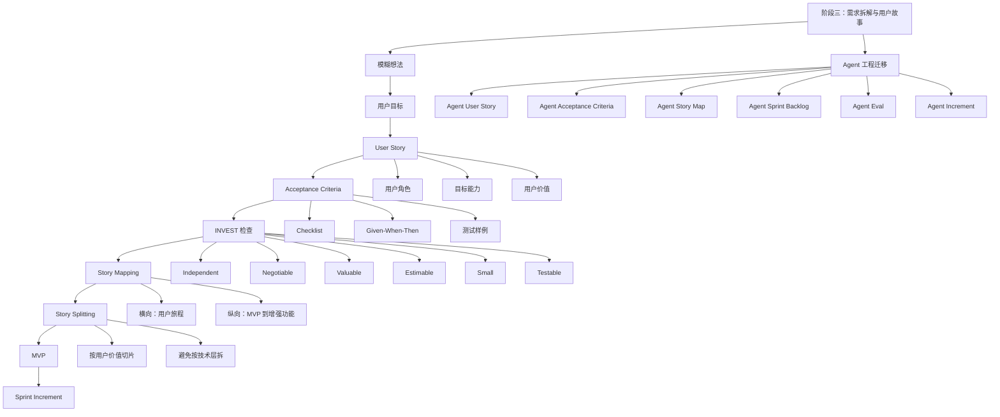

# 敏捷开发｜阶段三：需求拆解与用户故事

## 0. 本文定位

这篇笔记沉淀的是敏捷开发课程的**阶段三：需求拆解与用户故事｜第 12–18 章**。

阶段一解决的是：

> 敏捷为什么存在，它如何处理复杂系统的不确定性。

阶段二解决的是：

> Scrum 如何把 Product Goal 转成 Sprint、Increment、Review、Retrospective 的交付系统。

阶段三解决的是：

> Product Backlog 里的需求，到底应该怎么写、怎么拆、怎么验收、怎么变成可交付增量。

对 Agent 工程来说，本阶段对应的是：

> 如何把一个模糊 Agent 想法，拆成可迭代实现的 Prompt / Skill / Tool / Eval 任务。

---

# 1. 阶段三总览

| 章节 | 主题 | 学习目标 |
|---:|---|---|
| 第 12 章 | User Story 用户故事 | 学会从用户价值表达需求 |
| 第 13 章 | User Story Template | 学会写标准用户故事 |
| 第 14 章 | Acceptance Criteria 验收标准 | 学会定义“做到什么程度算完成” |
| 第 15 章 | INVEST 原则 | 学会判断用户故事质量 |
| 第 16 章 | Story Mapping | 学会用用户旅程组织需求 |
| 第 17 章 | Story Splitting | 学会把大需求拆成小需求 |
| 第 18 章 | MVP 与 Increment | 学会定义最小可验证交付物 |

---

# 2. 阶段三核心结论

## 2.1 一句话理解阶段三

> 阶段三的核心，是把“模糊需求”转成可理解、可排序、可拆分、可验收、可交付的敏捷需求单元。

## 2.2 阶段三在 Scrum 中的位置

阶段二的 Scrum 框架是：

```text
Product Goal
  ↓
Product Backlog
  ↓
Sprint Planning
  ↓
Sprint Backlog
  ↓
Increment
```

阶段三解决的问题是：

```text
Product Backlog 里面的需求，到底应该怎么写、怎么拆、怎么验收？
```

如果阶段三没学好，Scrum 会变成形式主义。

| 没有需求拆解能力 | 后果 |
|---|---|
| User Story 写得像任务 | 团队只会执行，不理解价值 |
| 验收标准不清 | 做完才发现不符合预期 |
| Story 太大 | Sprint 内交付不了 |
| Story 太技术化 | 用户价值丢失 |
| Backlog 没有结构 | 优先级混乱 |
| MVP 不清楚 | 一开始就过度设计 |

## 2.3 阶段三完整闭环

```text
模糊想法
  ↓
用户目标
  ↓
User Story
  ↓
Acceptance Criteria
  ↓
INVEST 检查
  ↓
Story Mapping
  ↓
Story Splitting
  ↓
MVP
  ↓
Sprint Increment
```

---

# 3. 第 12 章：User Story 用户故事

## 3.1 一句话理解 User Story

> User Story 是从用户目标出发，描述一个小而有价值的产品需求。

它不是功能清单，不是技术任务，也不是完整需求文档。

User Story 的核心是说明：

```text
谁
在什么场景下
想完成什么目标
为什么这个目标有价值
```

## 3.2 User Story 不是“功能清单”

| 类型 | 表达方式 | 问题 |
|---|---|---|
| 功能清单 | 增加导出按钮 | 只描述系统要做什么 |
| 技术任务 | 写一个 PDF 导出接口 | 只描述技术实现 |
| UI 需求 | 页面右上角放一个按钮 | 只描述界面元素 |
| User Story | 作为运营人员，我希望导出广告数据，以便分析投放效果 | 说明了用户、目标和价值 |

User Story 的重点不是：

```text
系统有什么功能
```

而是：

```text
用户要完成什么目标
这个目标为什么有价值
```

## 3.3 User Story 的价值

| 价值 | 说明 |
|---|---|
| 聚焦用户 | 避免团队只围绕功能和技术讨论 |
| 支持拆分 | 大需求可以被拆成多个小故事 |
| 支持排序 | 可以按用户价值和风险排序 |
| 支持沟通 | 让 PO、开发、测试围绕同一个目标讨论 |
| 支持验收 | 可以衍生出 Acceptance Criteria |
| 支持迭代 | 每个故事都可以成为可交付增量的一部分 |

## 3.4 User Story 在 Agent 工程中的含义

Agent 工程里，不应该这样写需求：

```text
做一个能分析 PRD 的 Agent
```

这个需求太大、太模糊、不可验收。

应该改成 User Story：

```text
作为一个 Agent 工程设计者，
我希望 Agent 能从 PRD 中提取目标、用户、输入、输出、约束和验收标准，
以便我快速判断这个需求是否具备进入开发的条件。
```

这样就明确了：

| 元素 | 内容 |
|---|---|
| 用户 | Agent 工程设计者 |
| 目标 | 从 PRD 提取关键需求要素 |
| 价值 | 判断需求是否具备开发条件 |
| 可拆分性 | 可以继续拆成目标提取、约束提取、验收标准提取等小能力 |
| 可验收性 | 可以定义输出结构和质量标准 |

---

# 4. 第 13 章：User Story Template

## 4.1 标准模板

英文模板：

```text
As a [user role],
I want [goal / capability],
so that [benefit / value].
```

中文模板：

```text
作为 [某类用户]，
我希望 [完成某个目标 / 获得某个能力]，
以便 [获得某种价值]。
```

## 4.2 模板三要素

| 要素 | 作用 | 错误写法 | 好写法 |
|---|---|---|---|
| 用户角色 | 明确谁需要它 | 用户 | 新手运营人员 |
| 目标能力 | 明确要完成什么 | 优化页面 | 快速筛选异常广告活动 |
| 用户价值 | 明确为什么要做 | 方便使用 | 以便优先处理浪费预算的活动 |

## 4.3 好的 User Story 示例

### 软件开发示例

```text
作为一个电商卖家，
我希望能按广告 ACOS 筛选广告活动，
以便快速找到需要优化的高浪费广告。
```

### Agent 工程示例

```text
作为一个 Skill 设计者，
我希望 Agent 能检查 SKILL.md 的 description 是否清楚定义触发边界，
以便降低 Skill 被误触发或漏触发的风险。
```

### LLM-Wiki 示例

```text
作为一个知识库维护者，
我希望 Agent 能把长对话整理成结构化 Markdown 文件，
以便把临时聊天内容沉淀为可复用知识资产。
```

## 4.4 差的 User Story 示例

| 差的写法 | 问题 |
|---|---|
| 做一个分析功能 | 没有用户、没有目标、没有价值 |
| 用户可以导出数据 | 缺少用户角色和业务价值 |
| 系统支持多语言 | 太泛，无法判断优先级 |
| 增加一个按钮 | UI 方案，不是用户故事 |
| 调用 GPT API | 技术任务，不是用户价值 |

## 4.5 User Story 检查公式

```text
用户故事 = 用户角色 + 用户目标 + 用户收益 + 验收标准 + 可交付边界
```

只写前三项还不够。真正进入 Sprint 前，还需要验收标准。

---

# 5. 第 14 章：Acceptance Criteria 验收标准

## 5.1 一句话理解验收标准

> Acceptance Criteria 是判断一个 User Story 是否完成的具体条件。

它回答的问题是：

```text
做到什么程度，才算这个 Story 完成？
```

## 5.2 没有验收标准会怎样

| 情况 | 后果 |
|---|---|
| 只写“优化搜索功能” | 不知道优化什么 |
| 只写“提升 Agent 输出质量” | 不知道什么叫质量好 |
| 只写“支持导出报告” | 不知道导出哪些字段、什么格式 |
| 只写“整理成 Markdown” | 不知道目录、粒度、格式、链接规则 |

没有验收标准，需求就会变成：

```text
你以为完成了
我觉得没完成
开发觉得做完了
测试不知道测什么
```

## 5.3 验收标准的常见格式

### 格式一：Checklist

```md
验收标准：

- [ ] 可以上传 CSV 文件
- [ ] 系统能识别广告活动名称、花费、销售额、ACOS
- [ ] 可以按 ACOS 从高到低排序
- [ ] 异常广告活动会被标记
- [ ] 导出结果为 .xlsx 文件
```

### 格式二：Given-When-Then

```text
Given 用户已上传广告数据
When 用户点击“分析”
Then 系统应输出高 ACOS 广告活动列表
And 每个活动应包含花费、销售额、ACOS 和优化建议
```

## 5.4 Agent 工程中的验收标准

示例 User Story：

```text
作为一个 Skill 设计者，
我希望 Agent 能检查 SKILL.md 的 description 是否清楚定义触发边界，
以便降低 Skill 被误触发或漏触发的风险。
```

对应验收标准：

```md
验收标准：

- [ ] 能识别 description 是否说明 Skill 的适用任务
- [ ] 能识别 description 是否说明不适用场景
- [ ] 能指出可能误触发的近似场景
- [ ] 能给出改写建议
- [ ] 输出必须包含：问题、原因、风险、改进建议
- [ ] 至少能通过 3 个测试样例：好案例、差案例、边界案例
```

## 5.5 Acceptance Criteria vs Definition of Done

| 对比项 | Acceptance Criteria | Definition of Done |
|---|---|---|
| 作用对象 | 单个 User Story | 所有 Increment / Backlog Item |
| 关注点 | 这个需求是否满足业务预期 | 这个成果是否达到统一质量标准 |
| 举例 | 导出文件必须包含 ACOS 字段 | 代码通过测试、完成评审、无阻塞缺陷 |
| Agent 对应 | 某个 Agent 能力的输出要求 | 所有 Agent 能力统一完成标准 |

简单理解：

```text
Acceptance Criteria = 这个需求自己的完成条件
Definition of Done = 团队所有成果统一必须达到的质量门槛
```

---

# 6. 第 15 章：INVEST 原则

## 6.1 一句话理解 INVEST

> INVEST 是判断 User Story 质量的检查清单。

如果一个 Story 不满足 INVEST，通常需要重写或拆分。

## 6.2 INVEST 六项标准

| 字母 | 英文 | 中文理解 | 检查问题 |
|---|---|---|---|
| I | Independent | 独立 | 这个 Story 能否尽量独立交付？ |
| N | Negotiable | 可协商 | 它是目标描述，而不是死板合同吗？ |
| V | Valuable | 有价值 | 它是否对用户或业务产生价值？ |
| E | Estimable | 可估算 | 团队是否能大致判断复杂度？ |
| S | Small | 足够小 | 它能否在一个 Sprint 内完成？ |
| T | Testable | 可测试 | 是否能判断它完成没完成？ |

## 6.3 用 INVEST 评估 User Story

差的 Story：

```text
作为一个卖家，
我希望系统能分析全部广告数据，
以便提升广告效果。
```

评估：

| INVEST | 问题 |
|---|---|
| Independent | 太大，依赖多个模块 |
| Negotiable | 目标太泛，无法讨论实现边界 |
| Valuable | 有价值，但价值表达过泛 |
| Estimable | 很难估算 |
| Small | 不够小 |
| Testable | 不知道怎么测试“提升广告效果” |

改写：

```text
作为一个卖家，
我希望系统能识别过去 7 天 ACOS 高于 80% 且花费超过 30 美元的广告活动，
以便优先暂停或优化浪费预算的活动。
```

改写后：

| INVEST | 判断 |
|---|---|
| Independent | 可独立实现 |
| Negotiable | 可讨论阈值和字段 |
| Valuable | 直接节省广告预算 |
| Estimable | 可以估算数据处理和规则判断 |
| Small | 可在一个 Sprint 内完成 |
| Testable | 有明确输入、阈值、输出 |

## 6.4 Agent 工程中的 INVEST

差的 Agent Story：

```text
作为用户，我希望 Agent 能帮我做敏捷开发。
```

问题：

| INVEST | 问题 |
|---|---|
| Independent | 太大 |
| Valuable | 价值泛 |
| Estimable | 无法估算 |
| Small | 无法在一轮完成 |
| Testable | 无法测试 |

改写成小 Story：

```text
作为一个 Agent 工程学习者，
我希望 Agent 能把一个模糊 Agent 想法拆成 User Story、Acceptance Criteria 和 Sprint Backlog，
以便我能判断这个 Agent 需求是否可以进入开发。
```

验收标准：

```md
- [ ] 输出至少包含 3 条 User Story
- [ ] 每条 User Story 都包含用户、目标、价值
- [ ] 每条 Story 至少有 3 条 Acceptance Criteria
- [ ] 能指出哪些 Story 太大，需要继续拆分
- [ ] 能生成一个 Sprint Backlog 草案
```

---

# 7. 第 16 章：Story Mapping

## 7.1 一句话理解 Story Mapping

> Story Mapping 是把用户完成目标的全过程画出来，再把 User Story 按用户旅程和优先级组织起来。

它解决的是：

```text
Backlog 不再只是列表，而是用户价值地图。
```

## 7.2 为什么需要 Story Mapping

普通 Backlog 容易变成一长串列表：

```text
登录
注册
导出
筛选
搜索
报表
权限
通知
设置
```

问题是：

| 问题 | 说明 |
|---|---|
| 看不出用户路径 | 不知道用户先做什么、后做什么 |
| 看不出 MVP | 不知道第一版必须有什么 |
| 看不出优先级层次 | 所有需求混在一起 |
| 看不出缺口 | 用户旅程中可能漏掉关键步骤 |
| 难以讨论价值 | 团队容易围绕功能争论 |

Story Mapping 把需求从“列表”变成“地图”。

## 7.3 Story Map 的基本结构

```text
用户目标
  ↓
用户活动 1 → 用户活动 2 → 用户活动 3 → 用户活动 4
  ↓           ↓           ↓           ↓
MVP Story   MVP Story   MVP Story   MVP Story
  ↓           ↓           ↓           ↓
增强 Story  增强 Story  增强 Story  增强 Story
  ↓           ↓           ↓           ↓
未来 Story  未来 Story  未来 Story  未来 Story
```

横向：

```text
用户完成任务的路径
```

纵向：

```text
从最小可用版本到增强版本
```

## 7.4 软件产品示例：广告分析工具

用户目标：

> 帮卖家快速发现浪费预算的广告活动。

Story Map：

| 用户活动 | MVP 层 | 增强层 | 未来层 |
|---|---|---|---|
| 上传数据 | 上传 CSV | 支持 Excel | 自动连接广告 API |
| 识别字段 | 识别花费、销售额、ACOS | 自动修正常见字段名 | 多站点字段映射 |
| 发现异常 | 标记高 ACOS 活动 | 识别低 CTR / 低 CVR 问题 | 预测预算浪费趋势 |
| 输出建议 | 给出暂停 / 降价建议 | 给出关键词级建议 | 自动生成优化计划 |
| 导出结果 | 导出 Excel | 生成 PDF 报告 | 同步到运营看板 |

MVP 不是“做很少”，而是：

> 先交付一条完整但最薄的用户价值链。

## 7.5 Agent 工程示例：Skill 质量评估 Agent

用户目标：

> 帮我评估一个 SKILL.md 是否具备正确触发和稳定执行能力。

Story Map：

| 用户活动 | MVP 层 | 增强层 | 未来层 |
|---|---|---|---|
| 输入 Skill | 粘贴 SKILL.md | 支持上传文件 | 自动扫描仓库 |
| 识别结构 | 检查 description / instructions | 检查 references / scripts / evals | 检查多 Skill 依赖 |
| 评估触发 | 判断是否清楚说明适用场景 | 增加误触发 / 漏触发测试 | 自动生成 trigger evals |
| 评估执行 | 检查流程是否可执行 | 检查资源是否闭环 | 自动运行测试 |
| 输出报告 | 输出评分和问题 | 输出改写建议 | 生成 PR 修改建议 |
| 沉淀知识 | 生成 Markdown 总结 | 写入 LLM-Wiki 模板 | 更新 Skill 质量标准库 |

这个 Story Map 可以帮助判断：

```text
第一版 Agent 到底做什么？
哪些是 MVP？
哪些是增强功能？
哪些先不要做？
```

---

# 8. 第 17 章：Story Splitting

## 8.1 一句话理解 Story Splitting

> Story Splitting 是把一个太大的 User Story 拆成多个更小但仍然有业务价值的 User Story。

重点是：

```text
拆小，但不能拆掉用户价值。
```

## 8.2 好拆分 vs 坏拆分

### 坏拆分：按技术层拆

```text
前端页面
后端接口
数据库表
测试脚本
```

问题：

| 问题 | 说明 |
|---|---|
| 单个部分没有用户价值 | 用户不能只用数据库表 |
| 无法独立验收 | 前端没有后端不能用 |
| 不利于反馈 | 用户看不到完整价值 |
| 容易变成瀑布 | 设计 → 后端 → 前端 → 测试 |

### 好拆分：按用户价值切薄片

```text
用户可以上传一个 CSV
用户可以看到高 ACOS 广告活动
用户可以导出异常活动列表
用户可以看到优化建议
```

每一片都能被用户理解、测试和反馈。

## 8.3 常见拆分维度

| 拆分维度 | 示例 |
|---|---|
| 按用户角色 | 新手用户、专家用户、管理员 |
| 按业务规则 | 先支持简单规则，再支持复杂规则 |
| 按数据范围 | 先支持单文件，再支持多文件 |
| 按输入类型 | 先支持 CSV，再支持 Excel / API |
| 按输出深度 | 先输出列表，再输出建议，再输出报告 |
| 按异常场景 | 先处理正常数据，再处理缺失字段 |
| 按流程步骤 | 先完成核心路径，再补充边缘路径 |
| 按自动化程度 | 先人工上传，再自动同步 |

## 8.4 Agent 工程中的拆分

大需求：

```text
做一个能帮我创建高质量 Agent 的系统。
```

拆分：

| 小 Story | 用户价值 |
|---|---|
| Agent 能澄清模糊需求 | 避免直接执行错误方向 |
| Agent 能生成 User Story | 把想法转成可开发需求 |
| Agent 能生成验收标准 | 明确完成边界 |
| Agent 能拆 Sprint Backlog | 形成执行计划 |
| Agent 能评估 Prompt 质量 | 降低输出漂移 |
| Agent 能评估 Skill 质量 | 提高 Skill 可复用性 |
| Agent 能生成 Eval 测试集 | 建立回归验证 |
| Agent 能复盘失败案例 | 沉淀工程经验 |

每个小 Story 都可以成为一个 Sprint 的目标。

## 8.5 Story Splitting 的判断标准

一个 Story 拆得好不好，看 5 点：

| 标准 | 问题 |
|---|---|
| 是否保留用户价值 | 用户能不能理解这片价值？ |
| 是否足够小 | 一个 Sprint 内能否完成？ |
| 是否可验收 | 能否判断完成没完成？ |
| 是否可反馈 | 用户或团队能否基于结果反馈？ |
| 是否减少风险 | 是否优先验证高风险部分？ |

---

# 9. 第 18 章：MVP 与 Increment

## 9.1 MVP 是什么

> MVP 是最小可验证产品。

关键不是“小”，而是：

```text
最小
但必须能验证核心价值假设
```

差的 MVP：

```text
只做登录、菜单、空页面
```

问题：

```text
用户无法验证核心价值。
```

好的 MVP：

```text
用户上传广告数据后，系统能识别高 ACOS 广告活动，并导出优化列表。
```

它虽然功能少，但已经能验证：

```text
这个工具是否真的帮用户发现浪费预算的问题？
```

## 9.2 Increment 是什么

> Increment 是本轮 Sprint 结束后真正可用、可验证、满足 DoD 的产品增量。

它不是：

- 代码写完
- 页面做完
- 任务状态改成 Done
- 半成品
- 只能内部看、不能验证的工作

它必须：

| 条件 | 说明 |
|---|---|
| 可用 | 不是半成品 |
| 可验证 | 能通过验收标准检查 |
| 满足 DoD | 达到统一完成标准 |
| 可叠加 | 能作为后续增量的基础 |

## 9.3 MVP vs Increment

| 对比项 | MVP | Increment |
|---|---|---|
| 关注点 | 验证核心价值假设 | 本轮完成的可用增量 |
| 时间尺度 | 通常是早期产品阶段 | 每个 Sprint 都可能产生 |
| 目标 | 证明方向是否值得继续 | 逐步接近 Product Goal |
| 是否必须完整 | 必须形成最小价值闭环 | 必须满足 DoD |
| Agent 对应 | 最小可用 Agent | 每轮新增的 Agent 能力 |

## 9.4 Agent 工程中的 MVP

大目标：

```text
构建一个高质量 Agent 工程助手。
```

差的 MVP：

```text
做一个很长的万能 Prompt。
```

问题：

| 问题 | 说明 |
|---|---|
| 无法验证稳定性 | 不知道在哪些任务有效 |
| 无法拆分能力 | 所有功能混在一起 |
| 无法回归测试 | 改一处可能影响所有输出 |
| 无法复盘 | 不知道失败来自哪里 |

好的 MVP：

```text
Agent 能把一个模糊 Agent 想法拆成：
1. User Story
2. Acceptance Criteria
3. Sprint Goal
4. Sprint Backlog
5. Definition of Done
```

这个 MVP 很小，但能验证核心假设：

```text
Agent 是否能把模糊想法变成可开发需求？
```

## 9.5 Agent Increment 示例

| Sprint | Agent Increment |
|---|---|
| Sprint 1 | Agent 可以根据模糊想法生成 3 条 User Story |
| Sprint 2 | Agent 可以为每条 User Story 生成 Acceptance Criteria |
| Sprint 3 | Agent 可以用 INVEST 检查每条 Story 质量 |
| Sprint 4 | Agent 可以把 Story 拆成 Sprint Backlog |
| Sprint 5 | Agent 可以生成 Eval 测试用例 |

这就是：

```text
MVP → Increment → Increment → Increment → 更完整的 Agent 系统
```

---

# 10. 阶段三核心心智图



---

# 11. 阶段三对 Agent 工程的迁移框架

## 11.1 敏捷需求概念到 Agent 工程的映射

| 敏捷需求概念 | Agent 工程对应物 |
|---|---|
| 用户目标 | Agent 要服务的真实任务 |
| User Story | Agent 使用场景 / Agent 能力需求 |
| Acceptance Criteria | Agent 输出验收标准 |
| INVEST | Agent 能力需求质量检查 |
| Story Mapping | Agent 用户任务路径 / 能力地图 |
| Story Splitting | Agent 能力拆分 |
| MVP | 最小可用 Agent |
| Increment | 每轮新增的 Agent 能力 |
| Definition of Done | Agent 统一完成标准 |
| Eval | Agent 验收和回归测试机制 |

## 11.2 Agent 需求拆解最小流程

```text
1. 输入一个模糊 Agent 想法
2. 提取用户角色和真实任务
3. 写出 3–5 条 Agent User Story
4. 为每条 Story 写 Acceptance Criteria
5. 用 INVEST 检查 Story 质量
6. 用 Story Mapping 组织用户路径
7. 用 Story Splitting 拆出 MVP
8. 形成第一轮 Sprint Backlog
9. 定义 Agent Increment
10. 生成 Eval 测试用例
```

## 11.3 Agent User Story 模板

```md
# Agent User Story 模板

## 1. 用户故事

作为 [用户角色]，
我希望 Agent 能 [完成某个任务 / 提供某个能力]，
以便 [获得某种工作价值]。

## 2. 验收标准

- [ ] 
- [ ] 
- [ ] 

## 3. INVEST 检查

| 标准 | 判断 | 问题 |
|---|---|---|
| Independent |  |  |
| Negotiable |  |  |
| Valuable |  |  |
| Estimable |  |  |
| Small |  |  |
| Testable |  |  |

## 4. 测试样例

| 类型 | 输入 | 预期输出 |
|---|---|---|
| 正常案例 |  |  |
| 边界案例 |  |  |
| 失败案例 |  |  |

## 5. Sprint Backlog

| 任务类型 | 任务 | 验收方式 |
|---|---|---|
| Prompt |  |  |
| Skill |  |  |
| Tool |  |  |
| Eval |  |  |
| Doc |  |  |
```

---

# 12. 阶段三最重要的 9 个理解

| 序号 | 核心理解 | 简单解释 |
|---:|---|---|
| 1 | User Story 不是任务 | 它描述用户目标和价值 |
| 2 | User Story 不是完整文档 | 它是沟通和协作的载体 |
| 3 | 模板只是辅助 | 重点是用户、目标、价值 |
| 4 | Acceptance Criteria 决定能否验收 | 没有验收标准就没有完成边界 |
| 5 | INVEST 是质量检查表 | 用来判断 Story 是否足够好 |
| 6 | Story Mapping 解决结构问题 | 让 Backlog 从列表变成用户旅程地图 |
| 7 | Story Splitting 解决粒度问题 | 把大需求拆成小价值切片 |
| 8 | MVP 不是半成品 | MVP 必须验证核心价值 |
| 9 | Increment 不是“做了一些事” | Increment 必须可用、可验证、满足 DoD |

---

# 13. 阶段三常见误区清单

| 误区 | 为什么错 | 正确理解 |
|---|---|---|
| User Story 就是需求文档 | 它不是完整文档，而是协作单元 | Story 需要持续讨论和补充 |
| User Story 越详细越好 | 过早细化会浪费 | 细节应随计划周期逐步展开 |
| 按技术层拆 Story | 每一层都没有独立用户价值 | 应按用户价值拆垂直切片 |
| 验收标准可以以后再补 | 会导致开发和测试理解不一致 | 进入 Sprint 前应足够清楚 |
| MVP 就是简陋版本 | 简陋不等于可验证 | MVP 必须验证核心价值 |
| Increment 等于任务完成 | 任务完成不代表可用 | 必须满足 DoD |
| Agent 需求可以直接写 Prompt | 这会跳过需求建模 | 应先写 Story、验收标准和测试 |
| Agent 输出好不好靠感觉 | 主观判断不可复用 | 应用 Acceptance Criteria 和 Eval |

---

# 14. 阶段三掌握标准

学完阶段三后，应该能回答：

| 序号 | 自测问题 | 掌握标准 |
|---:|---|---|
| 1 | User Story 是什么？ | 能说出它是从用户目标出发的价值需求单元 |
| 2 | User Story 和任务有什么区别？ | 能区分用户价值和技术实现 |
| 3 | 标准 User Story 模板是什么？ | 能写出“作为…我希望…以便…” |
| 4 | Acceptance Criteria 是什么？ | 能定义一个 Story 的完成条件 |
| 5 | Acceptance Criteria 和 DoD 有什么区别？ | 一个面向单个 Story，一个面向统一质量标准 |
| 6 | INVEST 是什么？ | 能解释六项质量标准 |
| 7 | Story Mapping 解决什么问题？ | 能用用户旅程组织 Backlog |
| 8 | Story Splitting 怎么拆才对？ | 能按用户价值切片，而不是按技术层拆 |
| 9 | MVP 和 Increment 有什么区别？ | MVP 验证价值假设，Increment 是每轮可用增量 |
| 10 | 如何迁移到 Agent 工程？ | 能把模糊 Agent 想法拆成 Story、验收标准、测试和 Sprint Backlog |

---

# 15. 阶段三最小知识卡片

## 15.1 需求拆解与用户故事

```md
# 需求拆解与用户故事

User Story 是敏捷需求拆解的核心单元。

它不是功能清单，也不是技术任务，而是从用户目标和用户价值出发描述需求：

作为 [用户角色]，
我希望 [完成某个目标]，
以便 [获得某种价值]。

一个好的 User Story 需要满足 INVEST：

- Independent：尽量独立
- Negotiable：可协商
- Valuable：有用户或业务价值
- Estimable：可估算
- Small：足够小
- Testable：可测试

User Story 必须配合 Acceptance Criteria，否则无法判断是否完成。

需求拆解的完整路径：

模糊想法
→ 用户目标
→ User Story
→ Acceptance Criteria
→ INVEST 检查
→ Story Mapping
→ Story Splitting
→ MVP
→ Sprint Increment

迁移到 Agent 工程中：

不要直接写万能 Prompt。
先把 Agent 想法拆成：

- Agent User Story
- Agent Acceptance Criteria
- Agent Story Map
- Agent Sprint Backlog
- Agent Eval 测试用例
- Agent Increment

这样才能把 Agent 从“灵感驱动”变成“工程化迭代”。
```

## 15.2 User Story 不是任务

```md
# User Story 不是任务

任务通常描述“要做什么”：

- 增加导出按钮
- 写一个接口
- 调用 GPT API

User Story 描述“谁为了什么价值要完成什么目标”：

作为一个运营人员，
我希望导出广告数据，
以便分析投放效果。

如果需求只描述功能或技术实现，而没有用户、目标和价值，它就不是合格的 User Story。
```

## 15.3 Agent 工程中的需求拆解

```md
# Agent 工程中的需求拆解

模糊 Agent 想法不能直接进入 Prompt 编写。

正确路径是：

1. 明确用户角色
2. 明确真实任务
3. 写 Agent User Story
4. 写 Acceptance Criteria
5. 用 INVEST 检查质量
6. 用 Story Mapping 组织能力路径
7. 用 Story Splitting 拆出 MVP
8. 形成 Sprint Backlog
9. 定义 Agent Increment
10. 生成 Eval 测试用例

这样 Agent 工程才能从“凭感觉写提示词”，升级为“可验收、可测试、可迭代的工程系统”。
```

---

# 16. 推荐放入 LLM-Wiki 的位置

## 16.1 建议目录

```text
llm-wiki/
  software-engineering/
    agile-development/
      00-index.md
      01-stage-cognition/
        00-agile-overview.md
        01-what-is-agile.md
        02-agile-vs-waterfall-lean-devops.md
        03-agile-manifesto-principles.md
        04-agile-for-complex-systems.md
        stage-1-summary.md
      02-stage-scrum-framework/
        05-scrum-overview.md
        06-scrum-roles.md
        07-product-backlog-sprint-backlog.md
        08-sprint-planning.md
        09-daily-scrum.md
        10-sprint-review.md
        11-sprint-retrospective.md
        stage-2-summary.md
      03-stage-requirements-user-stories/
        12-user-story.md
        13-user-story-template.md
        14-acceptance-criteria.md
        15-invest.md
        16-story-mapping.md
        17-story-splitting.md
        18-mvp-increment.md
        stage-3-summary.md
```

## 16.2 当前文件建议命名

```text
敏捷开发-阶段三-需求拆解与用户故事.md
```

## 16.3 建议双向链接

```md
相关链接：

- [[敏捷开发完整学习路线图]]
- [[敏捷开发-阶段一-认知入门]]
- [[敏捷开发-阶段二-Scrum基础框架]]
- [[Product Backlog]]
- [[Sprint Backlog]]
- [[User Story]]
- [[Acceptance Criteria]]
- [[Definition of Done]]
- [[INVEST]]
- [[Story Mapping]]
- [[Story Splitting]]
- [[MVP]]
- [[Increment]]
- [[Agent 工程]]
- [[Agent Evals]]
- [[Skill 工程化]]
- [[LLM-Wiki]]
```

---

# 17. 后续学习入口

阶段三完成后，下一阶段是：

> 阶段四：计划、估算与交付管理｜第 19–24 章

进入阶段四前，应先确认自己能够把下面这个模糊想法：

```text
我想做一个能帮我创建高质量 Agent 的助手。
```

拆成：

```text
1. 多条 Agent User Story
2. 每条 Story 的 Acceptance Criteria
3. Story Map
4. MVP 范围
5. 第一轮 Sprint Backlog
6. 可验证的 Agent Increment
```

阶段四会进入：

| 章节 | 主题 |
|---:|---|
| 第 19 章 | 估算的本质 |
| 第 20 章 | Story Point |
| 第 21 章 | Velocity |
| 第 22 章 | Release Planning |
| 第 23 章 | Roadmap 与 Sprint 的关系 |
| 第 24 章 | Scope、Time、Quality 的权衡 |

---

# 18. 参考来源

- Agile Alliance User Stories: https://agilealliance.org/glossary/user-stories/
- Agile Alliance User Story Template: https://agilealliance.org/glossary/user-story-template/
- Agile Alliance INVEST: https://agilealliance.org/glossary/invest/
- Agile Alliance Story Mapping: https://agilealliance.org/glossary/story-mapping/
- Agile Alliance Story Splitting: https://agilealliance.org/glossary/story-splitting/
- Scrum Guide: https://scrumguides.org/scrum-guide.html
