# 敏捷开发｜阶段五：Kanban 与流程优化

## 0. 本文定位

这篇笔记沉淀的是敏捷开发课程的**阶段五：Kanban 与流程优化｜第 25–30 章**。

前面四个阶段分别解决：

| 阶段 | 解决的问题 |
|---|---|
| 阶段一：认知入门 | 敏捷是什么，为什么适合复杂系统 |
| 阶段二：Scrum 基础框架 | Scrum 如何形成短周期交付闭环 |
| 阶段三：需求拆解与用户故事 | 模糊需求如何变成可验收、可交付的 User Story |
| 阶段四：计划、估算与交付管理 | 需求如何被估算、规划、发布和取舍 |

阶段五开始从“计划一个 Sprint”升级到“管理工作流动”。

核心问题是：

```text
任务进入执行后，
它们在流程中如何流动？
哪里排队？
哪里阻塞？
哪里并行过多？
哪里导致交付变慢？
```

对 Agent 工程来说，本阶段对应的是：

> 如何管理 Agent 能力从想法、设计、构建、测试、评审、文档沉淀到 Done 的真实流动过程。

---

# 1. 阶段五总览

| 章节 | 主题 | 学习目标 |
|---:|---|---|
| 第 25 章 | Kanban 基础 | 理解 Kanban 的本质：可视化、拉动、流动优化 |
| 第 26 章 | 工作流可视化 | 学会把工作状态画出来，而不是只列任务 |
| 第 27 章 | WIP Limit | 学会限制同时进行的工作，减少系统拥堵 |
| 第 28 章 | Cycle Time 与 Lead Time | 学会用流动指标判断交付效率 |
| 第 29 章 | 瓶颈识别 | 学会发现工作卡在哪里 |
| 第 30 章 | Scrum 与 Kanban 组合使用 | 学会用 Kanban 增强 Scrum，而不是替代 Scrum |

---

# 2. 阶段五核心结论

## 2.1 一句话理解阶段五

> 阶段五的核心，是从“任务管理”升级到“流动管理”。

Scrum 更强调：

```text
迭代节奏
Sprint Goal
Sprint Planning
Review
Retrospective
```

Kanban 更强调：

```text
工作如何流动
哪里排队
哪里阻塞
哪里 WIP 过高
如何缩短 Lead Time / Cycle Time
```

## 2.2 Scrum 与 Kanban 的核心区别

| 对比项 | Scrum | Kanban |
|---|---|---|
| 核心关注 | 迭代节奏 | 工作流动 |
| 时间结构 | Sprint timebox | 可连续流动 |
| 计划方式 | Sprint Planning | 按容量拉取 |
| 工作入口 | Sprint Backlog | Replenishment / Ready Queue |
| 交付节奏 | 每个 Sprint 产生 Increment | 可持续交付 |
| 核心约束 | Sprint Goal / DoD | WIP Limit / Flow Policy |
| 度量重点 | Velocity | Lead Time / Cycle Time / Throughput |

一句话：

```text
Scrum 解决“按什么节奏交付”。
Kanban 解决“工作如何更顺畅地流动”。
```

## 2.3 阶段五完整闭环

```text
工作项进入 Ready
  ↓
按容量拉取
  ↓
进入 In Progress
  ↓
经过 Review / Test / Document
  ↓
满足 Done
  ↓
记录 Cycle Time / Lead Time
  ↓
识别瓶颈
  ↓
调整 WIP / 规则 / 流程
  ↓
持续优化
```

Agent 工程对应：

```text
Agent Story Ready
  ↓
拉取一个高价值能力
  ↓
设计 Prompt / Skill / Tool
  ↓
运行 Eval
  ↓
Review 输出质量
  ↓
沉淀 LLM-Wiki
  ↓
Agent Increment Done
  ↓
记录流动数据
  ↓
优化流程
```

---

# 3. 第 25 章：Kanban 基础

## 3.1 一句话理解 Kanban

> Kanban 是一种通过可视化工作、限制在制品、管理流动，来提升交付效率的方法。

它不是简单的“任务看板”，也不是 Jira / Trello / Linear 里的几列状态。

Kanban 的本质是：

```text
让工作流动过程可见
让拥堵和阻塞暴露
让团队基于真实流动数据持续优化
```

## 3.2 Kanban 解决什么问题

| 问题 | 没有 Kanban 时 | Kanban 要解决 |
|---|---|---|
| 工作状态不透明 | 不知道谁在做什么 | 用看板可视化 |
| 同时开工太多 | 每件事都开始，但都没完成 | 限制 WIP |
| 阻塞不明显 | 任务卡住没人发现 | 让阻塞可见 |
| 交付慢 | 工作在流程中排队 | 优化流动 |
| 优先级混乱 | 谁催得急就做谁的 | 显示队列和规则 |
| 交付不可预测 | 不知道一件事多久完成 | 用 Lead Time / Cycle Time 度量 |

## 3.3 Kanban 的核心机制

| 机制 | 简单理解 |
|---|---|
| Visualize Workflow | 把流程画出来 |
| Limit WIP | 限制同时进行的工作 |
| Manage Flow | 管理工作如何流动 |
| Make Policies Explicit | 把规则写清楚 |
| Feedback Loops | 定期反馈和调整 |
| Improve Collaboratively | 基于数据持续改进 |

## 3.4 Kanban 到 Agent 工程的迁移

Agent 工程中，也会出现“流程拥堵”。

| Agent 工程问题 | Kanban 视角 |
|---|---|
| 同时改 Prompt、Skill、Tool、Eval | WIP 过高 |
| 很多想法都开头了，没有一个完成 | 缺少完成优先 |
| Prompt 改完但没有测试 | 流程卡在 Eval |
| Skill 写完但没有沉淀文档 | Done 定义不清 |
| 工具集成反复失败 | 需要暴露 Blocker |
| 输出质量不稳定 | 需要看 Cycle Time 和返工率 |

Agent Kanban 的核心是：

```text
不要只管理任务清单。
要管理 Agent 能力从想法到可验证交付的流动过程。
```

---

# 4. 第 26 章：工作流可视化

## 4.1 一句话理解工作流可视化

> 工作流可视化不是把任务贴到看板上，而是把工作从开始到完成的真实状态画出来。

看板列不是随便写：

```text
To Do → Doing → Done
```

而应该反映真实流程：

```text
Idea → Ready → In Progress → Review → Test → Done
```

## 4.2 一个基础 Kanban Board

```text
Backlog → Ready → In Progress → Review → Test → Done
```

| 列 | 含义 |
|---|---|
| Backlog | 候选工作，还没准备好 |
| Ready | 已经准备好，可以拉取 |
| In Progress | 正在执行 |
| Review | 等待评审 |
| Test | 等待测试 / 验收 |
| Done | 满足完成标准 |

## 4.3 不同工作流示例

### 软件开发工作流

```text
Backlog
→ Ready
→ Development
→ Code Review
→ QA
→ Release
→ Done
```

### 内容生产工作流

```text
Idea
→ Outline
→ Drafting
→ Editing
→ Review
→ Publish
```

### Agent 工程工作流

```text
Agent Idea
→ Ready for Design
→ Prompt / Skill Design
→ Tool Integration
→ Eval Testing
→ Review
→ LLM-Wiki / Repo Update
→ Done
```

## 4.4 看板不是越复杂越好

错误做法：

```text
Backlog → Analysis → Ready → UX → UI → Frontend → Backend → API → Test → Review → Deploy → Done
```

问题：

| 问题 | 说明 |
|---|---|
| 状态太多 | 团队维护成本高 |
| 粒度过细 | 容易变成流程负担 |
| 责任不清 | 不知道谁该推动 |
| 列多不等于透明 | 真正阻塞可能仍然隐藏 |

更好的原则：

```text
只可视化对流动管理有意义的状态。
```

## 4.5 Agent 工程看板示例

| 状态 | 说明 | 完成条件 |
|---|---|---|
| Backlog | Agent 能力想法 | 已记录价值和来源 |
| Ready | 准备进入开发 | 有 User Story + AC |
| Designing | 设计 Prompt / Skill / Tool | 有方案和边界 |
| Building | 实现能力 | Prompt / Skill / Tool 已完成初版 |
| Eval Testing | 运行测试 | 通过正常 / 边界 / 失败案例 |
| Review | 检查输出质量 | 满足验收标准 |
| Documenting | 沉淀知识 | 更新 LLM-Wiki / 模板 / Changelog |
| Done | 可交付 | 满足 Agent DoD |

这个看板的价值是：

```text
一眼看到 Agent 能力卡在哪里。
```

---

# 5. 第 27 章：WIP Limit

## 5.1 一句话理解 WIP Limit

> WIP Limit 是限制某个阶段或整个系统同时进行的工作数量。

WIP = Work In Progress，在制品。

WIP Limit 的核心不是“限制团队产能”，而是：

```text
防止系统同时开太多工作，
导致所有工作都变慢。
```

## 5.2 为什么 WIP 过高会变慢

| 现象 | 原因 |
|---|---|
| 每个人都很忙 | 但工作没有完成 |
| 任务都在进行中 | 没有形成 Done |
| 上下文切换频繁 | 注意力被打碎 |
| Review 堆积 | 下游处理不过来 |
| 测试排队 | 缺陷发现变晚 |
| 返工变多 | 反馈周期变长 |

简单公式：

```text
开工越多 ≠ 完成越快
```

更准确：

```text
同时进行越多，
排队、切换、等待、返工越多。
```

## 5.3 WIP Limit 示例

```text
Ready         WIP: 无限制
In Progress  WIP: 3
Review       WIP: 2
Test         WIP: 2
Done         WIP: 无限制
```

含义：

| 状态 | WIP Limit | 规则 |
|---|---:|---|
| In Progress | 3 | 同时最多 3 个任务在开发 |
| Review | 2 | 最多 2 个任务等待 / 进行评审 |
| Test | 2 | 最多 2 个任务测试中 |
| Done | 不限 | 完成越多越好 |

如果 Review 已经有 2 个任务，就不能继续把新任务推入 Review。

正确动作是：

```text
先帮助 Review 清空，
再开始新任务。
```

## 5.4 WIP Limit 的核心行为改变

没有 WIP Limit：

```text
做完自己的部分 → 推给下游 → 开始新任务
```

有 WIP Limit：

```text
下游满了 → 不能继续推 → 帮助系统疏通瓶颈
```

这会迫使团队从：

```text
关注个人忙不忙
```

转向：

```text
关注系统是否顺畅完成价值
```

## 5.5 Agent 工程中的 WIP Limit

Agent 工程常见 WIP 过高：

```text
同时设计 5 个 Skill
同时改 3 个 Prompt
同时接 2 个 Tool
同时整理 4 篇知识库
但没有一个真正 Done
```

Agent Kanban 可以这样设 WIP：

| 状态 | WIP Limit |
|---|---:|
| Designing | 2 |
| Building | 2 |
| Eval Testing | 1 |
| Review | 1 |
| Documenting | 2 |

这意味着：

```text
如果 Eval Testing 已满，
不要继续开发新能力。
先把测试中的能力验收完成。
```

## 5.6 WIP Limit 的反直觉点

| 直觉 | 实际 |
|---|---|
| 多开任务更快 | 多开任务通常更慢 |
| 人不能闲着 | 系统需要缓冲 |
| 每个人都满负荷才有效率 | 局部满负荷会造成全局拥堵 |
| 开始越多越好 | 完成越多才有价值 |
| 等测试时可以开新任务 | 测试排队会让反馈变晚 |

---

# 6. 第 28 章：Cycle Time 与 Lead Time

## 6.1 一句话理解

| 指标 | 一句话 |
|---|---|
| Lead Time | 从用户提出需求到价值交付，一共用了多久 |
| Cycle Time | 从团队开始处理到完成，一共用了多久 |

## 6.2 Lead Time vs Cycle Time

```text
用户提出需求
  ↓
等待排期
  ↓
进入 Ready
  ↓
开始开发 ← Cycle Time 开始
  ↓
开发 / Review / Test
  ↓
Done ← Cycle Time 结束
  ↓
交付用户 ← Lead Time 结束
```

| 对比项 | Lead Time | Cycle Time |
|---|---|---|
| 起点 | 用户提出请求 | 团队开始处理 |
| 终点 | 用户拿到价值 | 工作完成 |
| 包含等待时间 | 包含 | 通常不包含前置等待 |
| 关注对象 | 用户体验 | 团队流程效率 |
| 用途 | 判断交付响应速度 | 判断执行流动效率 |

## 6.3 为什么这两个指标重要

| 只看任务数量 | 看不到的问题 |
|---|---|
| 本周完成 10 个任务 | 每个任务等了多久？ |
| 团队很忙 | 是否大量时间在等待？ |
| 开发很快 | 是否卡在 Review / Test？ |
| 任务都 Done | 用户是否已经拿到价值？ |

Lead Time 和 Cycle Time 能帮助看见：

```text
工作不是慢在“做”，
而是慢在“等”。
```

## 6.4 Agent 工程中的 Lead Time / Cycle Time

### Agent Lead Time

```text
从提出一个 Agent 能力想法
到这个能力真正可用、可测试、可沉淀
一共用了多久。
```

### Agent Cycle Time

```text
从开始设计这个 Agent 能力
到完成 Prompt / Skill / Eval / 文档
一共用了多久。
```

示例：

| Agent 能力 | Lead Time | Cycle Time | 说明 |
|---|---:|---:|---|
| 生成 User Story | 7 天 | 2 天 | 等待排期久 |
| Skill 质量评估 | 5 天 | 5 天 | 开始后复杂度高 |
| LLM-Wiki 整理 | 2 天 | 1 天 | 流程清楚 |
| GitHub PR 建议 | 14 天 | 8 天 | 工具集成和测试复杂 |

## 6.5 如何降低 Lead Time / Cycle Time

| 问题 | 改进方式 |
|---|---|
| Lead Time 长 | 减少 Backlog 排队，明确优先级 |
| Cycle Time 长 | 拆小 Story，减少 WIP |
| Review 等太久 | 设置 Review WIP，明确评审规则 |
| Test 等太久 | 提前设计验收标准和测试样例 |
| 返工太多 | 改善 DoR / AC / DoD |
| 文档拖延 | 把文档沉淀纳入 Done |

---

# 7. 第 29 章：瓶颈识别

## 7.1 一句话理解瓶颈

> 瓶颈是限制整个系统交付速度的环节。

不是最忙的人一定是瓶颈，也不是最难的任务一定是瓶颈。

瓶颈的判断标准是：

```text
哪里堆积最多，
哪里等待最长，
哪里限制了整体流动。
```

## 7.2 看板上的瓶颈信号

| 信号 | 说明 |
|---|---|
| 某一列长期堆满 | 这个阶段处理能力不足 |
| 某些任务长期不动 | 可能阻塞或无人负责 |
| Review 一直积压 | 评审能力不足 |
| Test 一直积压 | 测试能力不足 |
| Done 很少增加 | 工作没有真正完成 |
| In Progress 很多 | WIP 过高 |
| Blocked 卡片多 | 依赖或风险未解决 |

## 7.3 常见瓶颈类型

| 瓶颈类型 | 表现 | 解决方向 |
|---|---|---|
| 需求瓶颈 | 需求不清，反复问 | 加强 DoR 和 AC |
| 开发瓶颈 | In Progress 堆积 | 限制 WIP、拆小 Story |
| Review 瓶颈 | 等评审很多 | 明确评审规则，增加评审容量 |
| 测试瓶颈 | 测试排队 | 提前写测试，自动化测试 |
| 发布瓶颈 | 做完但不能上线 | 改善 CI/CD |
| 决策瓶颈 | 等 PO / 管理层确认 | 明确授权和优先级规则 |
| 知识瓶颈 | 只有一个人会做 | 文档化、结对、知识沉淀 |

## 7.4 Agent 工程常见瓶颈

| 瓶颈 | 表现 | 解决方向 |
|---|---|---|
| 需求瓶颈 | 想法很多，但没有 Story / AC | 先做 Agent Discovery |
| Prompt 瓶颈 | 反复改 Prompt，仍不稳定 | 增加测试样例和输出标准 |
| Tool 瓶颈 | 工具调用经常失败 | 明确工具边界和错误处理 |
| Eval 瓶颈 | 没法判断输出好坏 | 建立最小测试集 |
| 文档瓶颈 | 聊完就丢，无法复用 | 每轮沉淀到 LLM-Wiki |
| 复盘瓶颈 | 同类错误反复出现 | 建失败案例库 |
| 集成瓶颈 | Prompt / Skill / Tool 互相影响 | 分层测试、逐步集成 |

## 7.5 瓶颈处理顺序

当发现瓶颈时，不要马上增加人或加班。

推荐顺序：

```text
1. 先看是否 WIP 过高
2. 再看 Story 是否太大
3. 再看规则是否不清
4. 再看是否缺少测试 / 自动化
5. 再看是否需要调整角色或资源
```

原因：

```text
很多瓶颈不是人不够，
而是系统设计导致工作排队。
```

---

# 8. 第 30 章：Scrum 与 Kanban 组合使用

## 8.1 一句话理解组合使用

> Scrum 提供迭代节奏，Kanban 提供流动管理。

组合后可以理解为：

```text
用 Scrum 管目标和节奏，
用 Kanban 管任务流动和瓶颈。
```

## 8.2 为什么 Scrum 需要 Kanban 补强

Scrum 有 Sprint Planning、Daily Scrum、Review、Retro，但它不自动解决以下问题：

| Scrum 中可能出现的问题 | Kanban 如何补强 |
|---|---|
| Sprint 内任务流动不透明 | 用看板列显示真实状态 |
| In Progress 太多 | 设置 WIP Limit |
| Review / Test 堆积 | 看板暴露瓶颈 |
| Daily Scrum 变流水账 | 围绕看板流动讨论 |
| Sprint 总是完不成 | 用 Cycle Time 分析问题 |
| 团队只看 Velocity | 增加 Flow Metrics |

## 8.3 Scrum + Kanban 的常见形态

### 形态一：Scrum 外壳 + Kanban 看板

```text
仍然保留 Sprint
仍然有 Sprint Goal
仍然有 Review / Retro
但 Sprint 内用 Kanban Board 管理流动
```

适合：

| 场景 | 原因 |
|---|---|
| Scrum 团队任务太多 | 需要可视化流动 |
| Sprint 经常完不成 | 需要看瓶颈 |
| Review / Test 堆积 | 需要 WIP 控制 |

### 形态二：Kanban 主体 + Scrum 事件

```text
没有固定 Sprint 承诺
但保留定期 Planning / Review / Retro
```

适合：

| 场景 | 原因 |
|---|---|
| 运维 / 支持团队 | 工作持续流入 |
| Bug 修复团队 | 难以按 Sprint 锁范围 |
| 内容生产团队 | 需要持续发布 |
| Agent 优化团队 | 持续处理失败案例和改进项 |

### 形态三：Scrumban

```text
Sprint 节奏 + Kanban 流动
计划保留，但工作按容量拉取
```

适合：

| 场景 | 原因 |
|---|---|
| 产品开发 + 维护并存 | 既有计划任务，又有突发任务 |
| Agent 工程 | 既有 Roadmap，又有失败案例修复 |
| 小团队 | 不想过重流程，但需要节奏和可视化 |

## 8.4 Agent 工程中的 Scrum + Kanban

Agent 工程推荐组合：

```text
Scrum 管版本目标
Kanban 管能力流动
```

### Scrum 层

| Scrum 元素 | Agent 工程对应 |
|---|---|
| Product Goal | Agent 系统目标 |
| Sprint Goal | 本轮能力目标 |
| Sprint Backlog | 本轮要实现的 Agent Story |
| Review | 检查输出质量 |
| Retro | 复盘失败模式 |

### Kanban 层

| Kanban 元素 | Agent 工程对应 |
|---|---|
| Board | Agent 能力流动看板 |
| WIP Limit | 限制同时设计 / 测试 / 文档化的能力 |
| Blocker | 工具失败、数据缺失、测试不通过 |
| Cycle Time | 从开始做到完成 Agent 能力的时间 |
| Lead Time | 从想法提出到能力可用的时间 |
| Bottleneck | Eval、Tool、Review、Doc 堵点 |

## 8.5 Agent 工程组合示例

### Sprint Goal

```text
本轮让 Agent 能稳定完成“SKILL.md 质量评估”。
```

### Sprint Backlog

| Story | Points |
|---|---:|
| 检查 description 触发边界 | 3 |
| 检查 instructions 是否可执行 | 3 |
| 检查 references / evals 是否闭环 | 5 |
| 输出结构化评分报告 | 3 |

### Kanban Board

```text
Ready → Designing → Building → Eval Testing → Review → Documenting → Done
```

### WIP Limit

| 状态 | WIP |
|---|---:|
| Designing | 2 |
| Building | 2 |
| Eval Testing | 1 |
| Review | 1 |
| Documenting | 2 |

### Daily Scrum 讨论方式

不要问：

```text
昨天做了什么？
今天做什么？
```

而是看板驱动：

```text
哪些卡片卡住了？
Eval Testing 为什么满了？
Review 为什么没有流动？
今天先帮助哪张卡片进入 Done？
```

---

# 9. 阶段五核心心智图

```mermaid
flowchart TD
    A[阶段五：Kanban 与流程优化] --> B[Kanban 基础]
    B --> B1[可视化工作流]
    B --> B2[限制 WIP]
    B --> B3[管理流动]
    B --> B4[显式化规则]
    B --> B5[反馈回路]
    B --> B6[持续改进]

    A --> C[工作流可视化]
    C --> C1[Backlog]
    C --> C2[Ready]
    C --> C3[In Progress]
    C --> C4[Review]
    C --> C5[Test / Eval]
    C --> C6[Documenting]
    C --> C7[Done]

    A --> D[WIP Limit]
    D --> D1[减少上下文切换]
    D --> D2[减少排队]
    D --> D3[暴露瓶颈]
    D --> D4[优先完成而不是优先开工]

    A --> E[Flow Metrics]
    E --> E1[Lead Time<br/>用户等待时间]
    E --> E2[Cycle Time<br/>团队处理时间]
    E --> E3[Throughput<br/>单位时间完成量]
    E --> E4[Blocked Time<br/>阻塞时间]

    A --> F[瓶颈识别]
    F --> F1[堆积最多]
    F --> F2[等待最长]
    F --> F3[流动停滞]
    F --> F4[限制整体速度]

    A --> G[Scrum + Kanban]
    G --> G1[Scrum 管节奏]
    G --> G2[Kanban 管流动]
    G --> G3[Scrumban]

    A --> H[Agent 工程迁移]
    H --> H1[Agent Kanban Board]
    H --> H2[Agent WIP Limit]
    H --> H3[Agent Lead Time]
    H --> H4[Agent Cycle Time]
    H --> H5[Eval 瓶颈]
    H --> H6[LLM-Wiki 沉淀]
```



---

# 10. 阶段五对 Agent 工程的迁移框架

## 10.1 Kanban 概念到 Agent 工程的映射

| Kanban 概念 | Agent 工程对应物 |
|---|---|
| Workflow | Agent 能力从想法到 Done 的流程 |
| Board | Agent 能力流动看板 |
| Card | 单个 Agent Story / Prompt / Skill / Eval 任务 |
| Ready | 已经有 User Story + AC，可进入开发 |
| In Progress | 正在设计 / 构建 |
| Review | 正在检查输出质量 |
| Test / Eval | 正在运行测试样例 |
| Done | 满足 Agent DoD，且已沉淀 |
| WIP Limit | 限制同时设计、构建、测试的 Agent 能力 |
| Lead Time | 从想法提出到能力可用的总时间 |
| Cycle Time | 从开始处理到完成的时间 |
| Bottleneck | 限制 Agent 能力交付速度的环节 |

## 10.2 Agent Kanban Board 模板

```md
# Agent Kanban Board 模板

## Board Columns

| 状态 | 含义 | 进入条件 | 退出条件 | WIP Limit |
|---|---|---|---|---:|
| Backlog | 能力想法池 | 有价值来源 | 被选入 Ready | 不限 |
| Ready | 准备开发 | 有 User Story + AC | 被拉入 Designing | 不限 |
| Designing | 设计 Prompt / Skill / Tool | Sprint 目标需要 | 方案和边界明确 | 2 |
| Building | 实现能力 | 设计已明确 | 初版完成 | 2 |
| Eval Testing | 运行测试 | 有测试样例 | 通过测试或记录失败 | 1 |
| Review | 检查价值和质量 | Eval 完成 | 满足验收或退回修改 | 1 |
| Documenting | 沉淀知识 | Review 通过 | 更新 LLM-Wiki / 模板 / Changelog | 2 |
| Done | 完成 | 满足 Agent DoD | 无 | 不限 |

## Flow Metrics

| 指标 | 记录方式 |
|---|---|
| Lead Time | 从进入 Backlog 到 Done |
| Cycle Time | 从进入 Designing 到 Done |
| Blocked Time | 被 Blocked 标记的总时间 |
| Rework Count | 被退回次数 |
```

## 10.3 Agent WIP Limit 建议

| 状态 | 建议 WIP | 原因 |
|---|---:|---|
| Designing | 1–2 | 防止同时设计太多能力 |
| Building | 1–2 | 防止 Prompt / Skill 并行过多 |
| Eval Testing | 1 | Eval 最容易成为瓶颈，需要集中处理 |
| Review | 1 | Review 需要高质量判断 |
| Documenting | 1–2 | 避免聊完不沉淀 |

## 10.4 Agent 瓶颈复盘模板

```md
# Agent 瓶颈复盘模板

## 1. 当前瓶颈在哪里？

- [ ] 需求不清
- [ ] Prompt 不稳定
- [ ] Tool 调用失败
- [ ] Eval 不足
- [ ] Review 积压
- [ ] 文档未沉淀
- [ ] 失败案例未复盘

## 2. 看板信号

| 信号 | 观察 |
|---|---|
| 哪一列堆积最多？ |  |
| 哪些卡片长期不动？ |  |
| 哪些卡片被退回？ |  |
| 哪些卡片 Blocked？ |  |

## 3. 原因分析

| 可能原因 | 是否存在 | 证据 |
|---|---|---|
| WIP 过高 |  |  |
| Story 太大 |  |  |
| AC 不清 |  |  |
| DoD 不清 |  |  |
| Eval 不足 |  |  |
| Tool 边界不清 |  |  |
| 缺少文档沉淀 |  |  |

## 4. 改进行动

| 行动 | 负责人 | 下轮检查方式 |
|---|---|---|
|  |  |  |
```

---

# 11. 阶段五最重要的 8 个理解

| 序号 | 核心理解 | 简单解释 |
|---:|---|---|
| 1 | Kanban 不是看板工具 | 它是优化价值流动的方法 |
| 2 | 可视化不是贴任务 | 是把真实工作流画出来 |
| 3 | WIP Limit 是核心 | 限制同时进行，帮助更快完成 |
| 4 | 忙不等于有效率 | 完成价值才算效率 |
| 5 | Lead Time 看用户等待 | 从请求到交付 |
| 6 | Cycle Time 看团队处理 | 从开始做到完成 |
| 7 | 瓶颈决定系统速度 | 不要只优化局部 |
| 8 | Scrum 和 Kanban 可以组合 | Scrum 管节奏，Kanban 管流动 |

---

# 12. 阶段五常见误区清单

| 误区 | 为什么错 | 正确理解 |
|---|---|---|
| Kanban 就是 To Do / Doing / Done | 太浅 | 要反映真实工作流 |
| 看板越复杂越专业 | 增加维护成本 | 只保留有管理价值的状态 |
| WIP Limit 会降低效率 | 误解效率 | 限制 WIP 通常提升完成速度 |
| 每个人都满负荷才好 | 会造成系统拥堵 | 系统需要缓冲 |
| 任务开始越多越好 | 会增加切换和等待 | 完成越多才有价值 |
| Lead Time 和 Cycle Time 一样 | 起点不同 | Lead Time 从请求开始，Cycle Time 从开始处理开始 |
| 瓶颈靠加班解决 | 可能只是系统设计问题 | 先看 WIP、Story 粒度、规则和自动化 |
| Scrum 和 Kanban 只能二选一 | 不是对立关系 | 可以组合使用 |

---

# 13. 阶段五掌握标准

学完阶段五后，应该能回答：

| 序号 | 自测问题 | 掌握标准 |
|---:|---|---|
| 1 | Kanban 是什么？ | 能说出它是优化价值流动的方法 |
| 2 | Kanban 和 Scrum 区别是什么？ | Scrum 管节奏，Kanban 管流动 |
| 3 | 工作流可视化怎么做？ | 能画出真实状态，而不是只写 To Do / Doing / Done |
| 4 | WIP Limit 是什么？ | 能解释限制同时进行的工作数量 |
| 5 | 为什么 WIP 太高会变慢？ | 能解释排队、切换、等待、返工 |
| 6 | Lead Time 和 Cycle Time 区别是什么？ | 一个看用户等待，一个看团队处理 |
| 7 | 如何识别瓶颈？ | 看堆积、等待、阻塞和流动停滞 |
| 8 | Scrum 和 Kanban 怎么组合？ | Scrum 保留 Sprint，Kanban 管 Sprint 内流动 |
| 9 | 如何迁移到 Agent 工程？ | 能设计 Agent Kanban Board、WIP Limit、流动指标 |
| 10 | Agent 工程中最常见瓶颈是什么？ | Eval、Tool、Review、文档沉淀、失败案例复盘 |

---

# 14. 阶段五最小知识卡片

## 14.1 Kanban 与流程优化

```md
# Kanban 与流程优化

Kanban 不是看板工具，而是一种优化价值流动的方法。

它的核心是：

- 可视化工作流
- 限制 WIP
- 管理流动
- 显式化规则
- 建立反馈回路
- 持续改进流程

Scrum 更关注迭代节奏，Kanban 更关注工作流动。

WIP Limit 是 Kanban 的关键机制。它限制同时进行的工作数量，防止系统拥堵、上下文切换和下游堆积。

Lead Time = 从用户提出请求到价值交付的总时间。  
Cycle Time = 从团队开始处理到工作完成的时间。

瓶颈不是最忙的人，而是限制整个系统流动的环节。

迁移到 Agent 工程中：

- Agent Backlog 不是任务堆，而是能力流动池
- Agent 看板要显示真实状态：Designing、Building、Eval Testing、Review、Documenting、Done
- WIP Limit 要限制同时设计、构建和测试的 Agent 能力
- Eval Testing 经常是 Agent 工程瓶颈
- Done 必须包含测试、Review 和 LLM-Wiki 沉淀
```

## 14.2 WIP Limit 的本质

```md
# WIP Limit 的本质

WIP Limit 不是限制产能，而是限制系统拥堵。

开工越多，不等于完成越快。

当同时进行的任务太多，会出现：

- 上下文切换
- 排队等待
- Review 堆积
- 测试延迟
- 返工增加
- Done 变少

WIP Limit 的真正作用是：

让团队从“保持每个人忙碌”，转向“让价值更快完成”。
```

## 14.3 Agent 工程中的 Kanban

```md
# Agent 工程中的 Kanban

Agent 工程不应只管理任务清单，而应管理能力流动。

推荐 Agent Kanban：

Backlog
→ Ready
→ Designing
→ Building
→ Eval Testing
→ Review
→ Documenting
→ Done

关键规则：

- Ready 必须有 User Story + Acceptance Criteria
- Eval Testing 必须有测试样例
- Review 必须检查输出质量
- Documenting 必须沉淀到 LLM-Wiki
- Done 必须满足 Agent DoD

Agent 工程常见瓶颈：

- Prompt 反复修改
- Tool 调用失败
- Eval 不足
- Review 积压
- 文档未沉淀
- 失败案例未复盘
```

---

# 15. 推荐放入 LLM-Wiki 的位置

## 15.1 建议目录

```text
llm-wiki/
  software-engineering/
    agile-development/
      00-index.md
      01-stage-cognition/
        00-agile-overview.md
        01-what-is-agile.md
        02-agile-vs-waterfall-lean-devops.md
        03-agile-manifesto-principles.md
        04-agile-for-complex-systems.md
        stage-1-summary.md
      02-stage-scrum-framework/
        05-scrum-overview.md
        06-scrum-roles.md
        07-product-backlog-sprint-backlog.md
        08-sprint-planning.md
        09-daily-scrum.md
        10-sprint-review.md
        11-sprint-retrospective.md
        stage-2-summary.md
      03-stage-requirements-user-stories/
        12-user-story.md
        13-user-story-template.md
        14-acceptance-criteria.md
        15-invest.md
        16-story-mapping.md
        17-story-splitting.md
        18-mvp-increment.md
        stage-3-summary.md
      04-stage-planning-estimation-delivery/
        19-estimation.md
        20-story-point.md
        21-velocity.md
        22-release-planning.md
        23-roadmap-vs-sprint.md
        24-scope-time-quality.md
        stage-4-summary.md
      05-stage-kanban-flow-optimization/
        25-kanban-basics.md
        26-workflow-visualization.md
        27-wip-limit.md
        28-cycle-time-lead-time.md
        29-bottleneck-identification.md
        30-scrum-kanban-scrumban.md
        stage-5-summary.md
```

## 15.2 当前文件建议命名

```text
敏捷开发-阶段五-Kanban与流程优化.md
```

## 15.3 建议双向链接

```md
相关链接：

- [[敏捷开发完整学习路线图]]
- [[敏捷开发-阶段一-认知入门]]
- [[敏捷开发-阶段二-Scrum基础框架]]
- [[敏捷开发-阶段三-需求拆解与用户故事]]
- [[敏捷开发-阶段四-计划估算与交付管理]]
- [[Scrum]]
- [[Kanban]]
- [[WIP Limit]]
- [[Lead Time]]
- [[Cycle Time]]
- [[Bottleneck]]
- [[Scrumban]]
- [[Definition of Done]]
- [[Agent 工程]]
- [[Agent Evals]]
- [[Skill 工程化]]
- [[LLM-Wiki]]
```

---

# 16. 后续学习入口

阶段五完成后，下一阶段是：

> 阶段六：工程质量与持续交付｜第 31–38 章

进入阶段六前，应先确认自己能完成下面任务：

```text
1. 画出 Agent Kanban Board
2. 定义每一列的进入 / 退出规则
3. 为关键列设置 WIP Limit
4. 记录 Lead Time / Cycle Time
5. 判断当前最大瓶颈在哪里
6. 说明如何用 Scrum + Kanban 管理一个 Agent Sprint
```

阶段六会进入：

| 章节 | 主题 |
|---:|---|
| 第 31 章 | Definition of Ready |
| 第 32 章 | Definition of Done |
| 第 33 章 | 自动化测试 |
| 第 34 章 | TDD / BDD |
| 第 35 章 | Code Review |
| 第 36 章 | Refactoring |
| 第 37 章 | CI/CD |
| 第 38 章 | 发布、灰度与回滚 |

---

# 17. 参考来源

- Kanban Guide: https://www.prokanban.org/the-kanban-guide
- Kanban University Kanban Guide: https://kanban.university/kanban-guide/
- Atlassian Kanban: https://www.atlassian.com/agile/kanban
- Scrum Alliance Glossary: https://www.scrumalliance.org/glossary
- Atlassian Scrumban: https://www.atlassian.com/agile/project-management/scrumban
