# 敏捷开发｜阶段六：工程质量与持续交付

## 0. 本文定位

这篇笔记沉淀的是敏捷开发课程的**阶段六：工程质量与持续交付｜第 31–38 章**。

前面五个阶段分别解决：

| 阶段 | 解决的问题 |
|---|---|
| 阶段一：认知入门 | 敏捷是什么，为什么适合复杂系统 |
| 阶段二：Scrum 基础框架 | Scrum 如何形成短周期交付闭环 |
| 阶段三：需求拆解与用户故事 | 模糊需求如何变成可验收、可交付的 User Story |
| 阶段四：计划、估算与交付管理 | 需求如何被估算、规划、发布和取舍 |
| 阶段五：Kanban 与流程优化 | 工作如何在系统中顺畅流动 |

阶段六开始进入“质量内建”。

核心问题是：

```text
交付出来的东西是否真的可用？
是否稳定？
是否可测试？
是否可发布？
是否可回滚？
是否不会越做越烂？
```

对 Agent 工程来说，本阶段对应的是：

> 如何避免 Agent 能力“看起来完成了，但其实不可用、不稳定、不可复用、不可持续”。

---

# 1. 阶段六总览

| 章节 | 主题 | 学习目标 |
|---:|---|---|
| 第 31 章 | Definition of Ready | 理解什么样的需求才适合进入开发 |
| 第 32 章 | Definition of Done | 理解什么样的结果才算真正完成 |
| 第 33 章 | 自动化测试 | 学会把质量检查变成可重复机制 |
| 第 34 章 | TDD / BDD | 学会用测试和行为描述驱动开发 |
| 第 35 章 | Code Review | 学会用评审提升质量和知识共享 |
| 第 36 章 | Refactoring | 学会控制技术债，避免系统腐化 |
| 第 37 章 | CI/CD | 学会持续集成、持续交付 |
| 第 38 章 | 发布、灰度与回滚 | 学会降低上线风险 |

---

# 2. 阶段六核心结论

## 2.1 一句话理解阶段六

> 阶段六的核心，是从“能交付”升级到“稳定交付、可验证交付、可持续交付”。

## 2.2 质量不是最后补

阶段六不是在 Sprint 最后“补质量”，而是把质量前移到整个流程中。

```text
User Story
  ↓
Definition of Ready
  ↓
Sprint Planning
  ↓
开发 / 测试 / Review
  ↓
Definition of Done
  ↓
Increment
  ↓
CI/CD
  ↓
发布 / 灰度 / 回滚
```

对应到 Agent 工程：

```text
Agent User Story
  ↓
Agent DoR
  ↓
Agent Sprint
  ↓
Prompt / Skill / Tool / Eval 开发
  ↓
Agent DoD
  ↓
Agent Increment
  ↓
持续测试 / 版本管理
  ↓
灰度使用 / 回滚 Prompt / Skill
```

## 2.3 阶段六的核心关系

| 机制 | 控制什么 | 一句话理解 |
|---|---|---|
| DoR | 输入质量 | 不让模糊需求进入 Sprint |
| DoD | 输出质量 | 不让半成品伪装完成 |
| 自动化测试 | 质量反馈 | 让常见问题被重复检查 |
| TDD | 技术行为 | 先定义测试，再实现 |
| BDD | 业务行为 | 用业务场景统一理解 |
| Code Review | 集体质量判断 | 用多人视角降低错误 |
| Refactoring | 技术债 | 行为不变，结构变好 |
| CI/CD | 交付系统 | 频繁、安全、可追踪地集成和发布 |
| 灰度 / 回滚 | 发布风险 | 小范围验证，出问题可恢复 |

---

# 3. 第 31 章：Definition of Ready

## 3.1 一句话理解 DoR

> Definition of Ready，简称 DoR，是判断一个需求是否已经准备好进入开发的标准。

简单说：

```text
DoR = 进入 Sprint 前的准备门槛
```

DoR 管的是输入质量。

## 3.2 DoR 解决什么问题

没有 DoR，团队容易把模糊需求塞进 Sprint：

```text
做一个更好的搜索功能
优化 Agent 输出质量
让系统更智能
支持多语言
```

这些需求的问题是：

| 问题 | 后果 |
|---|---|
| 用户是谁不清楚 | 不知道为谁做 |
| 目标不清楚 | 不知道做什么 |
| 验收标准不清楚 | 不知道怎么算完成 |
| 依赖不清楚 | 做到一半卡住 |
| 风险不清楚 | Sprint 中途大量返工 |
| Story 太大 | 一个 Sprint 内做不完 |

DoR 的作用是：

```text
不让“没准备好的需求”进入开发系统。
```

## 3.3 一个基础 DoR 清单

| 检查项 | 标准 |
|---|---|
| 用户明确 | 知道谁需要这个需求 |
| 价值明确 | 知道为什么要做 |
| User Story 清楚 | 有用户、目标、价值 |
| Acceptance Criteria 明确 | 能判断完成没完成 |
| Story 足够小 | 能在一个 Sprint 内完成 |
| 依赖明确 | 外部接口、数据、权限、工具已确认 |
| 风险明确 | 技术风险、产品风险已识别 |
| 可估算 | 团队能给出 Story Point |
| 可测试 | 知道如何验证结果 |

## 3.4 DoR 不是“需求必须完美”

DoR 容易被误用成“阶段门”：

```text
只要需求还有不确定性，就不让开发。
```

这会让团队回到瀑布模式。

正确理解是：

```text
DoR 不是要求需求 100% 完美，
而是要求需求足够清楚，可以安全开始。
```

## 3.5 Agent 工程中的 DoR

Agent 需求进入 Sprint 前，需要满足 Agent DoR。

### Agent DoR 示例

```md
# Agent Definition of Ready

一个 Agent Story 进入 Sprint 前，必须满足：

- [ ] 明确用户角色
- [ ] 明确真实任务场景
- [ ] 有 Agent User Story
- [ ] 有 Acceptance Criteria
- [ ] 明确输入类型
- [ ] 明确输出格式
- [ ] 明确不能做什么
- [ ] 明确需要哪些工具
- [ ] 明确测试样例类型
- [ ] 能估算复杂度
```

### 不 Ready 示例

```text
做一个能帮我优化 Prompt 的 Agent。
```

问题：

| 问题 | 说明 |
|---|---|
| 用户不清 | 不知道谁在什么场景用 |
| 目标不清 | “优化”没有定义 |
| 输出不清 | 不知道输出什么格式 |
| 验收不清 | 不知道怎样算优化成功 |
| 测试不清 | 不知道用什么样例验证 |

### Ready 示例

```text
作为一个 Skill 设计者，
我希望 Agent 能检查 Prompt 是否包含角色、任务、约束、输出格式和验收标准，
以便降低 Prompt 输出泛化和漂移的风险。
```

验收标准：

```md
- [ ] 能识别是否缺少角色定义
- [ ] 能识别是否缺少任务边界
- [ ] 能识别是否缺少输出格式
- [ ] 能识别是否缺少验收标准
- [ ] 输出包含问题、风险、修改建议
```

---

# 4. 第 32 章：Definition of Done

## 4.1 一句话理解 DoD

> Definition of Done，简称 DoD，是判断一个工作项是否真正完成的统一质量标准。

简单说：

```text
DoD = 退出 Sprint / 进入 Increment 的质量门槛
```

DoD 管的是输出质量。

## 4.2 DoD 和 Acceptance Criteria 的区别

| 对比项 | Acceptance Criteria | Definition of Done |
|---|---|---|
| 作用对象 | 单个 User Story | 所有工作项 / Increment |
| 关注点 | 这个需求是否满足业务预期 | 交付物是否达到统一质量标准 |
| 举例 | 导出文件必须包含 ACOS 字段 | 代码通过测试、完成 Review、文档更新 |
| Agent 对应 | 某个 Agent 能力的输出要求 | 所有 Agent 能力统一完成标准 |

一句话：

```text
Acceptance Criteria = 这个需求自己的完成条件
DoD = 所有交付物都必须满足的统一质量底线
```

## 4.3 没有 DoD 会怎样

| 现象 | 本质问题 |
|---|---|
| 代码写完就算完成 | 没测试 |
| 功能能跑就算完成 | 没边界验证 |
| Prompt 输出一次正确就算完成 | 没回归测试 |
| Skill 文件写完就算完成 | 没触发测试 |
| 文档以后再补 | 知识不沉淀 |
| Review 没做就合并 | 质量不可控 |

没有 DoD，Done 会变成主观判断：

```text
你觉得 Done
我觉得没 Done
测试觉得不能交付
用户觉得不可用
```

## 4.4 软件开发 DoD 示例

```md
# Definition of Done

- [ ] 代码已实现
- [ ] 单元测试通过
- [ ] 集成测试通过
- [ ] Code Review 完成
- [ ] 无阻塞级缺陷
- [ ] 验收标准全部满足
- [ ] 文档已更新
- [ ] 日志 / 监控已补充
- [ ] 可部署到目标环境
```

## 4.5 Agent 工程中的 DoD

Agent 工程尤其需要 DoD，因为 Agent 容易出现“看起来能用，但其实不稳定”。

### Agent DoD 示例

```md
# Agent Definition of Done

一个 Agent 能力只有满足以下标准，才算 Done：

- [ ] 有明确 Agent User Story
- [ ] Acceptance Criteria 全部满足
- [ ] 至少通过正常案例测试
- [ ] 至少通过边界案例测试
- [ ] 至少通过失败案例测试
- [ ] 输出结构稳定
- [ ] 不越权调用工具
- [ ] 工具失败时有处理策略
- [ ] 不宣称未完成的工作已完成
- [ ] 失败案例已记录
- [ ] Prompt / Skill / Eval 已版本化
- [ ] LLM-Wiki 已沉淀
```

### 核心原则

```text
Agent 的 Done 不是“这次输出看起来不错”。
Agent 的 Done 是“在明确场景下，经过测试、评审、沉淀后，可以稳定复用”。
```

---

# 5. 第 33 章：自动化测试

## 5.1 一句话理解自动化测试

> 自动化测试是把质量检查变成可重复、可快速运行的机制。

它不是为了替代人，而是为了让常见质量问题能被稳定发现。

```text
人工测试 = 靠人记得检查
自动化测试 = 系统自动检查
```

## 5.2 为什么敏捷需要自动化测试

敏捷强调短周期交付。如果每次改动都靠人工从头测一遍，会出现：

| 问题 | 后果 |
|---|---|
| 测试太慢 | Sprint 交付变慢 |
| 回归测试不足 | 老功能被改坏 |
| 人工检查遗漏 | 缺陷逃逸 |
| 不敢频繁发布 | 交付批量变大 |
| 质量反馈太晚 | 返工成本升高 |

自动化测试的价值是：

```text
每次改动后，快速判断系统是否仍然可用。
```

## 5.3 常见测试层级

| 测试类型 | 检查什么 | 特点 |
|---|---|---|
| 单元测试 | 单个函数 / 模块 | 快、细、定位清楚 |
| 集成测试 | 多模块协作 | 检查接口和依赖 |
| 端到端测试 | 用户完整路径 | 接近真实使用，但较慢 |
| 回归测试 | 旧功能是否被破坏 | 防止改 A 坏 B |
| 性能测试 | 速度、容量、稳定性 | 检查系统承载 |
| 安全测试 | 权限、输入、漏洞 | 防止风险暴露 |

## 5.4 Agent 工程中的自动化测试

Agent 测试不能只靠“看一次输出”。

Agent 需要自己的测试集：

| 测试类型 | Agent 示例 |
|---|---|
| 正常案例 | 输入清晰需求，Agent 正确生成 User Story |
| 模糊案例 | 输入含糊想法，Agent 先澄清而不是乱做 |
| 边界案例 | 输入超长、缺字段、多目标需求 |
| 失败案例 | 工具不可用、文件缺失、数据异常 |
| 回归案例 | 过去失败过的问题是否再次出现 |
| 安全案例 | 是否越权、泄露、编造、错误调用工具 |

## 5.5 Agent Eval 的最小结构

```md
# Agent Eval Case

## 1. 测试名称

## 2. 输入

## 3. 预期输出

## 4. 通过标准

- [ ] 
- [ ] 
- [ ] 

## 5. 失败表现

## 6. 修复记录
```

Agent 工程中的自动化测试，实质上是：

```text
把“经验判断”变成“可重复检查”。
```

---

# 6. 第 34 章：TDD / BDD

## 6.1 TDD 是什么

> TDD，Test-Driven Development，测试驱动开发，是先写测试，再写代码，再重构的开发方式。

典型循环：

```text
Red：先写一个失败测试
  ↓
Green：写最少代码让测试通过
  ↓
Refactor：在测试保护下重构
```

## 6.2 TDD 的本质

TDD 不是“多写测试”。

它的本质是：

```text
先定义期望行为，
再实现最小代码，
最后在测试保护下优化设计。
```

| 阶段 | 作用 |
|---|---|
| Red | 明确目标和失败条件 |
| Green | 用最小实现让测试通过 |
| Refactor | 改善结构，不改变行为 |

## 6.3 BDD 是什么

> BDD，Behavior-Driven Development，行为驱动开发，是用业务可理解的行为场景来描述系统应该如何工作。

常见格式：

```text
Given 某个前置条件
When 用户执行某个动作
Then 系统应该产生某个结果
```

## 6.4 TDD vs BDD

| 对比项 | TDD | BDD |
|---|---|---|
| 关注点 | 代码行为是否正确 | 业务行为是否符合预期 |
| 主要对象 | 开发者 | 产品、开发、测试、业务共同理解 |
| 常见形式 | 单元测试 | Given-When-Then 场景 |
| 目标 | 写出可测试、可重构代码 | 消除需求理解偏差 |
| 粒度 | 偏技术 | 偏业务行为 |

## 6.5 Agent 工程中的 TDD / BDD

Agent 工程可以借鉴 TDD / BDD。

### Agent TDD

```text
先写 Eval Case
再改 Prompt / Skill / Tool
最后在测试通过后重构 Prompt / Skill
```

### Agent BDD

```text
Given 用户提供一个模糊 Agent 想法
When Agent 分析需求
Then Agent 不应直接执行
And 应输出澄清问题、任务拆解和验收标准
```

## 6.6 Agent BDD 示例

```gherkin
Feature: Agent 需求澄清

Scenario: 用户输入模糊 Agent 想法
  Given 用户输入“我想做一个能帮我写 Skill 的 Agent”
  When Agent 接收到该需求
  Then Agent 应识别该需求过于模糊
  And Agent 应输出用户角色、任务目标、边界、验收标准相关的澄清问题
  And Agent 不应直接生成最终 SKILL.md
```

这类场景能防止 Agent 出现：

```text
需求还没澄清，就开始执行。
```

---

# 7. 第 35 章：Code Review

## 7.1 一句话理解 Code Review

> Code Review 是在代码进入主分支或发布前，由其他人检查其正确性、可维护性、可读性和风险的质量活动。

它不是挑刺，也不是形式审批。

Code Review 的核心是：

```text
用集体判断降低单点错误。
```

## 7.2 Code Review 看什么

| 维度 | 检查问题 |
|---|---|
| 正确性 | 是否实现了需求 |
| 可读性 | 是否容易理解 |
| 可维护性 | 后续是否容易修改 |
| 测试覆盖 | 是否有必要测试 |
| 边界处理 | 异常、空值、错误输入是否处理 |
| 安全性 | 是否有权限、注入、泄露风险 |
| 性能 | 是否有明显低效实现 |
| 一致性 | 是否符合项目规范 |

## 7.3 Code Review 的真正价值

| 价值 | 说明 |
|---|---|
| 提前发现缺陷 | 比上线后发现成本低 |
| 统一代码风格 | 降低维护成本 |
| 传播知识 | 避免只有一个人懂 |
| 提升设计质量 | 发现结构问题 |
| 降低技术债 | 防止坏实现进入主干 |
| 促进团队学习 | 评审也是知识共享 |

## 7.4 差的 Review vs 好的 Review

| 差的 Review | 好的 Review |
|---|---|
| 只看格式 | 关注正确性、风险、可维护性 |
| 人身评价 | 只评价代码和设计 |
| 大 PR 才 Review | 小批量、频繁 Review |
| 只说“不行” | 说明原因和建议 |
| 审批式盖章 | 真正检查质量 |
| 拖很久 | 快速反馈 |

## 7.5 Agent 工程中的 Review

Agent 工程也需要 Review，只是对象不一定是代码。

| Review 对象 | 检查内容 |
|---|---|
| Prompt Review | 角色、任务、边界、输出格式、失败处理 |
| Skill Review | description、instructions、references、assets、scripts、evals |
| Tool Review | 工具调用条件、参数、失败处理 |
| Eval Review | 测试样例是否覆盖正常 / 边界 / 失败案例 |
| Output Review | 是否符合验收标准，有无幻觉、漏项、越权 |
| LLM-Wiki Review | 是否结构清晰、可复用、可链接 |

### Agent Review Checklist

```md
# Agent Review Checklist

- [ ] 是否明确任务边界
- [ ] 是否明确不可做事项
- [ ] 是否有输出格式
- [ ] 是否有验收标准
- [ ] 是否有失败处理
- [ ] 是否有测试样例
- [ ] 是否有证据链
- [ ] 是否避免过度泛化
- [ ] 是否沉淀到 LLM-Wiki
```

---

# 8. 第 36 章：Refactoring

## 8.1 一句话理解重构

> Refactoring，重构，是在不改变外部行为的前提下，改善内部结构。

重构不是重写，也不是加新功能。

它的定义可以压缩成：

```text
行为不变
结构变好
未来更容易改
```

## 8.2 为什么需要重构

软件和 Agent 系统都会积累债务。

| 债务类型 | 软件开发表现 | Agent 工程表现 |
|---|---|---|
| 代码债 | 代码重复、结构混乱 | Prompt 过长、规则混杂 |
| 架构债 | 模块耦合严重 | Skill、Tool、Memory 边界不清 |
| 测试债 | 缺少回归测试 | 缺少 Eval |
| 文档债 | 没有说明和上下文 | 知识只在聊天里 |
| 流程债 | Review、Retro 缺失 | 失败案例没有沉淀 |
| 数据债 | 数据格式混乱 | 知识库结构混乱 |

## 8.3 重构什么时候做

| 信号 | 说明 |
|---|---|
| 改一个地方影响很多地方 | 耦合过高 |
| 每次新增都很慢 | 结构不支持扩展 |
| 同类逻辑重复多处 | 可抽象 |
| 测试很难写 | 设计不清晰 |
| Bug 反复出现 | 技术债积累 |
| 新人看不懂 | 可读性差 |
| Prompt 越改越长 | Agent 规则堆叠失控 |
| Skill 触发边界混乱 | Skill 设计需要重构 |

## 8.4 重构的原则

| 原则 | 说明 |
|---|---|
| 小步重构 | 不一次性大改 |
| 有测试保护 | 避免改坏行为 |
| 不混入新功能 | 重构和功能开发分开 |
| 保持行为一致 | 外部结果不能变 |
| 优先处理高频修改区域 | 经常改的地方最值得重构 |
| 重构后更新文档 | 防止结构变化无人知道 |

## 8.5 Agent 工程中的重构

Agent 重构对象包括：

| 对象 | 重构方式 |
|---|---|
| Prompt | 拆成角色、任务、约束、流程、输出格式 |
| Skill | 重写 description，拆分 instructions，补 references |
| Tool 调用 | 明确何时调用、何时不调用、失败怎么处理 |
| Eval | 把零散测试样例变成结构化测试集 |
| LLM-Wiki | 把长文拆成原子笔记、目录、双向链接 |
| Workflow | 把重复步骤沉淀成模板或 Skill |

### Agent Prompt 重构示例

重构前：

```text
你是专家，请帮我分析这个需求，输出专业、详细、完整的内容。
```

重构后：

```text
角色：你是 Agent 工程需求分析专家。

任务：
1. 识别用户角色
2. 提取任务目标
3. 生成 Agent User Story
4. 生成 Acceptance Criteria
5. 判断是否满足 DoR

输出格式：
- 需求摘要
- 用户故事
- 验收标准
- 风险
- 下一步建议

限制：
- 不要直接进入开发
- 如果需求模糊，先输出澄清问题
```

---

# 9. 第 37 章：CI/CD

## 9.1 一句话理解 CI/CD

> CI/CD 是把代码集成、测试、构建、交付和部署流程自动化，让团队可以更频繁、更可靠地发布。

## 9.2 CI、CD 分别是什么

| 缩写 | 含义 | 核心问题 |
|---|---|---|
| CI | Continuous Integration，持续集成 | 改动能否频繁、安全地合并 |
| CD | Continuous Delivery，持续交付 | 系统是否随时可发布 |
| CD | Continuous Deployment，持续部署 | 通过测试后是否自动部署到生产 |

注意：

```text
Continuous Delivery 和 Continuous Deployment 都可缩写为 CD，
但含义不同。
```

## 9.3 CI/CD 的基本流水线

```text
提交代码
  ↓
自动构建
  ↓
自动测试
  ↓
静态检查
  ↓
安全扫描
  ↓
生成构建产物
  ↓
部署到测试环境
  ↓
验收 / 审批
  ↓
发布到生产
```

## 9.4 CI/CD 解决什么问题

| 问题 | 没有 CI/CD | 有 CI/CD |
|---|---|---|
| 集成冲突 | 很晚才发现 | 早发现 |
| 测试遗漏 | 靠人工记忆 | 自动运行 |
| 发布困难 | 手工步骤多 | 流水线标准化 |
| 回滚困难 | 不知道版本状态 | 可追踪版本 |
| 交付慢 | 大批量发布 | 小批量发布 |
| 风险集中 | 上线爆雷 | 频繁小改动降低风险 |

## 9.5 DORA 指标

DORA 用软件交付性能指标衡量交付效率和稳定性。

| 指标 | 含义 |
|---|---|
| Deployment Frequency | 多久部署一次 |
| Lead Time for Changes | 从代码提交到上线需要多久 |
| Change Failure Rate | 发布导致失败的比例 |
| Failed Deployment Recovery Time | 发布失败后恢复需要多久 |

这些指标的价值在于同时看：

```text
速度
+
稳定性
```

不是只看“发得快”。

## 9.6 Agent 工程中的 CI/CD

Agent 工程也需要类似 CI/CD，只是对象不一定是代码。

| 软件 CI/CD | Agent CI/CD |
|---|---|
| 代码提交 | Prompt / Skill / Eval 修改 |
| 自动测试 | Agent Eval 测试集 |
| 构建产物 | Skill 包 / Prompt 版本 / Agent 配置 |
| 部署 | 启用新 Agent 版本 |
| 回滚 | 回退到旧 Prompt / Skill / Tool 配置 |
| 监控 | 观察输出质量、失败率、人工修正率 |

### Agent CI 流程

```text
修改 Prompt / Skill
  ↓
运行 Eval 测试集
  ↓
检查输出格式
  ↓
检查工具调用
  ↓
检查失败案例
  ↓
Review
  ↓
合并到主版本
```

### Agent CD 流程

```text
Agent 新版本通过测试
  ↓
小范围使用
  ↓
观察失败率
  ↓
扩大使用范围
  ↓
沉淀反馈
  ↓
正式替换旧版本
```

---

# 10. 第 38 章：发布、灰度与回滚

## 10.1 一句话理解发布管理

> 发布管理是把已经完成的 Increment 安全交付给用户，并在出问题时能快速控制影响。

敏捷不是“做完就随便上线”。

真正成熟的交付系统要考虑：

```text
能发布
能观察
能控制影响
能回滚
能复盘
```

## 10.2 常见发布策略

| 策略 | 含义 | 适合场景 |
|---|---|---|
| 全量发布 | 一次性给所有用户 | 风险低、小改动 |
| 灰度发布 | 先给少量用户 | 新功能、有不确定性 |
| Canary Release | 先给极小比例流量 | 高风险变更 |
| 蓝绿部署 | 新旧环境并行，切换流量 | 需要快速回滚 |
| Feature Flag | 功能开关控制启用 | 需要按用户 / 场景控制 |
| 回滚 | 回到上一个稳定版本 | 发布失败时 |

## 10.3 为什么需要灰度

灰度发布的核心不是“慢一点上线”，而是：

```text
先让小范围用户暴露问题，
避免一次性影响全部用户。
```

| 没有灰度 | 有灰度 |
|---|---|
| 问题影响所有用户 | 问题影响小范围用户 |
| 难定位原因 | 变更范围清楚 |
| 回滚压力大 | 可逐步停止扩大 |
| 发布风险高 | 风险可控 |

## 10.4 回滚不是失败，是能力

很多团队害怕回滚，觉得回滚说明失败。

正确理解：

```text
不能回滚才是高风险。
```

一个成熟系统应该能回答：

| 问题 | 说明 |
|---|---|
| 当前线上版本是什么？ | 可追踪 |
| 上一个稳定版本是什么？ | 可恢复 |
| 哪个变更导致问题？ | 可定位 |
| 如何快速停止影响？ | 可控制 |
| 回滚后如何复盘？ | 可改进 |

## 10.5 Agent 工程中的发布、灰度、回滚

Agent 发布风险更隐蔽，因为它可能不是“系统崩溃”，而是：

| 风险 | 表现 |
|---|---|
| 输出质量下降 | 内容更泛、更空 |
| 工具调用错误 | 该调用不调用，不该调用乱调用 |
| 幻觉增加 | 编造事实或步骤 |
| 越权行为 | 做了不该做的操作 |
| 格式漂移 | 输出结构不稳定 |
| 任务边界失控 | 原本只分析，却开始执行 |

### Agent 灰度发布

```text
新 Prompt / Skill 不要直接替换全局版本
先在少量真实任务中测试
观察失败率、人工修改率、用户反馈
再逐步扩大使用范围
```

### Agent 回滚策略

| 对象 | 回滚方式 |
|---|---|
| Prompt | 回退到上一版 Prompt |
| Skill | 回退到上一版 SKILL.md |
| Tool 配置 | 禁用新工具或回退参数 |
| Eval | 恢复旧测试集或保留新旧并行 |
| Workflow | 回退到旧流程 |
| Knowledge | 回退错误知识库变更 |

---

# 11. 阶段六整合：质量内建系统

## 11.1 阶段六完整闭环

```text
DoR
  ↓
清楚需求进入 Sprint
  ↓
TDD / BDD / 自动化测试
  ↓
开发与 Review
  ↓
Refactoring
  ↓
DoD
  ↓
CI/CD
  ↓
灰度发布
  ↓
监控与回滚
  ↓
复盘改进
```

## 11.2 Agent 工程对应闭环

```text
Agent DoR
  ↓
Agent Story 进入 Sprint
  ↓
Agent Eval / BDD Case
  ↓
Prompt / Skill / Tool 开发
  ↓
Agent Review
  ↓
Agent Refactoring
  ↓
Agent DoD
  ↓
Agent CI/CD
  ↓
灰度使用
  ↓
回滚 Prompt / Skill
  ↓
失败案例沉淀
```

## 11.3 阶段六的核心判断

| 问题 | 如果答案是否定的 | 说明 |
|---|---|---|
| 需求进入 Sprint 前清楚吗？ | 否 | DoR 不足 |
| 每个 Story 有验收标准吗？ | 否 | AC 不足 |
| 完成标准统一吗？ | 否 | DoD 不足 |
| 改动后能快速测试吗？ | 否 | 自动化测试不足 |
| 行为预期清楚吗？ | 否 | BDD 不足 |
| 交付前有人 Review 吗？ | 否 | 质量判断单点化 |
| 系统越来越好维护吗？ | 否 | 重构不足 |
| 能持续集成和交付吗？ | 否 | CI/CD 不足 |
| 发布出问题能控制影响吗？ | 否 | 灰度 / 回滚不足 |

---

# 12. 阶段六核心心智图

```mermaid
flowchart TD
    A[阶段六：工程质量与持续交付] --> B[输入质量]
    B --> B1[Definition of Ready]
    B1 --> B2[用户明确]
    B1 --> B3[价值明确]
    B1 --> B4[AC 明确]
    B1 --> B5[可估算 / 可测试]

    A --> C[开发质量]
    C --> C1[自动化测试]
    C --> C2[TDD]
    C --> C3[BDD]
    C --> C4[Code Review]

    A --> D[结构质量]
    D --> D1[Refactoring]
    D --> D2[技术债控制]
    D --> D3[可维护性]
    D --> D4[知识共享]

    A --> E[输出质量]
    E --> E1[Definition of Done]
    E1 --> E2[测试通过]
    E1 --> E3[Review 完成]
    E1 --> E4[文档更新]
    E1 --> E5[满足 AC]

    A --> F[持续交付]
    F --> F1[CI]
    F --> F2[CD]
    F --> F3[自动测试]
    F --> F4[版本追踪]

    A --> G[发布风险控制]
    G --> G1[灰度发布]
    G --> G2[Canary]
    G --> G3[Feature Flag]
    G --> G4[回滚]

    A --> H[Agent 工程迁移]
    H --> H1[Agent DoR]
    H --> H2[Agent DoD]
    H --> H3[Agent Eval]
    H --> H4[Prompt / Skill Review]
    H --> H5[Agent Refactoring]
    H --> H6[Agent CI/CD]
    H --> H7[Prompt / Skill 回滚]
```



---

# 13. 阶段六对 Agent 工程的迁移框架

## 13.1 敏捷质量概念到 Agent 工程的映射

| 敏捷质量概念 | Agent 工程对应物 |
|---|---|
| Definition of Ready | Agent Story 进入开发前的准备标准 |
| Acceptance Criteria | 单个 Agent 能力的验收标准 |
| Definition of Done | Agent 能力完成的统一质量标准 |
| 自动化测试 | Agent Eval 测试集 |
| TDD | 先写 Eval Case，再改 Prompt / Skill |
| BDD | 用 Given-When-Then 描述 Agent 行为 |
| Code Review | Prompt / Skill / Tool / Eval Review |
| Refactoring | Prompt / Skill / Workflow / LLM-Wiki 重构 |
| CI | 修改后自动运行 Eval |
| CD | 小范围启用新 Agent 版本 |
| 灰度 | 少量真实任务试用 |
| 回滚 | 回退 Prompt / Skill / Tool 配置 |

## 13.2 Agent DoR 模板

```md
# Agent Definition of Ready 模板

一个 Agent Story 进入 Sprint 前，必须满足：

## 1. 用户与场景

- [ ] 用户角色明确
- [ ] 使用场景明确
- [ ] 真实任务明确

## 2. 输入与输出

- [ ] 输入类型明确
- [ ] 输出格式明确
- [ ] 输出粒度明确

## 3. 边界与限制

- [ ] 适用范围明确
- [ ] 不适用范围明确
- [ ] 是否需要工具明确
- [ ] 工具调用边界明确

## 4. 验收与测试

- [ ] Acceptance Criteria 明确
- [ ] 至少有正常测试样例
- [ ] 至少有边界测试样例
- [ ] 至少有失败测试样例

## 5. 估算与风险

- [ ] 能估 Story Point
- [ ] 主要风险已识别
- [ ] 外部依赖已确认
```

## 13.3 Agent DoD 模板

```md
# Agent Definition of Done 模板

一个 Agent 能力只有满足以下标准，才算 Done：

## 1. 需求完整

- [ ] 有 Agent User Story
- [ ] 有 Acceptance Criteria
- [ ] AC 全部满足

## 2. 输出质量

- [ ] 输出结构稳定
- [ ] 输出内容符合任务目标
- [ ] 没有明显幻觉
- [ ] 没有漏掉关键字段
- [ ] 不越权执行任务

## 3. 测试通过

- [ ] 正常案例通过
- [ ] 边界案例通过
- [ ] 失败案例通过
- [ ] 回归案例通过

## 4. 工具安全

- [ ] 工具调用条件明确
- [ ] 工具失败有处理策略
- [ ] 不错误调用高风险工具

## 5. 工程沉淀

- [ ] Prompt / Skill / Eval 已版本化
- [ ] 失败案例已记录
- [ ] 文档已沉淀到 LLM-Wiki
- [ ] 必要时更新 Changelog
```

## 13.4 Agent CI/CD 模板

```md
# Agent CI/CD 模板

## 1. 变更对象

- [ ] Prompt
- [ ] Skill
- [ ] Tool 配置
- [ ] Eval 测试集
- [ ] Workflow
- [ ] LLM-Wiki 文档

## 2. CI 检查

- [ ] 输出格式测试
- [ ] 正常案例测试
- [ ] 边界案例测试
- [ ] 失败案例测试
- [ ] 工具调用测试
- [ ] 回归案例测试
- [ ] Review Checklist 通过

## 3. CD 发布

- [ ] 新版本标记
- [ ] 小范围试用
- [ ] 记录失败率
- [ ] 收集人工修正点
- [ ] 通过后扩大使用范围

## 4. 回滚策略

- [ ] 上一版 Prompt 可恢复
- [ ] 上一版 Skill 可恢复
- [ ] 工具配置可关闭
- [ ] Eval 变更可回退
- [ ] 错误知识库变更可撤销
```

## 13.5 Agent Review Checklist

```md
# Agent Review Checklist

## 1. Prompt Review

- [ ] 角色清楚
- [ ] 任务清楚
- [ ] 边界清楚
- [ ] 输出格式清楚
- [ ] 失败处理清楚

## 2. Skill Review

- [ ] description 能清楚触发
- [ ] instructions 可执行
- [ ] references 有必要且可用
- [ ] assets / scripts / evals 闭环
- [ ] 不适用场景明确

## 3. Tool Review

- [ ] 工具调用条件明确
- [ ] 参数明确
- [ ] 失败处理明确
- [ ] 不越权调用

## 4. Eval Review

- [ ] 有正常案例
- [ ] 有边界案例
- [ ] 有失败案例
- [ ] 有回归案例
- [ ] 通过标准明确

## 5. Output Review

- [ ] 符合 Acceptance Criteria
- [ ] 有证据链
- [ ] 无明显幻觉
- [ ] 无任务遗漏
- [ ] 可被用户直接使用
```

---

# 14. 阶段六最重要的 10 个理解

| 序号 | 核心理解 | 简单解释 |
|---:|---|---|
| 1 | DoR 控制输入质量 | 不让模糊需求进入 Sprint |
| 2 | DoD 控制输出质量 | 不让半成品伪装完成 |
| 3 | AC 和 DoD 不同 | AC 管单个需求，DoD 管统一质量底线 |
| 4 | 自动化测试是反馈机制 | 不是测试人员的额外负担 |
| 5 | TDD 是测试先行 | 用测试驱动设计 |
| 6 | BDD 是行为共识 | 用业务行为统一理解 |
| 7 | Code Review 是质量和知识共享机制 | 不是形式审批 |
| 8 | Refactoring 控制技术债 | 行为不变，结构变好 |
| 9 | CI/CD 降低集成和发布风险 | 小批量、自动化、可追踪 |
| 10 | 回滚是能力 | 不能回滚才是高风险 |

---

# 15. 阶段六常见误区清单

| 误区 | 为什么错 | 正确理解 |
|---|---|---|
| DoR 要求需求完美 | 容易变成瀑布阶段门 | DoR 只要求足够清楚可开始 |
| DoD 是形式清单 | 如果不用就没有价值 | DoD 必须实际决定是否 Done |
| 测试是开发完成后的事 | 反馈太晚 | 测试应该前移 |
| 自动化测试越多越好 | 无效测试会增加维护成本 | 应覆盖高价值和高风险路径 |
| TDD 就是先写单元测试 | 过浅 | TDD 是测试、编码、设计的循环 |
| BDD 就是 Given-When-Then | 过浅 | BDD 重点是共同理解业务行为 |
| Code Review 是挑错 | 会制造对立 | Review 是质量控制和知识共享 |
| 重构就是重写 | 风险大 | 重构是不改变行为地改善结构 |
| CI/CD 只是工具链 | 过浅 | 它是持续交付能力 |
| 发布失败才需要回滚 | 太晚 | 发布前就要设计回滚策略 |
| Agent 输出一次正确就算完成 | 不稳定 | 必须通过 Eval 和 DoD |
| Prompt 改坏了再说 | 风险后置 | Prompt / Skill 应该可版本化、可回滚 |

---

# 16. 阶段六掌握标准

学完阶段六后，应该能回答：

| 序号 | 自测问题 | 掌握标准 |
|---:|---|---|
| 1 | DoR 是什么？ | 能说出它是需求进入开发前的准备标准 |
| 2 | DoD 是什么？ | 能说出它是成果真正完成的统一质量标准 |
| 3 | DoR 和 DoD 区别是什么？ | DoR 管输入，DoD 管输出 |
| 4 | AC 和 DoD 区别是什么？ | AC 管单个需求，DoD 管统一质量 |
| 5 | 自动化测试为什么重要？ | 能解释快速反馈和回归保护 |
| 6 | TDD 的循环是什么？ | Red → Green → Refactor |
| 7 | BDD 解决什么问题？ | 用行为场景减少需求理解偏差 |
| 8 | Code Review 看什么？ | 正确性、可维护性、测试、风险 |
| 9 | 重构的定义是什么？ | 行为不变，结构变好 |
| 10 | CI/CD 解决什么问题？ | 频繁、安全、可追踪地集成和发布 |
| 11 | 灰度和回滚为什么重要？ | 降低发布风险，控制影响范围 |
| 12 | 如何迁移到 Agent 工程？ | 能设计 Agent DoR、DoD、Eval、Review、CI/CD 和回滚机制 |

---

# 17. 阶段六最小知识卡片

## 17.1 工程质量与持续交付

```md
# 工程质量与持续交付

敏捷质量不是 Sprint 最后补测试，而是质量内建。

阶段六核心链路：

DoR
→ 清楚需求进入 Sprint
→ 自动化测试 / TDD / BDD
→ 开发与 Review
→ Refactoring
→ DoD
→ CI/CD
→ 灰度发布
→ 回滚
→ 复盘改进

DoR = 输入质量门槛  
DoD = 输出质量门槛  
Acceptance Criteria = 单个 Story 的完成条件  
Definition of Done = 所有交付物的统一质量底线

Agent 工程迁移：

- Agent DoR：需求进入开发前必须有用户、任务、输入、输出、验收标准、测试样例
- Agent DoD：能力完成必须通过正常、边界、失败案例测试
- Agent Eval：把主观判断变成可重复测试
- Agent Review：检查 Prompt / Skill / Tool / Output 质量
- Agent Refactoring：重构 Prompt、Skill、Eval、Workflow
- Agent CI/CD：Prompt / Skill 修改后自动运行 Eval
- Agent 灰度：新版本先小范围使用
- Agent 回滚：Prompt / Skill / Tool 配置可回退

核心原则：

不要让模糊需求进入 Sprint。
不要让半成品进入 Increment。
不要让未经测试的 Agent 能力进入复用系统。
```

## 17.2 DoR 与 DoD

```md
# DoR 与 DoD

DoR = Definition of Ready  
控制输入质量。

一个需求进入 Sprint 前，需要足够清楚：

- 用户是谁
- 目标是什么
- 价值是什么
- 验收标准是什么
- 依赖是什么
- 风险是什么
- 是否可估算
- 是否可测试

DoD = Definition of Done  
控制输出质量。

一个成果离开 Sprint 前，必须满足统一质量标准：

- 验收标准满足
- 测试通过
- Review 完成
- 文档更新
- 无阻塞问题
- 可交付、可验证、可维护

一句话：

DoR 防止垃圾进来。  
DoD 防止半成品出去。
```

## 17.3 Agent 质量内建

```md
# Agent 质量内建

Agent 工程不能靠“这次输出看起来不错”判断完成。

Agent 能力 Done 的最低标准：

- 有明确 Agent User Story
- 有 Acceptance Criteria
- 有正常测试
- 有边界测试
- 有失败测试
- 输出结构稳定
- 工具调用安全
- 失败案例已记录
- Prompt / Skill / Eval 已版本化
- LLM-Wiki 已沉淀

Agent 的质量内建链路：

Agent DoR
→ Agent Eval Case
→ Prompt / Skill / Tool 开发
→ Agent Review
→ Agent DoD
→ Agent CI/CD
→ 灰度使用
→ 回滚策略
→ 失败案例沉淀
```

---

# 18. 推荐放入 LLM-Wiki 的位置

## 18.1 建议目录

```text
llm-wiki/
  software-engineering/
    agile-development/
      00-index.md
      01-stage-cognition/
        00-agile-overview.md
        01-what-is-agile.md
        02-agile-vs-waterfall-lean-devops.md
        03-agile-manifesto-principles.md
        04-agile-for-complex-systems.md
        stage-1-summary.md
      02-stage-scrum-framework/
        05-scrum-overview.md
        06-scrum-roles.md
        07-product-backlog-sprint-backlog.md
        08-sprint-planning.md
        09-daily-scrum.md
        10-sprint-review.md
        11-sprint-retrospective.md
        stage-2-summary.md
      03-stage-requirements-user-stories/
        12-user-story.md
        13-user-story-template.md
        14-acceptance-criteria.md
        15-invest.md
        16-story-mapping.md
        17-story-splitting.md
        18-mvp-increment.md
        stage-3-summary.md
      04-stage-planning-estimation-delivery/
        19-estimation.md
        20-story-point.md
        21-velocity.md
        22-release-planning.md
        23-roadmap-vs-sprint.md
        24-scope-time-quality.md
        stage-4-summary.md
      05-stage-kanban-flow-optimization/
        25-kanban-basics.md
        26-workflow-visualization.md
        27-wip-limit.md
        28-cycle-time-lead-time.md
        29-bottleneck-identification.md
        30-scrum-kanban-scrumban.md
        stage-5-summary.md
      06-stage-quality-continuous-delivery/
        31-definition-of-ready.md
        32-definition-of-done.md
        33-automated-testing.md
        34-tdd-bdd.md
        35-code-review.md
        36-refactoring.md
        37-ci-cd.md
        38-release-canary-rollback.md
        stage-6-summary.md
```

## 18.2 当前文件建议命名

```text
敏捷开发-阶段六-工程质量与持续交付.md
```

## 18.3 建议双向链接

```md
相关链接：

- [[敏捷开发完整学习路线图]]
- [[敏捷开发-阶段一-认知入门]]
- [[敏捷开发-阶段二-Scrum基础框架]]
- [[敏捷开发-阶段三-需求拆解与用户故事]]
- [[敏捷开发-阶段四-计划估算与交付管理]]
- [[敏捷开发-阶段五-Kanban与流程优化]]
- [[Definition of Ready]]
- [[Definition of Done]]
- [[Acceptance Criteria]]
- [[Automated Testing]]
- [[TDD]]
- [[BDD]]
- [[Code Review]]
- [[Refactoring]]
- [[CI-CD]]
- [[DORA]]
- [[Release Management]]
- [[Canary Release]]
- [[Rollback]]
- [[Agent 工程]]
- [[Agent Evals]]
- [[Skill 工程化]]
- [[LLM-Wiki]]
```

---

# 19. 后续学习入口

阶段六完成后，下一阶段是：

> 阶段七：度量、复盘与持续改进｜第 39–45 章

进入阶段七前，应先确认自己能完成下面任务：

```text
1. 设计 Agent Definition of Ready
2. 设计 Agent Definition of Done
3. 设计 Agent Eval 测试集
4. 设计 Agent Review Checklist
5. 定义 Agent Refactoring 规则
6. 设计 Agent CI/CD 流程
7. 设计 Agent 灰度发布策略
8. 设计 Agent Prompt / Skill 回滚策略
```

阶段七会进入：

| 章节 | 主题 |
|---:|---|
| 第 39 章 | 敏捷度量的边界 |
| 第 40 章 | Burndown / Burnup |
| 第 41 章 | Throughput、Cycle Time、Lead Time |
| 第 42 章 | 缺陷率与逃逸缺陷 |
| 第 43 章 | Team Health |
| 第 44 章 | Retrospective 深度复盘 |
| 第 45 章 | 敏捷反模式识别 |

---

# 20. 参考来源

- Agile Alliance Definition of Ready: https://agilealliance.org/glossary/definition-of-ready/
- Agile Alliance Definition of Done: https://agilealliance.org/glossary/definition-of-done/
- Agile Alliance TDD: https://agilealliance.org/glossary/tdd/
- Agile Alliance BDD: https://agilealliance.org/glossary/bdd/
- Martin Fowler Continuous Integration: https://www.martinfowler.com/articles/continuousIntegration.html
- DORA Metrics: https://dora.dev/guides/dora-metrics/
- Scrum Guide: https://scrumguides.org/scrum-guide.html
