# 敏捷开发｜阶段七：度量、复盘与持续改进

## 0. 本文定位

这篇笔记沉淀的是敏捷开发课程的**阶段七：度量、复盘与持续改进｜第 39–45 章**。

前面六个阶段分别解决：

| 阶段 | 解决的问题 |
|---|---|
| 阶段一：认知入门 | 敏捷是什么，为什么适合复杂系统 |
| 阶段二：Scrum 基础框架 | Scrum 如何形成短周期交付闭环 |
| 阶段三：需求拆解与用户故事 | 模糊需求如何变成可验收、可交付的 User Story |
| 阶段四：计划、估算与交付管理 | 需求如何被估算、规划、发布和取舍 |
| 阶段五：Kanban 与流程优化 | 工作如何在系统中顺畅流动 |
| 阶段六：工程质量与持续交付 | 如何做到质量内建、持续交付、可回滚 |

阶段七开始进入“用数据和复盘让系统持续变好”。

核心问题是：

```text
我们怎么知道团队真的在变好？
哪些指标能帮助判断？
哪些指标会被滥用？
一次失败如何变成下一轮改进？
如何识别伪敏捷和反模式？
```

对 Agent 工程来说，本阶段对应的是：

> 如何用 Eval 数据、失败案例、质量指标、流动指标、复盘机制和反模式清单，持续改进 Prompt、Skill、Tool、Eval、Workflow 和 LLM-Wiki。

---

# 1. 阶段七总览

| 章节 | 主题 | 学习目标 |
|---:|---|---|
| 第 39 章 | 敏捷度量的边界 | 理解指标是改进工具，不是绩效棍子 |
| 第 40 章 | Burndown / Burnup | 学会看进度趋势和范围变化 |
| 第 41 章 | Throughput、Cycle Time、Lead Time | 学会用流动指标判断效率 |
| 第 42 章 | 缺陷率与逃逸缺陷 | 学会用质量指标判断交付稳定性 |
| 第 43 章 | Team Health | 学会判断团队系统是否健康 |
| 第 44 章 | Retrospective 深度复盘 | 学会把问题转成改进行动 |
| 第 45 章 | 敏捷反模式识别 | 学会识别伪敏捷、指标异化和流程失效 |

---

# 2. 阶段七核心结论

## 2.1 一句话理解阶段七

> 阶段七的核心，是从“会做敏捷流程”升级到“能用数据和复盘持续改进敏捷系统”。

## 2.2 阶段七不是做报表

阶段七不是为了“做报表”，而是为了形成持续改进闭环：

```text
交付数据
  ↓
流程数据
  ↓
质量数据
  ↓
团队健康数据
  ↓
发现问题
  ↓
复盘根因
  ↓
形成改进行动
  ↓
进入下一轮 Sprint
```

对 Agent 工程来说，对应的是：

```text
Agent 输出结果
  ↓
Eval 结果
  ↓
失败案例
  ↓
工具调用错误
  ↓
人工修正点
  ↓
复盘失败模式
  ↓
更新 Prompt / Skill / Tool / Eval / LLM-Wiki
```

## 2.3 阶段七完整闭环

```text
数据观察
  ↓
趋势判断
  ↓
识别异常
  ↓
复盘根因
  ↓
制定改进行动
  ↓
更新规则 / 测试 / 文档
  ↓
下一轮验证
```

Agent 工程对应：

```text
Agent Eval 数据
  ↓
失败案例
  ↓
质量指标
  ↓
Retro 根因分析
  ↓
更新 Prompt / Skill / Tool / Eval
  ↓
沉淀 LLM-Wiki
  ↓
回归测试验证
```

---

# 3. 第 39 章：敏捷度量的边界

## 3.1 一句话理解敏捷度量

> 敏捷度量是为了帮助团队发现问题、判断趋势、改进系统，不是为了监控个人。

错误用法：

```text
谁的点数最多？
谁的任务最多？
为什么 Velocity 没涨？
为什么你这个 Bug 这么多？
```

正确用法：

```text
流程哪里卡住？
交付是否更稳定？
质量是否变好？
反馈是否更快？
团队是否能持续交付价值？
```

## 3.2 指标的三类风险

| 风险 | 表现 | 后果 |
|---|---|---|
| 指标替代目标 | 只追 Velocity，不看价值 | 做了很多低价值任务 |
| 指标变成绩效 | 用点数考核个人 | 团队开始虚报、保守估算 |
| 指标脱离上下文 | 只看数字不看原因 | 误判团队问题 |

一句话：

```text
指标只能提示问题，不能直接替代判断。
```

## 3.3 好指标 vs 坏指标

| 对比项 | 好指标 | 坏指标 |
|---|---|---|
| 目的 | 帮助改进系统 | 施压、排名、追责 |
| 视角 | 看趋势 | 看单点 |
| 对象 | 看团队系统 | 看个人表现 |
| 行为影响 | 促进透明 | 导致造假 |
| 使用方式 | 结合复盘分析 | 单独做结论 |
| 结果 | 发现瓶颈 | 制造指标游戏 |

## 3.4 敏捷度量的五类指标

| 类型 | 代表指标 | 回答的问题 |
|---|---|---|
| 进度指标 | Burndown、Burnup | 进度趋势如何？范围有没有变化？ |
| 流动指标 | Throughput、Cycle Time、Lead Time | 工作流动是否顺畅？ |
| 质量指标 | Defect Rate、Escaped Defects | 交付是否稳定？缺陷是否外溢？ |
| 交付指标 | Deployment Frequency、Change Lead Time、Recovery Time | 能否频繁、稳定地交付？ |
| 团队健康指标 | 团队负载、协作、心理安全、学习能力 | 团队是否能持续工作？ |

## 3.5 Agent 工程中的度量边界

Agent 工程不能只看：

```text
这次回答看起来好不好
这次任务有没有完成
这次 Prompt 有没有变长
```

而要看：

| 指标类型 | Agent 工程指标 |
|---|---|
| 质量 | Eval 通过率、输出结构稳定率、幻觉率 |
| 流动 | Agent Story Cycle Time、Lead Time |
| 失败 | 失败案例数量、重复失败率 |
| 工具 | 工具调用成功率、错误调用率 |
| 修正 | 人工修改率、返工次数 |
| 沉淀 | 失败案例是否进入 LLM-Wiki / Eval / Skill |
| 复用 | Prompt / Skill 被复用次数 |
| 回滚 | 新版本失败后能否回退 |

核心原则：

```text
Agent 指标不是为了证明 Agent 很强，
而是为了发现 Agent 在哪里不稳定。
```

---

# 4. 第 40 章：Burndown / Burnup

## 4.1 一句话理解 Burndown

> Burndown Chart 用来显示剩余工作量随时间减少的趋势。

它通常用于 Sprint 或 Release 期间，观察团队是否在逐步完成计划内工作。

## 4.2 一句话理解 Burnup

> Burnup Chart 用来显示已完成工作量随时间增加的趋势，同时可以显示总范围变化。

Burndown 主要看“还剩多少”。

Burnup 更容易看：

```text
做了多少？
总范围有没有变化？
范围是否膨胀？
```

## 4.3 Burndown vs Burnup

| 对比项 | Burndown | Burnup |
|---|---|---|
| 关注点 | 剩余工作减少 | 已完成工作增加 |
| 是否显示范围变化 | 不明显 | 更明显 |
| 常用场景 | Sprint 进度追踪 | Release / 项目范围追踪 |
| 风险 | 可能掩盖范围变化 | 更容易看到范围膨胀 |
| 简单理解 | 还剩多少没做 | 已做多少，总范围变没变 |

## 4.4 Burndown 的常见形态

### 理想下降

```text
剩余工作每天稳定减少
```

说明：

| 可能含义 |
|---|
| 任务拆分较合理 |
| 工作持续完成 |
| 没有明显阻塞 |

### 前期不动，后期快速下降

```text
前几天没变化，最后两天突然完成很多
```

可能问题：

| 问题 |
|---|
| Story 太大 |
| Done 太晚 |
| 测试和 Review 集中到最后 |
| 任务状态更新不及时 |
| 团队在做很多未完成工作 |

### 中途上升

```text
剩余工作变多
```

可能原因：

| 原因 |
|---|
| 新需求加入 |
| 发现隐藏工作 |
| 估算偏小 |
| 缺陷导致返工 |

## 4.5 Burndown / Burnup 的误区

| 误区 | 为什么错 | 正确理解 |
|---|---|---|
| 曲线漂亮说明成功 | 可能做的是低价值任务 | 还要看价值和质量 |
| Burndown 没降就是团队懒 | 可能是 Story 太大或阻塞 | 要结合看板和复盘 |
| Burnup 增长越快越好 | 可能完成的是无关工作 | 要结合 Product Goal |
| Scope 增加没关系 | 范围膨胀会影响交付 | 要显式管理变更 |
| 用图表考核个人 | 会导致状态造假 | 图表应服务团队改进 |

## 4.6 Agent 工程中的 Burndown / Burnup

### Agent Burndown

用于追踪：

```text
本轮 Agent Sprint 还剩多少 Agent Story / Eval Case / Bug / 文档任务。
```

示例：

| 日期 | 剩余 Agent Points |
|---|---:|
| Day 1 | 20 |
| Day 2 | 18 |
| Day 3 | 16 |
| Day 4 | 16 |
| Day 5 | 10 |

Day 4 没有下降，可能说明：

| 可能原因 |
|---|
| Eval Testing 卡住 |
| Tool 调用失败 |
| Prompt 输出不稳定 |
| Review 没通过 |
| Story 太大 |

### Agent Burnup

用于追踪：

```text
已完成 Agent 能力 vs 总 Agent Backlog 范围。
```

如果已完成线在上升，总范围线也不断上升，说明：

```text
不是没有进展，
而是范围也在膨胀。
```

这对 Agent 工程很常见，因为：

| 范围膨胀来源 |
|---|
| 发现更多边界案例 |
| 增加更多工具 |
| 想加入更多 Skill |
| Eval 维度不断扩展 |
| 输出模板不断变复杂 |

---

# 5. 第 41 章：Throughput、Cycle Time、Lead Time

## 5.1 一句话理解三个流动指标

| 指标 | 一句话 |
|---|---|
| Throughput | 单位时间完成了多少工作项 |
| Cycle Time | 一个工作项从开始处理到完成用了多久 |
| Lead Time | 一个需求从提出到交付给用户用了多久 |

这三个指标共同回答：

```text
工作流动是否顺畅？
交付是否可预测？
用户等待是否过长？
```

## 5.2 Throughput

> Throughput 是单位时间内完成的工作项数量。

示例：

| 周期 | 完成工作项 |
|---|---:|
| 第 1 周 | 8 |
| 第 2 周 | 10 |
| 第 3 周 | 7 |
| 第 4 周 | 9 |

平均 Throughput：

```text
(8 + 10 + 7 + 9) / 4 = 8.5 个工作项 / 周
```

注意：

```text
Throughput 看完成数量，但不直接说明工作大小和价值。
```

如果工作项大小差异很大，只看 Throughput 会误导。

## 5.3 Cycle Time

> Cycle Time 是团队开始处理一个工作项到完成它的时间。

它回答：

```text
一件工作进入执行后，多久能完成？
```

Cycle Time 长，通常说明：

| 可能原因 |
|---|
| Story 太大 |
| WIP 太高 |
| Review / Test 堵住 |
| 依赖太多 |
| 返工太多 |
| 验收标准不清 |

## 5.4 Lead Time

> Lead Time 是从用户提出需求到需求最终交付的总时间。

它回答：

```text
用户等了多久？
```

Lead Time 包含：

```text
等待排期
+ 需求澄清
+ 开发
+ Review
+ Test
+ 发布
```

所以：

```text
Lead Time 更贴近用户体验。
Cycle Time 更贴近团队执行效率。
```

## 5.5 三者关系

```text
需求提出
  ↓
等待排期
  ↓
进入 Ready
  ↓
开始处理  ← Cycle Time 开始
  ↓
开发 / Review / Test
  ↓
Done       ← Cycle Time 结束
  ↓
交付用户  ← Lead Time 结束
```

| 指标 | 起点 | 终点 | 重点 |
|---|---|---|---|
| Throughput | 时间窗口 | 时间窗口 | 完成多少 |
| Cycle Time | 开始处理 | 完成 | 处理速度 |
| Lead Time | 需求提出 | 交付 | 用户等待 |

## 5.6 Agent 工程中的流动指标

| 指标 | Agent 工程定义 |
|---|---|
| Agent Throughput | 每个 Sprint 完成多少 Agent Story / Eval Case / Skill 改进 |
| Agent Cycle Time | 从开始设计 Agent 能力到 Done 的时间 |
| Agent Lead Time | 从提出 Agent 能力想法到可用的总时间 |

示例：

| Agent Story | Lead Time | Cycle Time | 说明 |
|---|---:|---:|---|
| 生成 User Story | 7 天 | 2 天 | 等待排期久 |
| 生成 Eval Case | 3 天 | 3 天 | 开始后连续完成 |
| Skill 质量评估 | 12 天 | 8 天 | 实现复杂，测试多次失败 |
| LLM-Wiki 整理 | 2 天 | 1 天 | 流程成熟 |

如果 Agent Lead Time 很长，但 Cycle Time 很短，说明：

```text
问题在排队和优先级，不在执行。
```

如果 Cycle Time 很长，说明：

```text
问题在执行流程、Story 粒度、测试或 Review。
```

---

# 6. 第 42 章：缺陷率与逃逸缺陷

## 6.1 一句话理解质量指标

> 质量指标用来判断交付是否稳定，而不是只判断交付是否快。

速度指标只能说明：

```text
做得快不快
```

质量指标回答：

```text
做出来的东西稳不稳
有没有把问题交给用户
缺陷是否反复出现
```

## 6.2 Defect Rate 缺陷率

> Defect Rate 是一定时间或一定工作量内产生的缺陷数量或比例。

示例：

| Sprint | 完成 Story | 发现缺陷 | 缺陷率 |
|---|---:|---:|---:|
| Sprint 1 | 10 | 5 | 50% |
| Sprint 2 | 12 | 3 | 25% |
| Sprint 3 | 8 | 6 | 75% |

缺陷率上升，可能说明：

| 可能原因 |
|---|
| 需求不清 |
| 测试不足 |
| Review 不充分 |
| 技术债增加 |
| Sprint 过载 |
| 团队赶进度牺牲质量 |

## 6.3 Escaped Defects 逃逸缺陷

> Escaped Defects 是没有在团队内部测试和验收阶段发现，而是发布后被用户或生产环境发现的缺陷。

它比普通缺陷更危险，因为说明：

```text
质量门禁没有拦住问题。
```

逃逸缺陷常见来源：

| 来源 | 说明 |
|---|---|
| 验收标准不完整 | 没覆盖关键场景 |
| 测试集不足 | 缺少边界和异常案例 |
| Review 形式化 | 没真正检查风险 |
| DoD 不严格 | 半成品进入 Increment |
| 发布太大 | 大批量变更导致问题难定位 |
| 回归测试不足 | 改新功能破坏旧功能 |

## 6.4 质量指标不能孤立看

| 单独看指标 | 可能误判 |
|---|---|
| 缺陷多 | 可能是测试更充分，而不是质量更差 |
| 缺陷少 | 可能是没测出来 |
| 逃逸缺陷少 | 可能用户没反馈 |
| 修复很快 | 可能系统频繁制造缺陷 |
| Bug 数下降 | 可能团队停止记录问题 |

正确做法：

```text
缺陷率
+ 逃逸缺陷
+ 测试覆盖
+ 回归失败
+ 用户反馈
+ 复盘原因
一起看。
```

## 6.5 Agent 工程中的质量指标

Agent 工程可以定义自己的缺陷和逃逸缺陷。

### Agent Defect

| 类型 | 示例 |
|---|---|
| 输出结构错误 | 要表格却输出长文 |
| 内容泛化 | 说空话，没有具体判断 |
| 漏项 | 没覆盖用户要求 |
| 幻觉 | 编造事实、引用、步骤 |
| 工具错误 | 错误调用或漏调用工具 |
| 越权执行 | 未经确认发送邮件、删除内容 |
| 边界失败 | 模糊输入下直接执行 |
| 没有沉淀 | 结果没有进入 LLM-Wiki |

### Agent Escaped Defect

```text
在 Eval / Review 阶段没发现，
但真实使用中暴露出来的 Agent 失败。
```

示例：

| 逃逸缺陷 | 说明 |
|---|---|
| Prompt 在测试样例中正常，但真实任务输出泛泛而谈 | Eval 覆盖不足 |
| Skill 在单文件中能用，但多文件时失效 | 集成测试不足 |
| Agent 自动生成文档，但漏掉关键章节 | 验收标准不足 |
| Tool 在测试中能调用，但真实账号权限失败 | 环境差异未覆盖 |
| Agent 任务未完成却说已完成 | DoD 和完成检查不足 |

## 6.6 Agent 质量指标建议

| 指标 | 含义 |
|---|---|
| Eval Pass Rate | 测试样例通过率 |
| Regression Failure Rate | 旧失败案例再次失败比例 |
| Output Format Stability | 输出格式稳定率 |
| Hallucination Rate | 幻觉比例 |
| Tool Call Success Rate | 工具调用成功率 |
| Tool Misuse Rate | 工具误调用率 |
| Human Correction Rate | 人工修改率 |
| Escaped Agent Defects | 真实使用中暴露的失败 |
| Rework Count | 同一能力返工次数 |
| Knowledge Capture Rate | 失败案例沉淀率 |

关键：

```text
Agent 质量指标要服务于改进 Prompt / Skill / Tool / Eval，
不能只用来证明模型“好不好”。
```

---

# 7. 第 43 章：Team Health

## 7.1 一句话理解 Team Health

> Team Health 是团队能否长期稳定交付的系统健康度。

它不是“大家开心不开心”这么简单，而是看：

```text
团队是否有能力持续学习、协作、交付、改进。
```

## 7.2 为什么 Team Health 重要

敏捷不是机器流程，而是人和系统共同工作。

如果团队健康度差，即使流程看起来完整，也会出现：

| 问题 | 后果 |
|---|---|
| 不敢暴露问题 | 风险被隐藏 |
| 只报好消息 | Review 失真 |
| 复盘走形式 | 问题反复出现 |
| 指标被用来追责 | 团队开始造假 |
| 工作长期过载 | Velocity 短期高，长期崩 |
| 知识集中在少数人 | 瓶颈和风险上升 |
| 跨角色对立 | PO、开发、测试互相甩锅 |

## 7.3 Team Health 的核心维度

| 维度 | 检查问题 |
|---|---|
| 目标清晰 | 团队是否知道为什么做？ |
| 协作质量 | PO、开发、测试是否顺畅协作？ |
| 心理安全 | 团队是否敢说真实问题？ |
| 工作负载 | 是否长期过载？ |
| 学习能力 | 是否能从失败中改进？ |
| 工程健康 | 技术债是否被管理？ |
| 流程健康 | Review、Retro 是否有效？ |
| 知识共享 | 是否避免单点依赖？ |
| 决策效率 | 是否总在等某个人拍板？ |
| 质量意识 | 是否把 DoD 当成真实门槛？ |

## 7.4 Team Health 常见信号

| 信号 | 可能含义 |
|---|---|
| 大家都很忙，但 Done 很少 | WIP 过高 |
| Retro 总是没人说话 | 心理安全不足 |
| Review 只报喜 | 反馈机制失真 |
| Bug 反复出现 | 复盘和质量改进不足 |
| 团队不敢估高点数 | 指标被绩效化 |
| 新人难以上手 | 知识沉淀不足 |
| 一个核心成员一休假就卡住 | 知识瓶颈 |
| Sprint 总是塞满 | 团队没有缓冲 |
| 技术债没人处理 | 长期交付能力下降 |

## 7.5 Agent 工程中的 Team Health

如果是个人做 Agent 工程，也有“系统健康度”。

个人 Agent 工程健康度包括：

| 维度 | 检查问题 |
|---|---|
| 目标健康 | 当前 Agent 工程目标是否清楚？ |
| Backlog 健康 | 能力池是否排序？是否过载？ |
| 质量健康 | 是否有 DoD / Eval？ |
| 流程健康 | 是否有 Review / Retro？ |
| 知识健康 | 是否沉淀到 LLM-Wiki？ |
| 版本健康 | Prompt / Skill 是否可回滚？ |
| 复盘健康 | 失败案例是否进入测试集？ |
| 维护健康 | Prompt / Skill 是否越改越乱？ |
| 节奏健康 | 是否同时开太多能力？ |

---

# 8. 第 44 章：Retrospective 深度复盘

## 8.1 一句话理解深度复盘

> Retrospective 不是总结会，而是把问题转化为下一轮改进行动的机制。

## 8.2 Review vs Retrospective

| 对比项 | Sprint Review | Sprint Retrospective |
|---|---|---|
| 检查对象 | 产品成果 | 工作系统 |
| 参与者 | Scrum Team + Stakeholders | Scrum Team |
| 核心问题 | 交付有没有价值？ | 我们如何做得更好？ |
| 输出 | Product Backlog 调整 | 改进行动 |
| Agent 对应 | Agent 输出是否有价值？ | Agent 工程流程哪里要改？ |

## 8.3 普通复盘 vs 深度复盘

| 普通复盘 | 深度复盘 |
|---|---|
| 这次哪里不好 | 为什么会这样 |
| 下次注意 | 下次具体改什么 |
| 大家感觉怎样 | 哪个流程机制导致问题 |
| 问题归因到人 | 问题归因到系统 |
| 没有负责人 | 有行动项和检查时间 |
| 下次继续重复 | 下轮验证是否改善 |

## 8.4 深度复盘结构

```text
1. 事实：发生了什么？
2. 影响：造成什么后果？
3. 根因：为什么会发生？
4. 系统问题：流程哪里失效？
5. 改进行动：下轮具体改什么？
6. 验证方式：怎么知道改进有效？
7. 沉淀资产：是否需要更新 DoR / DoD / Eval / Wiki？
```

## 8.5 根因分析方法：5 Whys

示例：

```text
问题：Sprint 最后两天大量返工。

Why 1：为什么返工？
因为验收时发现输出不符合预期。

Why 2：为什么验收时才发现？
因为开发前验收标准不清。

Why 3：为什么验收标准不清？
因为 Sprint Planning 没检查 AC。

Why 4：为什么没检查？
因为 DoR 没把 AC 作为进入标准。

Why 5：为什么 DoR 缺少 AC？
因为团队没有统一的 Ready 标准。
```

改进行动：

```text
更新 DoR：所有 Story 进入 Sprint 前必须有 Acceptance Criteria。
```

## 8.6 根因分析方法：鱼骨图

适合分析多因素问题：

```text
问题：Agent 输出质量不稳定

可能因素：
- 需求：User Story 不清
- Prompt：边界不足
- Tool：调用规则不清
- Eval：测试样例不足
- Review：评审不严格
- Knowledge：失败案例没沉淀
```

## 8.7 好的改进行动标准

差的行动：

```text
下次注意
提高沟通
加强测试
优化流程
```

问题：

| 问题 |
|---|
| 不具体 |
| 不可检查 |
| 没负责人 |
| 没时间 |
| 没进入系统 |

好的行动：

```text
从下个 Sprint 开始，
所有 Agent Story 进入 Ready 前，
必须至少包含 1 个正常案例、1 个边界案例、1 个失败案例。
负责人：Terry
检查点：下次 Sprint Planning
沉淀位置：Agent DoR 模板
```

## 8.8 Agent 工程中的深度复盘

Agent Retro 不应只说：

```text
这次回答不够好。
```

而要问：

| 复盘问题 | 目的 |
|---|---|
| 失败属于哪类？ | 分类失败模式 |
| 是需求不清还是执行不稳？ | 定位根因 |
| AC 是否缺失？ | 检查验收标准 |
| Eval 是否没覆盖？ | 检查测试集 |
| Prompt 边界是否不清？ | 检查提示词设计 |
| Tool 是否误用？ | 检查工具规则 |
| Skill 是否触发错误？ | 检查 description |
| 是否需要更新 LLM-Wiki？ | 沉淀知识 |
| 是否需要新增回归测试？ | 防止重复失败 |

### Agent Retro 输出模板

```md
# Agent Retrospective

## 1. 失败事件

发生了什么？

## 2. 影响

对输出质量、效率、用户信任造成什么影响？

## 3. 失败分类

- [ ] 需求不清
- [ ] Prompt 边界不足
- [ ] Tool 调用错误
- [ ] Eval 覆盖不足
- [ ] Review 不充分
- [ ] DoD 不严格
- [ ] 知识未沉淀
- [ ] 版本不可回滚

## 4. 根因分析

为什么发生？

## 5. 改进行动

| 行动 | 更新对象 | 检查方式 |
|---|---|---|
|  | Prompt / Skill / Eval / DoD / Wiki |  |

## 6. 回归测试

新增什么测试，防止再次发生？

## 7. 知识沉淀

沉淀到哪个 LLM-Wiki 页面？
```

---

# 9. 第 45 章：敏捷反模式识别

## 9.1 一句话理解敏捷反模式

> 敏捷反模式是指表面看起来像敏捷，但实际破坏反馈、价值、质量和持续改进的做法。

简单说：

```text
有敏捷形式
没有敏捷机制
```

## 9.2 常见反模式总览

| 反模式 | 表现 | 本质问题 |
|---|---|---|
| 伪 Scrum | 有站会、Sprint、看板，但没有可用 Increment | 只有仪式，没有交付 |
| Velocity 崇拜 | 只追点数 | 指标替代价值 |
| Jira 敏捷 | 工具流程很完整，但反馈无效 | 工具替代协作 |
| 站会汇报化 | 每天向主管报进度 | Daily Scrum 变成管理控制 |
| Review 表演化 | 展示成果，不讨论反馈 | 失去产品校准 |
| Retro 形式化 | 每次说“下次注意” | 没有改进行动 |
| DoD 空心化 | 清单存在，但不影响 Done | 质量门禁失效 |
| Sprint 塞满 | 无缓冲、无学习、无改进 | 把团队当机器 |
| 敏捷外包化 | PO 写任务，开发照做 | 团队不理解价值 |
| 需求搬运工 | 用户说什么就做什么 | 没有产品判断 |

## 9.3 指标异化反模式

| 指标 | 异化方式 | 后果 |
|---|---|---|
| Velocity | 要求每轮上涨 | 虚报点数 |
| Story Point | 变成工时承诺 | 估算失真 |
| Bug 数 | 要求越少越好 | 团队不记录问题 |
| Throughput | 只追完成数量 | 做小而低价值的任务 |
| Cycle Time | 只追变短 | 牺牲质量和学习 |
| Deployment Frequency | 只追发布次数 | 发布无价值变更 |
| Eval Pass Rate | 只追通过率 | 测试集变简单 |

原则：

```text
任何指标一旦用于惩罚个人，
它就会开始失真。
```

## 9.4 Agent 工程反模式

| 反模式 | 表现 | 后果 |
|---|---|---|
| Prompt 万能主义 | 一段超长 Prompt 解决所有问题 | 不可测试、不可维护 |
| 无 Eval 开发 | 凭感觉判断 Agent 好不好 | 输出不稳定 |
| Skill 空壳化 | 有 SKILL.md，但无资源、无测试 | 不能稳定复用 |
| Tool 滥用 | 能调用就调用 | 风险上升、结果不可控 |
| 只修当前错误 | 不沉淀失败案例 | 同类错误反复出现 |
| 文档断层 | 结果只留在聊天里 | 无法复用 |
| 版本不可回滚 | 改坏 Prompt 后找不回旧版 | 风险不可控 |
| Agent 过度设计 | 一开始做全能系统 | MVP 迟迟不能交付 |
| 质量门禁缺失 | 没 DoR / DoD | 半成品进入系统 |
| 评估表演化 | Eval 只测简单样例 | 真实任务失败 |

## 9.5 如何识别伪敏捷

可以用 7 个问题判断：

| 问题 | 如果答案是否定的 |
|---|---|
| 每个 Sprint 是否有可用 Increment？ | 可能只是流程管理 |
| Review 是否改变 Backlog？ | 反馈没有进入系统 |
| Retro 是否产生行动项？ | 复盘无效 |
| DoD 是否真的决定 Done？ | 质量门禁空心化 |
| 指标是否用于改进而非追责？ | 指标可能已异化 |
| 团队是否敢暴露问题？ | 透明性不足 |
| 是否持续交付用户价值？ | 敏捷目标偏离 |

## 9.6 如何修复反模式

| 反模式 | 修复方式 |
|---|---|
| 只开会不交付 | 强制每轮定义 Increment |
| Review 没反馈 | 邀请真实 Stakeholder，反馈进入 Backlog |
| Retro 形式化 | 每轮只选 1–2 个具体改进行动 |
| Velocity 异化 | 停止跨团队比较和个人考核 |
| DoD 空心化 | Done 必须由 DoD 决定 |
| WIP 过高 | 设置 WIP Limit |
| Prompt 乱改 | 引入 Eval 和版本管理 |
| Skill 不稳定 | 增加触发测试和边界案例 |
| Agent 无沉淀 | 失败案例进入 LLM-Wiki 和测试集 |

---

# 10. 阶段七核心心智图

```mermaid
flowchart TD
    A[阶段七：度量、复盘与持续改进] --> B[敏捷度量边界]
    B --> B1[指标用于改进]
    B --> B2[不能用于个人追责]
    B --> B3[看趋势和上下文]

    A --> C[进度指标]
    C --> C1[Burndown<br/>剩余工作]
    C --> C2[Burnup<br/>完成工作 + 范围变化]

    A --> D[流动指标]
    D --> D1[Throughput<br/>完成数量]
    D --> D2[Cycle Time<br/>处理时间]
    D --> D3[Lead Time<br/>用户等待]

    A --> E[质量指标]
    E --> E1[Defect Rate]
    E --> E2[Escaped Defects]
    E --> E3[Regression Failure]
    E --> E4[Quality Gate]

    A --> F[团队健康]
    F --> F1[目标清晰]
    F --> F2[心理安全]
    F --> F3[负载健康]
    F --> F4[学习能力]
    F --> F5[知识共享]

    A --> G[深度复盘]
    G --> G1[事实]
    G --> G2[影响]
    G --> G3[根因]
    G --> G4[行动]
    G --> G5[验证]
    G --> G6[沉淀]

    A --> H[反模式识别]
    H --> H1[伪 Scrum]
    H --> H2[Velocity 崇拜]
    H --> H3[DoD 空心化]
    H --> H4[Retro 形式化]
    H --> H5[指标异化]

    A --> I[Agent 工程迁移]
    I --> I1[Eval Pass Rate]
    I --> I2[Escaped Agent Defects]
    I --> I3[Tool Call Success Rate]
    I --> I4[Human Correction Rate]
    I --> I5[Agent Retro]
    I --> I6[失败案例沉淀]
```



---

# 11. 阶段七对 Agent 工程的迁移框架

## 11.1 敏捷度量到 Agent 工程的映射

| 敏捷度量概念 | Agent 工程对应物 |
|---|---|
| Burndown | 本轮 Agent Sprint 剩余 Story / Eval / 文档任务 |
| Burnup | 已完成 Agent 能力 vs 总能力范围变化 |
| Throughput | 单位时间完成的 Agent Story / Eval / Skill 改进数量 |
| Cycle Time | 从开始处理 Agent 能力到 Done 的时间 |
| Lead Time | 从提出 Agent 能力想法到可用的总时间 |
| Defect Rate | Agent 输出缺陷比例 |
| Escaped Defects | 真实使用中暴露但 Eval 未发现的 Agent 失败 |
| Team Health | Agent 工程系统健康度 |
| Retrospective | Agent 失败复盘机制 |
| Anti-patterns | Prompt / Skill / Tool / Eval 的反模式 |

## 11.2 Agent 指标看板模板

```md
# Agent Metrics Dashboard 模板

## 1. Sprint 基础信息

| 项目 | 内容 |
|---|---|
| Sprint Goal |  |
| Sprint 时间 |  |
| Agent Product Goal |  |

## 2. 进度指标

| 指标 | 当前值 | 观察 |
|---|---:|---|
| 剩余 Agent Points |  |  |
| 已完成 Agent Points |  |  |
| Scope 变化 |  |  |

## 3. 流动指标

| 指标 | 当前值 | 观察 |
|---|---:|---|
| Agent Throughput |  |  |
| 平均 Cycle Time |  |  |
| 平均 Lead Time |  |  |
| Blocked Time |  |  |

## 4. 质量指标

| 指标 | 当前值 | 观察 |
|---|---:|---|
| Eval Pass Rate |  |  |
| Regression Failure Rate |  |  |
| Output Format Stability |  |  |
| Tool Call Success Rate |  |  |
| Human Correction Rate |  |  |
| Escaped Agent Defects |  |  |

## 5. 沉淀指标

| 指标 | 当前值 | 观察 |
|---|---:|---|
| 失败案例沉淀数 |  |  |
| 新增 Eval Case 数 |  |  |
| LLM-Wiki 更新数 |  |  |
| Prompt / Skill 版本更新数 |  |  |
```

## 11.3 Agent Retrospective 模板

```md
# Agent Retrospective 模板

## 1. 失败事件

发生了什么？

## 2. 影响

对输出质量、效率、用户信任造成什么影响？

## 3. 失败分类

- [ ] 需求不清
- [ ] Prompt 边界不足
- [ ] Tool 调用错误
- [ ] Eval 覆盖不足
- [ ] Review 不充分
- [ ] DoD 不严格
- [ ] 知识未沉淀
- [ ] 版本不可回滚

## 4. 根因分析

为什么发生？

## 5. 改进行动

| 行动 | 更新对象 | 检查方式 |
|---|---|---|
|  | Prompt / Skill / Eval / DoD / Wiki |  |

## 6. 回归测试

新增什么测试，防止再次发生？

## 7. 知识沉淀

沉淀到哪个 LLM-Wiki 页面？
```

## 11.4 Agent 反模式检查清单

```md
# Agent 反模式检查清单

## Prompt 层

- [ ] 是否用一个超长 Prompt 解决所有问题？
- [ ] 是否没有明确任务边界？
- [ ] 是否没有输出格式？
- [ ] 是否没有失败处理？
- [ ] 是否越改越长、越改越乱？

## Skill 层

- [ ] 是否有 SKILL.md 但缺少 references / evals？
- [ ] description 是否触发边界模糊？
- [ ] instructions 是否不可执行？
- [ ] 是否没有测试正确触发 / 错误触发 / 近似误触发？

## Tool 层

- [ ] 是否能调用就调用？
- [ ] 是否工具失败后没有处理策略？
- [ ] 是否存在越权调用风险？
- [ ] 是否没有记录工具调用错误？

## Eval 层

- [ ] 是否只测简单样例？
- [ ] 是否没有边界案例？
- [ ] 是否没有失败案例？
- [ ] 是否没有回归测试？
- [ ] 是否只追求 Eval Pass Rate 好看？

## Knowledge 层

- [ ] 失败案例是否没有沉淀？
- [ ] 结果是否只留在聊天里？
- [ ] LLM-Wiki 是否没有更新？
- [ ] 模板和规则是否没有版本化？
```

---

# 12. 阶段七最重要的 10 个理解

| 序号 | 核心理解 | 简单解释 |
|---:|---|---|
| 1 | 指标是改进工具 | 不是绩效工具 |
| 2 | 单个指标不能说明真相 | 要看趋势、上下文和复盘 |
| 3 | Burndown 看剩余工作 | 但不说明是否做对 |
| 4 | Burnup 更能看到范围变化 | 适合看 Release 和 Scope |
| 5 | Throughput 看完成数量 | 但要结合价值和大小 |
| 6 | Cycle Time 看处理效率 | 从开始处理到完成 |
| 7 | Lead Time 看用户等待 | 从提出需求到交付 |
| 8 | 缺陷率和逃逸缺陷看质量门禁 | 质量不是只看速度 |
| 9 | Team Health 决定长期交付能力 | 过载和不敢说真话会毁掉敏捷 |
| 10 | Retro 必须产生行动 | 否则只是聊天 |

---

# 13. 阶段七常见误区清单

| 误区 | 为什么错 | 正确理解 |
|---|---|---|
| 指标越多越好 | 指标太多会分散注意力 | 少量关键指标即可 |
| Velocity 越高越好 | 会导致虚报和低价值产出 | Velocity 只用于容量预测 |
| Burndown 好看就说明成功 | 可能做错东西 | 还要看价值和质量 |
| 缺陷少说明质量好 | 可能只是没测出来 | 要看测试覆盖和逃逸缺陷 |
| Retro 是总结会 | 没有行动就无效 | Retro 是改进机制 |
| Team Health 是软指标，不重要 | 团队健康决定长期交付 | 必须持续观察 |
| Agent Eval Pass Rate 越高越好 | 测试集可能太简单 | 要看真实任务覆盖 |
| Agent 失败修一次就行 | 没有回归测试会复发 | 失败要沉淀为 Eval |

---

# 14. 阶段七掌握标准

学完阶段七后，应该能回答：

| 序号 | 自测问题 | 掌握标准 |
|---:|---|---|
| 1 | 敏捷度量的目的是什么？ | 能说出用于改进系统，不是考核个人 |
| 2 | Burndown 和 Burnup 有什么区别？ | 一个看剩余，一个看完成和范围变化 |
| 3 | Throughput 是什么？ | 单位时间完成的工作项数量 |
| 4 | Cycle Time 和 Lead Time 区别是什么？ | Cycle Time 看处理时间，Lead Time 看用户等待 |
| 5 | 缺陷率和逃逸缺陷说明什么？ | 判断质量门禁是否有效 |
| 6 | Team Health 看什么？ | 目标、协作、负载、心理安全、学习能力 |
| 7 | 深度复盘怎么做？ | 事实、影响、根因、行动、验证、沉淀 |
| 8 | 什么是敏捷反模式？ | 有形式但破坏反馈、价值、质量和改进 |
| 9 | 如何迁移到 Agent 工程？ | 能设计 Agent 指标、Eval 数据、Retro 和反模式清单 |
| 10 | 如何判断改进是否有效？ | 下一轮用数据和行为变化验证 |

---

# 15. 阶段七最小知识卡片

## 15.1 度量、复盘与持续改进

```md
# 度量、复盘与持续改进

敏捷度量不是为了考核个人，而是为了发现系统问题并持续改进。

核心指标类型：

- 进度指标：Burndown、Burnup
- 流动指标：Throughput、Cycle Time、Lead Time
- 质量指标：Defect Rate、Escaped Defects
- 交付指标：Deployment Frequency、Change Lead Time、Recovery Time
- 团队健康指标：负载、协作、心理安全、学习能力

Burndown 看剩余工作。  
Burnup 看已完成工作和范围变化。  
Throughput 看单位时间完成数量。  
Cycle Time 看团队开始处理到完成的时间。  
Lead Time 看用户提出需求到交付的总时间。

指标不能单独下结论，必须结合上下文和复盘。

Retrospective 不是总结会，而是改进机制：

事实
→ 影响
→ 根因
→ 改进行动
→ 验证方式
→ 资产沉淀

迁移到 Agent 工程：

- Agent Eval Pass Rate
- Regression Failure Rate
- Output Format Stability
- Tool Call Success Rate
- Human Correction Rate
- Escaped Agent Defects
- Knowledge Capture Rate

Agent 失败不能只修当前问题，必须沉淀为：

- Prompt 改进
- Skill 改进
- Tool 规则
- Eval 测试
- LLM-Wiki 知识
- 回归案例

核心原则：

没有复盘，失败会重复。
没有指标，问题不可见。
没有行动，复盘无价值。
没有沉淀，经验会流失。
```

## 15.2 敏捷度量边界

```md
# 敏捷度量边界

指标的目的是改进系统，不是考核个人。

好指标：

- 看趋势
- 看系统
- 看上下文
- 促进透明
- 支持复盘
- 指向改进

坏指标：

- 看单点
- 看个人
- 用来排名
- 用来追责
- 导致造假
- 替代真实目标

原则：

任何指标一旦用于惩罚个人，它就会开始失真。
```

## 15.3 Agent 失败复盘

```md
# Agent 失败复盘

Agent 失败不能只修当前输出。

每一次失败都应该追问：

- 是需求不清吗？
- 是 Prompt 边界不足吗？
- 是 Tool 调用错误吗？
- 是 Eval 没覆盖吗？
- 是 Review 不充分吗？
- 是 DoD 不严格吗？
- 是知识没有沉淀吗？
- 是版本不可回滚吗？

失败应该沉淀为：

- 新 Prompt 规则
- 新 Skill 规则
- 新 Tool 边界
- 新 Eval Case
- 新 LLM-Wiki 知识
- 新回归测试
```

---

# 16. 推荐放入 LLM-Wiki 的位置

## 16.1 建议目录

```text
llm-wiki/
  software-engineering/
    agile-development/
      00-index.md
      01-stage-cognition/
        00-agile-overview.md
        01-what-is-agile.md
        02-agile-vs-waterfall-lean-devops.md
        03-agile-manifesto-principles.md
        04-agile-for-complex-systems.md
        stage-1-summary.md
      02-stage-scrum-framework/
        05-scrum-overview.md
        06-scrum-roles.md
        07-product-backlog-sprint-backlog.md
        08-sprint-planning.md
        09-daily-scrum.md
        10-sprint-review.md
        11-sprint-retrospective.md
        stage-2-summary.md
      03-stage-requirements-user-stories/
        12-user-story.md
        13-user-story-template.md
        14-acceptance-criteria.md
        15-invest.md
        16-story-mapping.md
        17-story-splitting.md
        18-mvp-increment.md
        stage-3-summary.md
      04-stage-planning-estimation-delivery/
        19-estimation.md
        20-story-point.md
        21-velocity.md
        22-release-planning.md
        23-roadmap-vs-sprint.md
        24-scope-time-quality.md
        stage-4-summary.md
      05-stage-kanban-flow-optimization/
        25-kanban-basics.md
        26-workflow-visualization.md
        27-wip-limit.md
        28-cycle-time-lead-time.md
        29-bottleneck-identification.md
        30-scrum-kanban-scrumban.md
        stage-5-summary.md
      06-stage-quality-continuous-delivery/
        31-definition-of-ready.md
        32-definition-of-done.md
        33-automated-testing.md
        34-tdd-bdd.md
        35-code-review.md
        36-refactoring.md
        37-ci-cd.md
        38-release-canary-rollback.md
        stage-6-summary.md
      07-stage-metrics-retrospective-improvement/
        39-agile-metrics-boundary.md
        40-burndown-burnup.md
        41-throughput-cycle-time-lead-time.md
        42-defect-rate-escaped-defects.md
        43-team-health.md
        44-deep-retrospective.md
        45-agile-anti-patterns.md
        stage-7-summary.md
```

## 16.2 当前文件建议命名

```text
敏捷开发-阶段七-度量复盘与持续改进.md
```

## 16.3 建议双向链接

```md
相关链接：

- [[敏捷开发完整学习路线图]]
- [[敏捷开发-阶段一-认知入门]]
- [[敏捷开发-阶段二-Scrum基础框架]]
- [[敏捷开发-阶段三-需求拆解与用户故事]]
- [[敏捷开发-阶段四-计划估算与交付管理]]
- [[敏捷开发-阶段五-Kanban与流程优化]]
- [[敏捷开发-阶段六-工程质量与持续交付]]
- [[Burndown]]
- [[Burnup]]
- [[Throughput]]
- [[Cycle Time]]
- [[Lead Time]]
- [[Defect Rate]]
- [[Escaped Defects]]
- [[Team Health]]
- [[Retrospective]]
- [[Agile Anti-patterns]]
- [[Agent 工程]]
- [[Agent Evals]]
- [[Skill 工程化]]
- [[LLM-Wiki]]
```

---

# 17. 后续学习入口

阶段七完成后，下一阶段是：

> 阶段八：敏捷开发迁移到 Agent 工程｜第 46–57 章

进入阶段八前，应先确认自己能完成下面任务：

```text
1. 设计 Agent 质量指标
2. 设计 Agent 流动指标
3. 设计 Agent Eval 数据看板
4. 定义 Agent Escaped Defect
5. 设计 Agent Team / Solo Health 检查表
6. 设计 Agent Retrospective 模板
7. 设计 Agent 反模式清单
8. 设计从失败案例到 Eval / LLM-Wiki 的沉淀流程
```

阶段八会进入：

| 章节 | 主题 |
|---:|---|
| 第 46 章 | 为什么 Agent 工程需要敏捷 |
| 第 47 章 | Agent Backlog |
| 第 48 章 | Agent User Story |
| 第 49 章 | Agent Acceptance Criteria |
| 第 50 章 | Prompt / Skill / Tool 的迭代管理 |
| 第 51 章 | Agent DoR / DoD |
| 第 52 章 | Agent Evals |
| 第 53 章 | Agent Sprint |
| 第 54 章 | Agent Review |
| 第 55 章 | Agent Retrospective |
| 第 56 章 | Agent 技术债 |
| 第 57 章 | 敏捷 Agent 工程模板 |

---

# 18. 参考来源

- Scrum.org Evidence-Based Management: https://www.scrum.org/resources/evidence-based-management
- DORA Metrics: https://dora.dev/guides/dora-metrics/
- Agile Alliance Burndown Chart: https://agilealliance.org/glossary/burndown-chart/
- Scrum Alliance Burndown Chart: https://www.scrumalliance.org/glossary/burndown-chart
- Scrum Guide: https://scrumguides.org/scrum-guide.html
