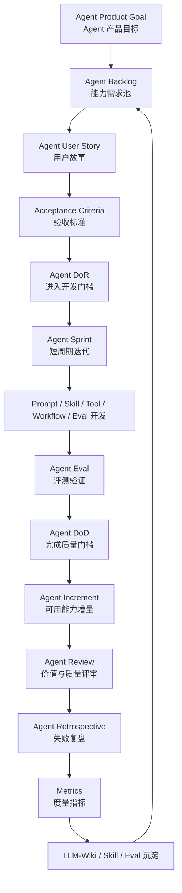

# 敏捷开发 × Agent 工程｜总方法论图谱


## 0. 一句话总定义

> **敏捷 Agent 工程 = 用敏捷开发的目标管理、需求拆解、短周期交付、质量门禁、流动优化、持续评测和复盘沉淀，来持续构建高质量 Agent 系统。**

核心不是“把敏捷概念套到 Agent 上”，而是把 Agent 构建从：

```text
灵感驱动 → 临时 Prompt → 手工修补 → 聊完就丢
```

升级为：

```text
目标驱动 → Backlog 管理 → Sprint 迭代 → Eval 验证 → Review / Retro → LLM-Wiki 沉淀
```

---

# 1. 总方法论闭环



简单理解：

```text
目标决定做什么
Backlog 管理能力池
User Story 拆清需求
AC 定义验收边界
DoR 控制输入质量
Sprint 组织短周期交付
Eval 验证稳定性
DoD 控制输出质量
Review 判断价值
Retro 复盘失败
Metrics 观察趋势
LLM-Wiki 沉淀方法
然后进入下一轮迭代
```

---

# 2. 九个阶段整合成一张总图

| 阶段 | 敏捷学习主题 | Agent 工程迁移结果 |
|---:|---|---|
| 阶段一 | 认知入门 | 理解 Agent 工程为什么需要快速反馈和持续迭代 |
| 阶段二 | Scrum 基础框架 | 建立 Agent Sprint、Agent Review、Agent Retro |
| 阶段三 | 需求拆解与用户故事 | 把模糊 Agent 想法拆成 Agent User Story 和 AC |
| 阶段四 | 计划、估算与交付管理 | 为 Agent Story 估点、规划 Release、管理范围 |
| 阶段五 | Kanban 与流程优化 | 管理 Agent 能力从想法到 Done 的流动 |
| 阶段六 | 工程质量与持续交付 | 建立 Agent DoR、DoD、Eval、Review、CI/CD、回滚 |
| 阶段七 | 度量、复盘与持续改进 | 用指标和 Retro 改进 Prompt / Skill / Tool / Eval |
| 阶段八 | 迁移到 Agent 工程 | 形成完整敏捷 Agent 工程闭环 |
| 阶段九 | 实战与方法论沉淀 | 构建 Skill、Prompt Workflow、Agent Backlog、Eval Sprint、Agent System Design |

---

# 3. 敏捷开发 × Agent 工程核心映射表

| 敏捷开发概念 | Agent 工程对应物 | 作用 |
|---|---|---|
| Product Goal | Agent Product Goal | 定义 Agent 系统长期目标 |
| Product Backlog | Agent Backlog | 管理 Agent 能力池 |
| User Story | Agent User Story | 把模糊想法转成可开发需求 |
| Acceptance Criteria | Agent Acceptance Criteria | 定义输出是否合格 |
| Definition of Ready | Agent DoR | 判断需求是否可以进入开发 |
| Sprint | Agent Sprint | 短周期构建 Agent 能力 |
| Sprint Goal | Agent Sprint Goal | 本轮要交付的能力目标 |
| Sprint Backlog | Agent Sprint Backlog | 本轮 Prompt / Skill / Tool / Eval 任务 |
| Increment | Agent Increment | 可验证的 Agent 能力增量 |
| Definition of Done | Agent DoD | 判断能力是否真正完成 |
| Review | Agent Review | 检查输出价值和质量 |
| Retrospective | Agent Retro | 把失败转成改进资产 |
| Velocity | Agent Velocity | 判断每轮可交付能力容量 |
| Kanban | Agent Kanban | 管理 Agent 能力流动 |
| WIP Limit | Agent WIP Limit | 限制同时开发过多能力 |
| Cycle Time | Agent Cycle Time | 从开始处理到完成的时间 |
| Lead Time | Agent Lead Time | 从想法提出到能力可用的时间 |
| Defect Rate | Agent Defect Rate | 输出缺陷比例 |
| Escaped Defects | Escaped Agent Defects | Eval 没发现但真实任务暴露的问题 |
| Technical Debt | Agent 技术债 | Prompt、Skill、Tool、Eval、Context 债务 |
| CI/CD | Agent CI/CD | Prompt / Skill / Eval 的持续测试和版本发布 |
| Knowledge Base | LLM-Wiki | 沉淀方法、失败案例、模板和规则 |

---

# 4. 总方法论分层结构

## 4.1 第一层：战略目标层

解决问题：

```text
这个 Agent 系统长期解决什么问题？
```

对应资产：

| 资产 | 作用 |
|---|---|
| Agent Product Goal | 长期目标 |
| Capability Roadmap | 能力路线图 |
| Agent Backlog | 能力需求池 |
| Release Plan | 版本计划 |

示例：

```text
Agent Product Goal：
构建一个能帮助我创建高质量 Agent / Skill / Prompt Workflow 的工程化助手。
```

---

## 4.2 第二层：需求建模层

解决问题：

```text
模糊想法如何变成可开发、可验收的需求？
```

对应资产：

| 资产 | 作用 |
|---|---|
| Agent User Story | 描述用户、目标、价值 |
| Acceptance Criteria | 定义完成条件 |
| INVEST 检查 | 判断需求质量 |
| Story Mapping | 组织用户任务路径 |
| Story Splitting | 拆成小价值切片 |

标准路径：

```text
模糊想法
→ 用户目标
→ Agent User Story
→ Acceptance Criteria
→ INVEST
→ Story Splitting
→ Sprint Backlog
```

---

## 4.3 第三层：迭代交付层

解决问题：

```text
怎么短周期交付一个可验证 Agent 能力？
```

对应资产：

| 资产 | 作用 |
|---|---|
| Agent Sprint Goal | 本轮目标 |
| Agent Sprint Backlog | 本轮任务 |
| Agent Increment | 本轮可用成果 |
| Agent Review | 检查价值 |
| Agent Retrospective | 改进流程 |

标准路径：

```text
Agent Sprint Goal
→ Sprint Backlog
→ Prompt / Skill / Tool / Eval 开发
→ Agent Increment
→ Review
→ Retro
```

---

## 4.4 第四层：质量保障层

解决问题：

```text
如何避免“看起来完成了，其实不可用”？
```

对应资产：

| 资产 | 作用 |
|---|---|
| Agent DoR | 输入质量门槛 |
| Agent DoD | 输出质量门槛 |
| Agent Eval | 自动化 / 半自动化评测 |
| Review Checklist | 人工质量检查 |
| Regression Suite | 回归测试 |
| Changelog | 版本记录 |
| Rollback Plan | 回滚策略 |

核心原则：

```text
DoR 防止模糊需求进入 Sprint
DoD 防止半成品进入系统
Eval 防止改坏了不知道
Review 防止质量判断单点化
Rollback 防止失败不可恢复
```

---

## 4.5 第五层：流动优化层

解决问题：

```text
Agent 能力从想法到 Done 的流程哪里堵住？
```

对应资产：

| 资产 | 作用 |
|---|---|
| Agent Kanban Board | 可视化工作流 |
| WIP Limit | 限制同时进行的工作 |
| Cycle Time | 处理时间 |
| Lead Time | 用户等待时间 |
| Bottleneck Report | 瓶颈分析 |

推荐 Agent Kanban：

```text
Backlog
→ Ready
→ Designing
→ Building
→ Eval Testing
→ Review
→ Documenting
→ Done
```

---

## 4.6 第六层：度量复盘层

解决问题：

```text
怎么知道 Agent 系统是否真的变好？
```

对应资产：

| 资产 | 作用 |
|---|---|
| Agent Metrics Dashboard | 指标看板 |
| Eval Pass Rate | 测试通过率 |
| Regression Failure Rate | 回归失败率 |
| Tool Call Success Rate | 工具调用成功率 |
| Human Correction Rate | 人工修正率 |
| Escaped Agent Defects | 真实任务逃逸缺陷 |
| Agent Retrospective | 失败复盘 |
| Anti-pattern Checklist | 反模式识别 |

核心原则：

```text
指标不是为了证明 Agent 很强。
指标是为了发现 Agent 哪里不稳定。
```

---

## 4.7 第七层：知识沉淀层

解决问题：

```text
如何让经验不丢失，方法可复用？
```

对应资产：

| 资产 | 作用 |
|---|---|
| LLM-Wiki | 知识库 |
| Prompt Templates | Prompt 模板 |
| Skill Templates | Skill 模板 |
| Eval Case Library | 测试案例库 |
| Failure Pattern Library | 失败模式库 |
| Checklists | 检查清单 |
| Changelog | 版本演进记录 |

沉淀路径：

```text
失败案例
→ Retro
→ 改进规则
→ Eval Case
→ LLM-Wiki
→ Skill / Template
→ 下一轮复用
```

---

# 5. 敏捷 Agent 工程标准作业流程

## 5.1 从想法到交付的 15 步

| 步骤 | 动作 | 输出物 |
|---:|---|---|
| 1 | 记录 Agent 想法 | Agent Idea |
| 2 | 明确长期目标 | Agent Product Goal |
| 3 | 放入能力池 | Agent Backlog |
| 4 | 写用户故事 | Agent User Story |
| 5 | 写验收标准 | Acceptance Criteria |
| 6 | 检查是否 Ready | Agent DoR |
| 7 | 估算复杂度 | Agent Story Point |
| 8 | 选择 Sprint 目标 | Agent Sprint Goal |
| 9 | 拆 Sprint Backlog | Prompt / Skill / Tool / Eval 任务 |
| 10 | 开发能力 | Agent Increment 初版 |
| 11 | 运行 Eval | Eval Result |
| 12 | 检查 DoD | Done / Not Done |
| 13 | 做 Review | Review Report |
| 14 | 做 Retro | Failure / Improvement Report |
| 15 | 沉淀知识 | LLM-Wiki / Eval / Skill / Template |

---

# 6. Agent 工程最小可运行系统

不需要一开始就做完整体系。最小系统包含：

```text
1. Agent Product Goal
2. Agent Backlog
3. Agent User Story
4. Acceptance Criteria
5. Agent DoR
6. Agent DoD
7. Agent Eval Cases
8. Agent Review Checklist
9. Agent Retrospective
10. LLM-Wiki 沉淀
11. Changelog
```

对应目录：

```text
agent-engineering/
  00-index.md
  agent-product-goal.md
  agent-backlog.md
  agent-user-stories.md
  agent-dor.md
  agent-dod.md
  eval-cases.md
  review-checklist.md
  retrospectives.md
  failure-patterns.md
  changelog.md
```

---

# 7. 三条主线

## 7.1 价值主线

```text
Product Goal
→ Backlog
→ User Story
→ Sprint Goal
→ Increment
→ Review
```

核心问题：

```text
我们是否在做最有价值的 Agent 能力？
```

---

## 7.2 质量主线

```text
Acceptance Criteria
→ DoR
→ Eval
→ DoD
→ Review
→ Regression Test
```

核心问题：

```text
这个 Agent 能力是否稳定、可测、可复用？
```

---

## 7.3 改进主线

```text
Metrics
→ Failure
→ Retrospective
→ Improvement Action
→ LLM-Wiki / Eval / Skill
→ Next Sprint
```

核心问题：

```text
这次失败有没有变成下一轮的系统改进？
```

---

# 8. Agent 工程的关键门禁

| 门禁 | 位置 | 阻止什么 |
|---|---|---|
| Agent DoR | Sprint 前 | 阻止模糊需求进入开发 |
| Acceptance Criteria | 开发前 | 阻止无法验收的需求 |
| Eval | 开发中 / Review 前 | 阻止不可重复验证的能力 |
| Agent DoD | Done 前 | 阻止半成品进入系统 |
| Review | 交付前 | 阻止无价值或低质量输出 |
| Retro | Sprint 后 | 阻止失败不被沉淀 |
| Changelog | 版本变更时 | 阻止不可回滚 |
| LLM-Wiki | 经验产生后 | 阻止知识流失 |

---

# 9. Agent 技术债总表

| 债务类型 | 表现 | 治理方式 |
|---|---|---|
| Prompt 债 | Prompt 越改越长 | 模块化、重构、Eval |
| Skill 债 | description 模糊 | 触发测试、边界说明 |
| Tool 债 | 工具误调用 | Tool policy、失败处理 |
| Eval 债 | 测试不足 | 增加正常、边界、失败、回归案例 |
| Context 债 | 上下文污染 | 上下文隔离、摘要、选择机制 |
| Workflow 债 | 流程靠人记 | 固化为模板 / Skill |
| Knowledge 债 | 聊完就丢 | LLM-Wiki 沉淀 |
| Version 债 | 改坏无法回滚 | Changelog、版本管理 |
| Metrics 债 | 不知道是否变好 | 指标看板 |

---

# 10. 敏捷 Agent 工程完整模板

```md
# 敏捷 Agent 工程模板

## 1. Agent Product Goal

这个 Agent 系统长期要解决什么问题？

## 2. Agent Backlog

| ID | Agent Story | 类型 | 价值 | 优先级 | Points | 状态 |
|---|---|---|---|---|---:|---|
| A-001 |  | 新能力 / 质量 / Tool / Eval / 文档 / 技术债 |  |  |  |  |

## 3. Agent User Story

作为 [用户角色]，
我希望 Agent 能 [完成某个任务]，
以便 [获得某种工作价值]。

## 4. Acceptance Criteria

- [ ] 
- [ ] 
- [ ] 

## 5. Agent DoR

- [ ] 用户明确
- [ ] 场景明确
- [ ] 输入明确
- [ ] 输出明确
- [ ] AC 明确
- [ ] 测试样例明确
- [ ] 工具边界明确
- [ ] 可估算

## 6. Agent Sprint

### Sprint Goal

本轮要交付什么 Agent 能力？

### Sprint Backlog

| 任务 | 类型 | Points | 验收 |
|---|---|---:|---|
|  | Prompt / Skill / Tool / Eval / Doc |  |  |

## 7. Agent Eval

| Case | 类型 | 输入 | 预期输出 | 通过标准 |
|---|---|---|---|---|
|  | 正常 / 模糊 / 边界 / 失败 / 回归 / 安全 |  |  |  |

## 8. Agent DoD

- [ ] AC 全部满足
- [ ] 正常案例通过
- [ ] 边界案例通过
- [ ] 失败案例通过
- [ ] 输出结构稳定
- [ ] 工具调用安全
- [ ] 失败案例记录
- [ ] Prompt / Skill / Eval 版本化
- [ ] LLM-Wiki 沉淀

## 9. Agent Review

- Sprint Goal 是否达成？
- 输出是否有价值？
- Eval 是否通过？
- 工具是否安全？
- 下一轮 Backlog 是否需要调整？

## 10. Agent Retrospective

- 失败是什么？
- 根因是什么？
- 改 Prompt、Skill、Tool、Eval、DoD 还是 Wiki？
- 新增什么回归测试？
- 沉淀到哪里？

## 11. Agent Metrics

| 指标 | 当前值 | 观察 |
|---|---:|---|
| Eval Pass Rate |  |  |
| Regression Failure Rate |  |  |
| Tool Call Success Rate |  |  |
| Human Correction Rate |  |  |
| Escaped Agent Defects |  |  |
| Knowledge Capture Rate |  |  |

## 12. Changelog

| 日期 | 版本 | 变更 | 原因 | 回滚点 |
|---|---|---|---|---|
|  |  |  |  |  |
```

---

# 11. LLM-Wiki 推荐目录结构

```text
llm-wiki/
  software-engineering/
    agile-development/
      00-index.md
      agile-agent-methodology-map.md
      01-stage-cognition/
      02-stage-scrum-framework/
      03-stage-requirements-user-stories/
      04-stage-planning-estimation-delivery/
      05-stage-kanban-flow-optimization/
      06-stage-quality-continuous-delivery/
      07-stage-metrics-retrospective-improvement/
      08-stage-agile-agent-engineering/
      09-stage-practice-methodology/

  agent-engineering/
    00-agent-system-index.md
    agent-product-goal.md
    agent-backlog.md
    agent-user-stories.md
    agent-dor.md
    agent-dod.md
    eval-cases.md
    review-checklist.md
    retrospectives.md
    failure-patterns.md
    changelog.md
```

---

# 12. 建议双向链接

```md
相关链接：

- [[敏捷开发完整学习路线图]]
- [[敏捷开发-阶段一-认知入门]]
- [[敏捷开发-阶段二-Scrum基础框架]]
- [[敏捷开发-阶段三-需求拆解与用户故事]]
- [[敏捷开发-阶段四-计划估算与交付管理]]
- [[敏捷开发-阶段五-Kanban与流程优化]]
- [[敏捷开发-阶段六-工程质量与持续交付]]
- [[敏捷开发-阶段七-度量复盘与持续改进]]
- [[敏捷开发-阶段八-敏捷开发迁移到Agent工程]]
- [[敏捷开发-阶段九-实战与方法论沉淀]]
- [[Agent 工程]]
- [[Agent System Design]]
- [[Agent Backlog]]
- [[Agent User Story]]
- [[Agent Evals]]
- [[Prompt Workflow]]
- [[Skill 工程化]]
- [[LLM-Wiki]]
```

---

# 13. 总判断标准

真正掌握“敏捷开发 × Agent 工程”后，应该能做到：

| 能力 | 判断标准 |
|---|---|
| 能理解 | 能解释为什么 Agent 工程天然适合敏捷 |
| 能拆解 | 能把模糊 Agent 想法拆成 Story 和 AC |
| 能规划 | 能构建 Agent Backlog、Sprint、Release Plan |
| 能交付 | 能交付一个可验证 Agent Increment |
| 能评估 | 能设计正常、边界、失败、回归 Eval |
| 能控质 | 能设计 Agent DoR、DoD、Review Checklist |
| 能复盘 | 能把失败案例转成改进行动 |
| 能沉淀 | 能把规则、模板、失败模式写入 LLM-Wiki |
| 能治理 | 能识别 Prompt / Skill / Tool / Eval 技术债 |
| 能系统化 | 能从单 Agent 升级到 Agent System Design |

---

# 14. 最终一句话

> **高质量 Agent 不是一次写出来的，而是通过敏捷迭代、持续评测、失败复盘、质量门禁和知识沉淀逐步长出来的。**
