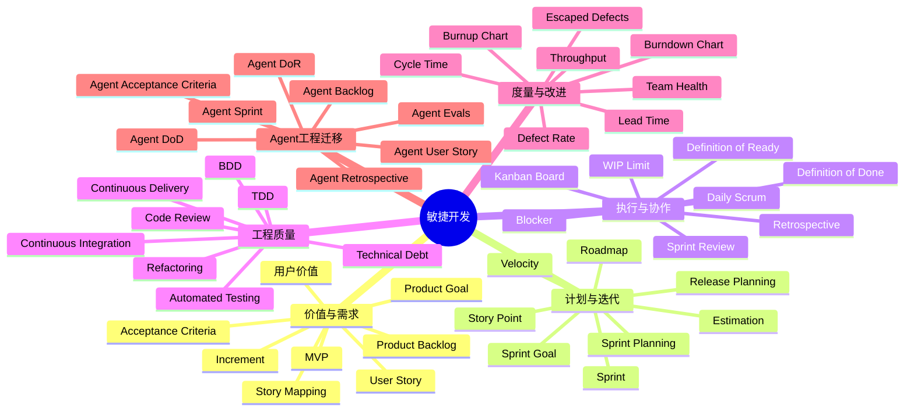

# 敏捷开发完整心智地图

> 用途：这份文档用于放入个人 LLM-Wiki / Obsidian，作为后续学习、复盘、Agent 工程迁移、课程拆解的总入口。  
> 定位：不是正式讲课内容，而是敏捷开发的完整知识地图、学习路线和工程迁移框架。

---

## 0. 一句话定义

**敏捷开发是一套以快速反馈、持续交付、适应变化为核心的软件开发方法体系。**

它不是单一工具，也不是固定流程，而是一种用于处理复杂软件开发不确定性的工程组织方式。

---

## 1. 知识识别层：它属于什么知识

| 维度 | 内容 |
|---|---|
| 知识类型 | 软件工程方法论 / 项目协作方法 / 产品迭代方法 / 工程交付体系 |
| 核心对象 | 需求、团队、迭代、交付、反馈、质量、改进 |
| 主要目的 | 在需求不确定、环境变化快、系统复杂的情况下，持续交付有价值的软件 |
| 学习目标 | 从“知道敏捷名词”升级为“能设计、判断、落地、迁移敏捷方法” |
| 适用范围 | 软件开发、产品迭代、AI Agent 工程、Prompt / Skill / Tool / Eval 迭代 |
| 不适用范围 | 高度确定、强监管、完全线性、变更成本极高且需求稳定的工程场景 |

---

## 2. 知识边界层：敏捷开发是什么，不是什么

### 2.1 敏捷开发是什么

| 结构 | 简单理解 |
|---|---|
| 一种复杂系统开发方法 | 面对不确定性，用短周期持续验证 |
| 一套反馈机制 | 让用户、团队、代码、质量持续反馈 |
| 一种价值交付方式 | 不追求一次做完，而是持续交付可用增量 |
| 一种协作系统 | 产品、开发、测试、运维围绕共同目标协作 |
| 一种持续改进机制 | 每轮迭代后复盘流程、质量和协作问题 |

### 2.2 敏捷开发不是什么

| 误解 | 正确理解 |
|---|---|
| 敏捷不是“没有计划” | 敏捷有计划，只是计划会根据反馈动态调整 |
| 敏捷不是“不要文档” | 敏捷反对低价值文档，不反对必要文档 |
| 敏捷不是“快速乱做” | 敏捷强调小步快跑，但必须有质量门禁 |
| 敏捷不是“每天开会” | 站会只是同步机制，不是敏捷本体 |
| 敏捷不是“Scrum” | Scrum 只是敏捷框架之一 |
| 敏捷不是“项目管理工具” | Jira、Trello、Linear 只是承载流程的工具 |

---

## 3. 相邻概念区分层

| 概念 | 核心关注 | 和敏捷的关系 | 简单理解 |
|---|---|---|---|
| 瀑布开发 | 先完整规划，再线性执行 | 敏捷的主要对照对象 | 一次性大计划 |
| 敏捷开发 | 快速反馈、持续适应 | 总方法论 | 小步快跑、边做边学 |
| Scrum | 角色、事件、工件 | 敏捷的一种框架 | 固定节奏的团队协作框架 |
| Kanban | 可视化流程、限制在制品 | 敏捷 / 精益方法 | 看板拉动工作流 |
| Lean 精益 | 消除浪费、优化价值流 | 敏捷的重要思想来源 | 少做无用功 |
| XP 极限编程 | 工程实践、代码质量 | 敏捷工程实践体系 | 用技术实践保证敏捷质量 |
| DevOps | 开发、测试、运维协同 | 敏捷交付能力的工程延伸 | 让软件能持续上线 |
| CI/CD | 持续集成、持续交付 / 部署 | 敏捷工程基础设施 | 自动化交付流水线 |
| 产品管理 | 定义价值、发现需求 | 敏捷的上游输入 | 决定做什么、为什么做 |
| 项目管理 | 范围、时间、资源、风险 | 敏捷可作为项目管理方式之一 | 组织交付过程 |
| Agent 工程 | 构建可执行、可评估、可迭代的智能系统 | 可迁移敏捷方法 | 把 Agent 当复杂软件系统来迭代 |

---

## 4. 前置知识层

| 前置知识 | 必要程度 | 为什么需要 |
|---|---:|---|
| 软件开发基本流程 | 高 | 理解需求、设计、开发、测试、发布之间的关系 |
| 产品需求基础 | 高 | 敏捷围绕用户价值和需求迭代展开 |
| 项目管理基础 | 中 | 理解进度、风险、资源、范围控制 |
| Git / 版本管理 | 中 | 真实敏捷开发离不开分支、合并、回滚 |
| 测试基础 | 中 | 敏捷强调持续验证，不懂测试会只剩流程 |
| DevOps / CI/CD 基础 | 中 | 进阶阶段需要理解持续交付 |
| Agent / LLM 工程基础 | 中 | 迁移到 Agent 工程时需要理解 Prompt、Tool、Skill、Eval |
| 团队协作基础 | 中 | 敏捷本质上是协作系统，不只是个人方法 |

---

## 5. 核心概念层

### 5.1 总体概念图



### 5.2 价值与需求层

| 概念 | 简单理解 |
|---|---|
| 用户价值 | 做出来的东西是否真的有用 |
| Product Goal | 产品阶段性目标 |
| Product Backlog | 产品需求池 |
| User Story | 从用户视角描述需求 |
| Acceptance Criteria | 判断需求是否完成的验收标准 |
| Story Mapping | 按用户旅程组织需求 |
| MVP | 最小可验证产品 |
| Increment | 每次迭代产生的可用增量 |

### 5.3 计划与迭代层

| 概念 | 简单理解 |
|---|---|
| Sprint | 固定周期的迭代 |
| Sprint Planning | 迭代计划会 |
| Sprint Goal | 本轮迭代目标 |
| Estimation | 工作量估算 |
| Story Point | 相对复杂度估算单位 |
| Velocity | 团队历史交付速率 |
| Release Planning | 发布计划 |
| Roadmap | 产品方向路线图 |

### 5.4 执行与协作层

| 概念 | 简单理解 |
|---|---|
| Daily Scrum | 每日同步阻塞和进展 |
| Kanban Board | 可视化工作流 |
| WIP Limit | 限制同时进行的任务数量 |
| Blocker | 阻塞项 |
| Definition of Ready | 需求准备好的标准 |
| Definition of Done | 任务完成的标准 |
| Review | 演示和反馈 |
| Retrospective | 复盘和改进 |

### 5.5 工程质量层

| 概念 | 简单理解 |
|---|---|
| TDD | 测试驱动开发 |
| BDD | 行为驱动开发 |
| Refactoring | 重构 |
| Continuous Integration | 持续集成 |
| Continuous Delivery | 持续交付 |
| Automated Testing | 自动化测试 |
| Code Review | 代码评审 |
| Technical Debt | 技术债 |

### 5.6 度量与改进层

| 概念 | 简单理解 |
|---|---|
| Burndown Chart | 剩余工作燃尽图 |
| Burnup Chart | 已完成工作增长图 |
| Cycle Time | 单个任务从开始到完成的时间 |
| Lead Time | 从提出需求到交付的总时间 |
| Throughput | 单位时间完成多少任务 |
| Defect Rate | 缺陷率 |
| Escaped Defects | 线上逃逸缺陷 |
| Team Health | 团队协作健康度 |

---

## 6. 底层原理层

| 原理 | 简单理解 | 在 Agent 工程中的对应 |
|---|---|---|
| 经验性过程控制 | 复杂系统不能完全预先规划，需要边做边学 | Agent 不能一次设计完美，需要测试和迭代 |
| 快速反馈 | 越早发现问题，修正成本越低 | Prompt、Tool、Memory、Eval 都要快速验证 |
| 小批量交付 | 小步交付比大批量交付风险低 | 先做最小可用 Agent，再逐步增强 |
| 透明化 | 状态不可见就无法管理 | Agent 任务流、日志、评测结果需要可见 |
| 自组织团队 | 复杂问题需要执行者参与决策 | Agent 工程需要产品、开发、评测共同协作 |
| 持续改进 | 每轮都优化流程和质量 | 每次失败都沉淀成规则、测试、Skill |
| 价值优先 | 不是完成任务最多，而是交付价值最大 | Agent 功能要围绕真实工作效率提升 |
| 质量内建 | 质量不能留到最后补 | Agent 需要从一开始设计评估标准和防漂移机制 |

---

## 7. 工程实现层

### 7.1 软件敏捷工程模块

| 模块 | 作用 |
|---|---|
| 需求管理 | 收集、拆分、排序、验收需求 |
| Backlog 管理 | 维护产品需求池 |
| 迭代管理 | 规划 Sprint、跟踪进度 |
| 看板管理 | 可视化任务流转 |
| 估算管理 | 评估复杂度和容量 |
| 质量管理 | 测试、评审、验收、缺陷控制 |
| 发布管理 | 管理版本、灰度、上线 |
| 复盘管理 | 发现问题、改进流程 |
| 度量管理 | 用数据判断交付效率和质量 |
| 文档沉淀 | 把经验转成可复用资产 |

### 7.2 Agent 工程对应模块

| 敏捷模块 | Agent 工程对应模块 |
|---|---|
| User Story | Agent 使用场景 / 用户任务 |
| Acceptance Criteria | Agent 输出验收标准 |
| Product Backlog | Agent 能力需求池 |
| Sprint | Agent 能力迭代周期 |
| Definition of Ready | Agent 需求进入开发前的准备标准 |
| Definition of Done | Agent 能力完成标准 |
| Review | Agent 演示、测试、对比输出 |
| Retrospective | Agent 失败案例复盘 |
| Test Case | Prompt / Skill / Tool / Workflow 测试用例 |
| CI/CD | Agent 配置、Prompt、Skill、代码的持续集成 |
| Technical Debt | Prompt 债、流程债、评测债、上下文债 |
| Velocity | Agent 工程团队稳定交付能力 |

---

## 8. 应用场景层

### 8.1 软件开发场景

| 场景 | 敏捷怎么用 |
|---|---|
| 新产品从 0 到 1 | 用 MVP + Sprint 快速验证 |
| 需求不清晰 | 用 Story Mapping 拆清用户路径 |
| 需求频繁变化 | 用 Backlog 动态排序 |
| 团队协作混乱 | 用 Scrum 明确节奏和角色 |
| 交付效率低 | 用 Kanban + WIP Limit 优化流动 |
| 缺陷频繁出现 | 用 DoD + 自动化测试 + Code Review |
| 上线风险高 | 用 CI/CD + 小批量发布 |
| 项目延期严重 | 用 Velocity + 范围调整控制风险 |

### 8.2 Agent 工程场景

| 场景 | 敏捷怎么迁移 |
|---|---|
| 构建复杂 Agent | 先定义 Agent Backlog，再按能力迭代 |
| Prompt 反复漂移 | 为 Prompt 建立验收标准和回归测试 |
| Skill 质量不稳定 | 用 DoR / DoD / Evals 管理 Skill 交付 |
| 多 Tool 调用混乱 | 用任务流建模和集成测试控制复杂度 |
| Agent 输出不可靠 | 用测试集、边界案例、失败案例复盘 |
| 需求一开始模糊 | 用 Discovery Sprint 做需求挖掘 |
| 多 Agent 协作 | 用角色、接口、事件流、评测标准拆分 |
| Agent 系统持续升级 | 用版本管理、变更记录、持续评测沉淀能力 |

---

## 9. 常见误区层

| 误区 | 错在哪里 | 正确理解 |
|---|---|---|
| 敏捷就是快 | 快不是目的，快速反馈才是目的 | 敏捷追求低风险、高适应性 |
| 敏捷不要文档 | 不要低价值文档，不是不写文档 | 必要文档必须保留 |
| Scrum 等于敏捷 | Scrum 只是框架之一 | 敏捷包括 Scrum、Kanban、XP、Lean 等 |
| 每天开站会就是敏捷 | 站会只是同步机制 | 核心是交付、反馈、改进 |
| Sprint 内不能变 | Sprint 目标要稳定，但 Backlog 可持续调整 | 保护当前迭代，调整未来迭代 |
| 速度越高越好 | Velocity 不是绩效指标 | 它是容量预测工具 |
| Story Point 是工时 | Story Point 是相对复杂度 | 不能直接等同小时 |
| DoD 是形式主义 | DoD 是质量门禁 | 没有 DoD 就无法判断完成 |
| 回顾会只是聊天 | 回顾会要产生改进行动 | 否则无法持续改进 |
| Agent 工程只靠 Prompt | Prompt 只是入口 | 高质量 Agent 需要流程、工具、测试、评估、版本管理 |

---

## 10. 学习顺序层

### 10.1 总体路径

```text
第一阶段：理解敏捷是什么
↓
第二阶段：掌握 Scrum / Kanban / User Story 等基础框架
↓
第三阶段：掌握需求拆分、估算、迭代、交付
↓
第四阶段：掌握工程质量实践：测试、CI/CD、DoD、重构
↓
第五阶段：掌握度量、复盘、持续改进
↓
第六阶段：迁移到 Agent 工程
↓
第七阶段：形成自己的敏捷 Agent 工程方法论
```

### 10.2 推荐学习节奏

| 阶段 | 重点 | 建议学习方式 |
|---|---|---|
| 第 0–4 章 | 建立认知边界 | 先理解，不急着操作 |
| 第 5–11 章 | Scrum 基础 | 用一个虚拟项目模拟 |
| 第 12–18 章 | 需求拆解 | 重点练 User Story 和验收标准 |
| 第 19–30 章 | 计划与流程 | 结合看板和迭代练习 |
| 第 31–38 章 | 工程质量 | 和真实代码 / Agent 工程结合 |
| 第 39–45 章 | 度量与复盘 | 学会判断流程好坏 |
| 第 46–57 章 | 迁移到 Agent 工程 | 核心目标阶段 |
| 第 58–63 章 | 实战沉淀 | 形成个人方法论和模板 |

---

## 11. 掌握标准层

| 掌握层级 | 判断标准 |
|---|---|
| 听过 | 能说出 Agile、Scrum、Sprint、Backlog 等词 |
| 理解 | 能解释敏捷为什么不是“快”和“无计划” |
| 能判断 | 能识别一个团队是真敏捷还是伪敏捷 |
| 能使用 | 能拆 User Story、写验收标准、组织 Sprint |
| 能落地 | 能搭建 Backlog、看板、DoR、DoD、Review、Retro |
| 能优化 | 能根据数据发现流程瓶颈 |
| 能迁移 | 能把敏捷方法迁移到 Agent 工程 |
| 能沉淀 | 能形成自己的流程模板、检查清单、评估标准和工程规范 |

---

## 12. 分级学习层

### 12.1 入门内容

| 内容 | 目标 |
|---|---|
| 敏捷是什么 | 建立正确认知 |
| 敏捷 vs 瀑布 | 理解边界 |
| Scrum 基础 | 掌握最常见框架 |
| User Story | 学会从用户价值表达需求 |
| Backlog | 理解需求池 |
| Sprint | 理解迭代节奏 |
| Review / Retro | 理解反馈和改进 |

### 12.2 进阶内容

| 内容 | 目标 |
|---|---|
| Story Mapping | 系统化拆需求 |
| Story Splitting | 把大需求拆成小需求 |
| INVEST 原则 | 判断 User Story 质量 |
| DoR / DoD | 建立质量门禁 |
| Velocity | 用历史数据做容量预测 |
| Kanban | 优化工作流 |
| WIP Limit | 减少并行浪费 |
| CI/CD | 建立持续交付能力 |
| 自动化测试 | 提升质量稳定性 |
| 技术债管理 | 避免越做越慢 |

### 12.3 专家级内容

| 内容 | 目标 |
|---|---|
| 敏捷转型 | 从团队实践升级到组织系统 |
| 复杂产品 Backlog 架构 | 管理多模块、多团队需求 |
| 度量系统设计 | 用数据驱动流程改进 |
| 大规模敏捷 | 处理多团队协同 |
| 敏捷与产品战略 | 让迭代服务于长期战略 |
| 敏捷与 Agent 工程 | 把敏捷迁移到 AI 系统构建 |
| Agent Evals 敏捷化 | 让评估成为迭代核心 |
| Prompt / Skill / Tool 的敏捷工程化 | 把 Agent 能力变成可持续交付资产 |
| 个人知识库沉淀 | 形成可复用方法论 |

---

## 13. 完整课程大纲

### 阶段一：认知入门

| 章节 | 主题 | 学习目标 |
|---:|---|---|
| 第 0 章 | 敏捷开发全景图 | 建立整体地图，知道要学什么 |
| 第 1 章 | 敏捷到底是什么 | 分清敏捷的本质、边界和误区 |
| 第 2 章 | 敏捷 vs 瀑布 vs 精益 vs DevOps | 理解相邻概念的区别 |
| 第 3 章 | 敏捷宣言与 12 条原则 | 理解敏捷的思想根基 |
| 第 4 章 | 为什么敏捷适合复杂系统 | 理解不确定性、反馈和小批量交付 |

### 阶段二：Scrum 基础框架

| 章节 | 主题 | 学习目标 |
|---:|---|---|
| 第 5 章 | Scrum 框架总览 | 掌握 Scrum 的角色、事件、工件 |
| 第 6 章 | Product Owner、Scrum Master、Developers | 理解角色分工 |
| 第 7 章 | Product Backlog 与 Sprint Backlog | 掌握需求池和迭代任务池 |
| 第 8 章 | Sprint Planning | 学会规划一个迭代 |
| 第 9 章 | Daily Scrum | 学会每日同步，不做低效站会 |
| 第 10 章 | Sprint Review | 学会用演示获取反馈 |
| 第 11 章 | Sprint Retrospective | 学会复盘和持续改进 |

### 阶段三：需求拆解与用户故事

| 章节 | 主题 | 学习目标 |
|---:|---|---|
| 第 12 章 | User Story 用户故事 | 学会从用户价值表达需求 |
| 第 13 章 | User Story Template | 掌握标准表达格式 |
| 第 14 章 | Acceptance Criteria 验收标准 | 学会定义完成条件 |
| 第 15 章 | INVEST 原则 | 判断用户故事质量 |
| 第 16 章 | Story Mapping | 用用户旅程组织需求 |
| 第 17 章 | Story Splitting | 把大需求拆成可交付小需求 |
| 第 18 章 | MVP 与 Increment | 学会定义最小可验证增量 |

### 阶段四：计划、估算与交付管理

| 章节 | 主题 | 学习目标 |
|---:|---|---|
| 第 19 章 | 估算的本质 | 理解估算不是承诺，而是预测 |
| 第 20 章 | Story Point | 掌握相对复杂度估算 |
| 第 21 章 | Velocity | 用历史交付速率规划容量 |
| 第 22 章 | Release Planning | 学会做发布计划 |
| 第 23 章 | Roadmap 与 Sprint 的关系 | 理解长期方向和短期迭代 |
| 第 24 章 | Scope、Time、Quality 的权衡 | 学会处理延期和范围变化 |

### 阶段五：Kanban 与流程优化

| 章节 | 主题 | 学习目标 |
|---:|---|---|
| 第 25 章 | Kanban 基础 | 掌握看板方法 |
| 第 26 章 | 工作流可视化 | 学会设计任务流转状态 |
| 第 27 章 | WIP Limit | 学会限制并行工作 |
| 第 28 章 | Cycle Time 与 Lead Time | 学会衡量流动效率 |
| 第 29 章 | 瓶颈识别 | 学会发现流程卡点 |
| 第 30 章 | Scrum 与 Kanban 组合使用 | 掌握 Scrumban 思路 |

### 阶段六：工程质量与持续交付

| 章节 | 主题 | 学习目标 |
|---:|---|---|
| 第 31 章 | Definition of Ready | 学会判断需求是否准备好 |
| 第 32 章 | Definition of Done | 学会定义完成质量标准 |
| 第 33 章 | 自动化测试 | 理解测试在敏捷中的位置 |
| 第 34 章 | TDD / BDD | 理解测试驱动和行为驱动 |
| 第 35 章 | Code Review | 掌握代码评审的质量作用 |
| 第 36 章 | Refactoring | 理解重构与技术债管理 |
| 第 37 章 | CI/CD | 掌握持续集成和持续交付 |
| 第 38 章 | 发布、灰度与回滚 | 学会降低上线风险 |

### 阶段七：度量、复盘与持续改进

| 章节 | 主题 | 学习目标 |
|---:|---|---|
| 第 39 章 | 敏捷度量的边界 | 避免把指标当绩效 |
| 第 40 章 | Burndown / Burnup | 学会看燃尽图和燃起图 |
| 第 41 章 | Throughput、Cycle Time、Lead Time | 掌握流程效率指标 |
| 第 42 章 | 缺陷率与逃逸缺陷 | 掌握质量指标 |
| 第 43 章 | Team Health | 评估团队协作健康度 |
| 第 44 章 | Retrospective 深度复盘 | 把问题转成改进行动 |
| 第 45 章 | 敏捷反模式识别 | 识别伪敏捷和流程失效 |

### 阶段八：敏捷开发迁移到 Agent 工程

| 章节 | 主题 | 学习目标 |
|---:|---|---|
| 第 46 章 | 为什么 Agent 工程需要敏捷 | 理解 Agent 系统的不确定性 |
| 第 47 章 | Agent Backlog | 建立 Agent 能力需求池 |
| 第 48 章 | Agent User Story | 用用户任务定义 Agent 需求 |
| 第 49 章 | Agent Acceptance Criteria | 为 Agent 输出定义验收标准 |
| 第 50 章 | Prompt / Skill / Tool 的迭代管理 | 把 Agent 能力拆成可迭代模块 |
| 第 51 章 | Agent DoR / DoD | 建立 Agent 工程质量门禁 |
| 第 52 章 | Agent Evals | 把评估测试纳入迭代流程 |
| 第 53 章 | Agent Sprint | 设计 Agent 能力迭代周期 |
| 第 54 章 | Agent Review | 演示、对比和验证 Agent 能力 |
| 第 55 章 | Agent Retrospective | 从失败案例中沉淀规则 |
| 第 56 章 | Agent 技术债 | 管理 Prompt 债、上下文债、工具债、评测债 |
| 第 57 章 | 敏捷 Agent 工程模板 | 形成可复用工程方法 |

### 阶段九：实战与方法论沉淀

| 章节 | 主题 | 学习目标 |
|---:|---|---|
| 第 58 章 | 实战一：用敏捷方法构建一个 Skill | 从需求到验收完整实践 |
| 第 59 章 | 实战二：用敏捷方法优化一个 Prompt 工作流 | 建立迭代、测试、复盘机制 |
| 第 60 章 | 实战三：构建 Agent 工程 Backlog | 管理复杂 Agent 能力池 |
| 第 61 章 | 实战四：设计 Agent Eval Sprint | 用评测驱动 Agent 改进 |
| 第 62 章 | 实战五：建立个人敏捷 Agent 工程体系 | 沉淀自己的模板和标准 |
| 第 63 章 | 最终章：从敏捷开发到敏捷 Agent System Design | 形成系统级迁移能力 |

---

## 14. Agent 工程迁移框架

### 14.1 敏捷到 Agent 工程的核心映射

| 敏捷开发 | Agent 工程 |
|---|---|
| Product Goal | Agent 系统目标 |
| Product Backlog | Agent 能力需求池 |
| User Story | 用户任务场景 |
| Acceptance Criteria | 输出验收标准 |
| Sprint | 能力迭代周期 |
| Increment | 可运行 Agent 能力增量 |
| Definition of Ready | 需求进入开发前的准备标准 |
| Definition of Done | Agent 能力完成标准 |
| Review | Agent 演示、对比、验证 |
| Retrospective | 失败案例复盘 |
| Test Case | Prompt / Skill / Tool / Eval 测试用例 |
| Technical Debt | Prompt 债、上下文债、工具债、评测债 |
| CI/CD | Prompt、Skill、配置、测试集的持续集成 |

### 14.2 Agent 工程中的敏捷循环

```text
需求发现
↓
Agent User Story
↓
Acceptance Criteria
↓
Agent Backlog
↓
Agent Sprint
↓
Prompt / Skill / Tool 实现
↓
Agent Evals
↓
Review
↓
Retrospective
↓
沉淀为模板、规则、测试集、知识库
```

### 14.3 迁移后的核心原则

| 原则 | 在 Agent 工程中的含义 |
|---|---|
| 不一次性追求完美 Agent | 先做最小可用能力，再迭代 |
| 不只看单次输出 | 要看稳定性、边界案例、回归表现 |
| 不只写 Prompt | 要设计流程、工具、评测、版本管理 |
| 不只修 Bug | 要把失败沉淀为测试用例和规则 |
| 不只靠感觉判断质量 | 要有明确验收标准和 Eval 数据 |
| 不只做功能堆叠 | 要持续管理技术债和复杂度 |

---

## 15. 可复用模板层

### 15.1 User Story 模板

```md
作为【用户角色】，
我想要【完成某个目标】，
以便【获得某种价值】。
```

### 15.2 Acceptance Criteria 模板

```md
## 验收标准

- Given【前置条件】
- When【用户行为 / 系统行为】
- Then【预期结果】

补充标准：
- 输出必须包含：
- 输出不得包含：
- 边界情况：
- 失败处理：
```

### 15.3 Definition of Ready 模板

```md
## Definition of Ready

进入开发前，需求必须满足：

- [ ] 用户角色明确
- [ ] 用户目标明确
- [ ] 用户价值明确
- [ ] 验收标准明确
- [ ] 边界条件明确
- [ ] 依赖项明确
- [ ] 风险点明确
- [ ] 可以在一个迭代内完成或已拆分
```

### 15.4 Definition of Done 模板

```md
## Definition of Done

完成前，任务必须满足：

- [ ] 功能已实现
- [ ] 验收标准全部通过
- [ ] 测试用例通过
- [ ] 边界情况已验证
- [ ] 文档已更新
- [ ] 代码 / Prompt / Skill 已版本化
- [ ] 已完成 Review
- [ ] 已沉淀失败案例或经验
```

### 15.5 Agent Backlog Item 模板

```md
## Agent Backlog Item

- 名称：
- 用户任务：
- 目标价值：
- 输入：
- 输出：
- 工具依赖：
- 上下文依赖：
- 验收标准：
- 测试用例：
- 风险：
- 优先级：
- 状态：
```

### 15.6 Agent Sprint 复盘模板

```md
## Agent Sprint Retrospective

### 本轮目标

### 已完成能力

### 未完成内容

### 失败案例

### 根因分析

### 需要沉淀的规则

### 需要新增的测试用例

### 需要更新的文档

### 下一轮改进重点
```

---

## 16. 个人 LLM-Wiki 建议拆分

如果后续要拆成多篇知识卡片，可以按下面方式拆分：

```text
knowledge-base/
  02-software-engineering/
    agile-development/
      agile-development-complete-mindmap.md
      agile-vs-waterfall-lean-devops.md
      scrum-framework.md
      user-story.md
      acceptance-criteria.md
      story-mapping.md
      story-splitting.md
      invest-principle.md
      definition-of-ready.md
      definition-of-done.md
      velocity.md
      kanban.md
      agile-metrics.md
      agile-retrospective.md
      agile-anti-patterns.md
  04-agent-engineering/
    agile-agent-engineering/
      agent-backlog.md
      agent-user-story.md
      agent-acceptance-criteria.md
      agent-dor-dod.md
      agent-evals-sprint.md
      agent-technical-debt.md
      agile-agent-system-design.md
```

---

## 17. 推荐双向链接

```md
[[软件工程]]
[[项目管理]]
[[产品管理]]
[[Scrum]]
[[Kanban]]
[[User Story]]
[[Acceptance Criteria]]
[[Definition of Ready]]
[[Definition of Done]]
[[Velocity]]
[[CI/CD]]
[[DevOps]]
[[Agent Engineering]]
[[Skill Engineering]]
[[Prompt Engineering]]
[[Agent Evals]]
[[LLM Wiki]]
```

---

## 18. 后续学习入口

建议正式教学从这里开始：

```text
第 0 章：敏捷开发全景图
```

这一章的目标不是深入细节，而是建立完整心智地图，避免后续学习 Scrum、Kanban、User Story、Velocity、DoD 时变成碎片化理解。

---

## 19. Changelog

| 日期 | 版本 | 变更 |
|---|---|---|
| 2026-05-20 | v0.1.0 | 根据对话生成敏捷开发完整心智地图，适配 LLM-Wiki / Obsidian 沉淀 |
