# 敏捷开发｜阶段一：认知入门

## 0. 本文定位

这篇笔记沉淀的是敏捷开发课程的**阶段一：认知入门**。

本阶段不直接进入 Scrum、Kanban、Velocity、User Story 等操作细节，而是先建立敏捷开发的底层心智模型。

核心目标：

| 目标 | 说明 |
|---|---|
| 理解敏捷是什么 | 避免把敏捷误解成“快”“少文档”“天天开会” |
| 理解敏捷为什么存在 | 看到它解决的是复杂系统的不确定性问题 |
| 理解敏捷和相邻概念的边界 | 区分瀑布、敏捷、精益、DevOps、Scrum |
| 理解敏捷为什么适合 Agent 工程 | 把敏捷迁移到 Prompt、Skill、Tool、Eval、Workflow 的工程迭代中 |
| 建立后续学习地基 | 为 Scrum、User Story、DoD、Velocity、CI/CD、Agent Sprint 做准备 |

---

# 1. 阶段一总览

| 章节 | 主题 | 学习目标 |
|---:|---|---|
| 第 0 章 | 敏捷开发全景图 | 建立整体地图，知道敏捷解决什么问题 |
| 第 1 章 | 敏捷到底是什么 | 分清敏捷的本质、边界和常见误区 |
| 第 2 章 | 敏捷 vs 瀑布 vs 精益 vs DevOps | 建立相邻概念边界 |
| 第 3 章 | 敏捷宣言与 12 条原则 | 理解敏捷思想来源 |
| 第 4 章 | 为什么敏捷适合复杂系统 | 理解反馈、小批量交付和不确定性管理 |

---

# 2. 阶段一核心结论

## 2.1 一句话理解敏捷

> 敏捷开发不是“快速开发”，而是通过短周期交付、真实反馈和持续改进，在不确定环境中稳定交付用户价值的开发方式。

## 2.2 敏捷解决的根本问题

软件开发、Agent 工程、复杂产品构建都有一个共同特征：

> 一开始无法完全知道正确答案。

因此，传统的“一次性规划 → 长周期开发 → 最后验收”容易失败。

敏捷的解决方式是：

```text
提出假设
  ↓
拆成小增量
  ↓
短周期交付
  ↓
获得真实反馈
  ↓
修正方向
  ↓
进入下一轮迭代
```

## 2.3 敏捷的关键词

| 错误关键词 | 正确关键词 |
|---|---|
| 快 | 反馈 |
| 乱改 | 适应 |
| 少文档 | 有价值文档 |
| 多开会 | 高质量协作 |
| 做完任务 | 交付价值 |
| 追求速度 | 降低风险 |
| 一次做完 | 小步验证 |
| 流程形式 | 持续改进 |

---

# 3. 第 0 章：敏捷开发全景图

## 3.1 敏捷开发解决的核心问题

| 复杂问题 | 传统做法的问题 | 敏捷做法 |
|---|---|---|
| 需求不清楚 | 前期文档写很多，但方向可能错 | 先做小版本验证 |
| 用户反馈晚 | 做完才知道没人要 | 每轮都获取反馈 |
| 技术不确定 | 前期估算不准 | 用迭代逐步逼近 |
| 变化频繁 | 计划被不断打破 | 让计划具备可调整性 |
| 质量不可见 | 最后集中爆雷 | 每轮交付都做质量验证 |

## 3.2 敏捷的整体结构

```text
用户价值
  ↓
Product Backlog 需求池
  ↓
User Story 用户故事
  ↓
Sprint / Flow 短周期执行
  ↓
Increment 可用增量
  ↓
Review 获取反馈
  ↓
Retrospective 改进流程
  ↓
下一轮迭代
```

简单理解：

> 敏捷就是把“大而不确定的目标”，拆成“一轮一轮可验证的小增量”。

## 3.3 敏捷开发核心闭环

| 环节 | 作用 | Agent 工程映射 |
|---|---|---|
| 需求发现 | 搞清楚用户真正要什么 | 定义 Agent 使用场景 |
| 需求拆分 | 把大需求拆成小任务 | 拆 Prompt / Skill / Tool / Eval |
| 迭代开发 | 短周期构建能力 | 每轮升级一个 Agent 能力 |
| 质量验证 | 判断是否真的可用 | 建测试集、验收标准、Evals |
| 用户反馈 | 校准方向 | 用真实任务测试 Agent |
| 复盘沉淀 | 把经验变成规则 | 沉淀到 LLM-Wiki / Skill / Checklist |

---

# 4. 第 1 章：敏捷到底是什么

## 4.1 敏捷的本质

> 敏捷是一种用小步交付、高频反馈和持续改进来管理复杂系统不确定性的开发系统。

它不是一个单独工具，不是某个项目管理软件，也不是某个固定流程。

## 4.2 敏捷不是这些东西

| 常见误解 | 为什么错 | 正确认知 |
|---|---|---|
| 敏捷就是快 | 快只是结果之一，不是本质 | 本质是快速反馈 |
| 敏捷不要计划 | 敏捷有计划，只是计划会动态调整 | 计划是滚动式的 |
| 敏捷不要文档 | 敏捷反对低价值文档 | 必要文档必须保留 |
| 敏捷就是 Scrum | Scrum 是敏捷框架之一 | 敏捷大于 Scrum |
| 每天站会就是敏捷 | 站会只是一个同步动作 | 交付、反馈、改进才是核心 |
| 敏捷可以随便改需求 | 敏捷欢迎变化，但不等于无边界变化 | 当前迭代保护目标，未来迭代可调整 |

## 4.3 判断一个团队是不是“真敏捷”

| 判断问题 | 真敏捷 | 伪敏捷 |
|---|---|---|
| 是否持续交付可用成果 | 每轮都有可验证增量 | 只是在开会 |
| 是否根据反馈调整 | 反馈会影响 Backlog | 计划永远不变 |
| 是否有质量门禁 | 有 DoD、测试、评审 | 只看任务是否完成 |
| 是否复盘流程问题 | 每轮改进工作方式 | 复盘只是形式 |
| 是否围绕价值排序 | 优先做高价值任务 | 谁声音大就做谁的需求 |

## 4.4 对 Agent 工程的直接启发

Agent 工程中最危险的做法是：

> 一次性设计一个“全能 Agent”，然后指望它稳定工作。

敏捷视角下，Agent 应该这样构建：

```text
不要一次做完整 Agent
而是先做最小可用 Agent

不要一次写完所有 Prompt
而是每轮验证一个任务场景

不要凭感觉判断好不好
而是建立验收标准和测试集

不要失败后只改一句提示词
而是把失败沉淀成规则、案例、Eval
```

---

# 5. 第 2 章：敏捷 vs 瀑布 vs 精益 vs DevOps

## 5.1 四者关系总览

| 概念 | 解决什么问题 | 关键词 |
|---|---|---|
| 瀑布 Waterfall | 如何按阶段完成项目 | 计划、阶段、交付 |
| 敏捷 Agile | 如何在不确定中持续交付价值 | 反馈、迭代、适应 |
| 精益 Lean | 如何减少浪费、提升价值流效率 | 价值、浪费、流动 |
| DevOps | 如何让开发、测试、运维持续协同交付 | 自动化、发布、运维 |

## 5.2 瀑布开发

典型路径：

```text
需求分析
  ↓
系统设计
  ↓
开发
  ↓
测试
  ↓
上线
  ↓
维护
```

| 适合场景 | 原因 |
|---|---|
| 需求非常稳定 | 前期可以完整定义 |
| 合规要求强 | 需要严格文档和审批 |
| 变化成本极高 | 不适合频繁调整 |
| 外包合同明确 | 范围、预算、交付物都固定 |

| 不适合场景 | 原因 |
|---|---|
| 需求模糊 | 前期文档容易失真 |
| 用户反馈重要 | 反馈来得太晚 |
| 创新产品 | 一开始不知道市场是否接受 |
| Agent 工程 | Agent 行为高度不确定，需要测试和迭代 |

## 5.3 敏捷开发

敏捷路径：

```text
设定目标
  ↓
拆小需求
  ↓
短周期开发
  ↓
交付可用增量
  ↓
获取反馈
  ↓
调整下一轮
```

| 适合场景 | 原因 |
|---|---|
| 需求持续变化 | 可以滚动调整 |
| 产品探索 | 可以快速验证假设 |
| 软件系统 | 可以小步发布 |
| Agent 工程 | 可以不断测试、评估、改进 |
| 跨职能协作 | 需要产品、开发、测试持续对齐 |

## 5.4 精益 Lean

精益关注：

> 如何减少浪费，让价值更顺畅地流向用户。

常见浪费：

| 浪费类型 | 软件开发例子 | Agent 工程例子 |
|---|---|---|
| 做了没人用的功能 | 需求没有验证 | 做了没人用的 Agent 能力 |
| 等待 | 等评审、等测试、等部署 | 等人工判断输出是否合格 |
| 返工 | 需求没讲清楚，做完重来 | Prompt 反复手改 |
| 过度设计 | 做了远超当前需要的架构 | 一开始设计全能 Agent |
| 多任务并行 | 每件事都开始，但都没完成 | Prompt、Tool、Memory 同时乱改 |
| 缺陷修复 | 前期质量门禁不足 | 没有测试集导致持续漂移 |

## 5.5 DevOps

DevOps 关注：

> 让软件从开发到上线的路径更自动化、更稳定、更可持续。

| 敏捷 | DevOps |
|---|---|
| 关注需求、迭代、反馈 | 关注构建、测试、发布、运维 |
| 偏产品和开发协作 | 偏开发、测试、运维协作 |
| 让团队持续做对的东西 | 让团队持续稳定交付 |
| 典型实践：Sprint、Backlog、Review | 典型实践：CI/CD、监控、自动化部署 |

## 5.6 四者一句话区分

| 概念 | 一句话 |
|---|---|
| 瀑布 | 先完整计划，再按阶段执行 |
| 敏捷 | 小步交付，持续反馈，动态调整 |
| 精益 | 消除浪费，让价值流动更顺畅 |
| DevOps | 自动化打通开发到上线的交付链路 |

---

# 6. 第 3 章：敏捷宣言与 12 条原则

## 6.1 敏捷宣言的核心

敏捷宣言的四组价值：

| 左侧更重视 | 右侧仍有价值 |
|---|---|
| 个体和互动 | 流程和工具 |
| 可工作的软件 | 详尽的文档 |
| 客户协作 | 合同谈判 |
| 响应变化 | 遵循计划 |

关键理解：

> 敏捷不是否定右侧，而是当两者冲突时，优先左侧。

## 6.2 四组价值的费曼解释

| 敏捷宣言价值 | 简单理解 | 错误理解 |
|---|---|---|
| 个体和互动 高于 流程和工具 | 人和沟通比工具更重要 | 不需要流程和工具 |
| 可工作的软件 高于 详尽文档 | 能跑、能用、能验证最重要 | 不需要文档 |
| 客户协作 高于 合同谈判 | 持续对齐用户价值 | 客户说什么都照做 |
| 响应变化 高于 遵循计划 | 计划要服务于现实 | 不需要计划 |

## 6.3 12 条原则压缩成 6 个核心思想

| 原则类别 | 核心思想 | 对 Agent 工程的映射 |
|---|---|---|
| 价值优先 | 优先交付用户真正需要的东西 | Agent 必须服务真实任务 |
| 快速交付 | 尽早、持续交付可用增量 | 先做可测试的最小 Agent |
| 欢迎变化 | 变化不是异常，而是输入 | 根据测试和反馈调整 Agent |
| 高频协作 | 业务和开发持续沟通 | 需求、Prompt、测试一起设计 |
| 技术卓越 | 好设计和技术质量支撑敏捷 | Agent 需要工具、日志、Evals、版本管理 |
| 持续改进 | 团队定期反思和优化 | 每轮失败都沉淀为规则和测试 |

## 6.4 “Working Software”的真正含义

敏捷中的“可工作的软件”不是“代码写完”，而是：

> 这个东西已经能被用户或团队验证价值。

对应到 Agent 工程：

| 软件开发 | Agent 工程 |
|---|---|
| 功能可以运行 | Agent 可以完成真实任务 |
| 用户可以试用 | 真实输入能跑通 |
| 有验收标准 | 有输出质量标准 |
| 有反馈路径 | 有失败案例和评测记录 |
| 可以继续迭代 | Prompt / Skill / Tool 可版本化改进 |

Agent 工程中的 “Working Agent” 不是：

```text
写了一大段 Prompt
```

而是：

```text
在明确任务场景下
能稳定输入
能调用必要工具
能输出符合验收标准的结果
能被测试集验证
能被复盘和继续迭代
```

---

# 7. 第 4 章：为什么敏捷适合复杂系统

## 7.1 什么是复杂系统

复杂系统有三个特征：

| 特征 | 软件开发表现 | Agent 工程表现 |
|---|---|---|
| 起点不确定 | 需求一开始不完整 | 不知道 Agent 会在哪些输入下失败 |
| 路径不确定 | 技术方案会变化 | Prompt、Tool、Memory 组合会出现意外 |
| 结果不确定 | 用户反馈不可预测 | Agent 输出质量不稳定 |

因此，复杂系统不适合只靠一次性规划。

## 7.2 复杂系统的正确处理方式

```text
提出假设
  ↓
做小实验
  ↓
获得反馈
  ↓
修正认知
  ↓
进入下一轮
```

这就是敏捷的底层逻辑。

## 7.3 敏捷的三条底层机制

| 机制 | 含义 | 没有它会怎样 |
|---|---|---|
| 透明 Transparency | 真实状态必须可见 | 问题被隐藏 |
| 检查 Inspection | 定期检查产品和流程 | 错误持续累积 |
| 适应 Adaptation | 根据检查结果调整 | 反馈无法转化为改进 |

## 7.4 为什么“小步快跑”有效

小步快跑不是为了显得快，而是为了降低错误成本。

| 大批量开发 | 小批量迭代 |
|---|---|
| 错误发现晚 | 错误发现早 |
| 返工成本高 | 返工成本低 |
| 方向偏差大 | 每轮都能校准 |
| 风险集中爆发 | 风险逐步暴露 |
| 用户反馈滞后 | 用户反馈提前 |

对 Agent 工程来说：

```text
一次性构建复杂 Agent
= 一次性叠加 Prompt、Tool、Memory、Workflow、Eval 的不确定性

敏捷式构建 Agent
= 每次只验证一个关键能力
```

## 7.5 Agent 工程中的敏捷闭环

```text
Agent 目标
  ↓
Agent Backlog
  ↓
选择一个高价值任务场景
  ↓
写 User Story
  ↓
定义 Acceptance Criteria
  ↓
构建最小可用 Prompt / Skill / Tool
  ↓
运行测试集
  ↓
Review 输出质量
  ↓
Retrospective 复盘失败案例
  ↓
更新 Prompt / Skill / Eval / LLM-Wiki
```

---

# 8. 阶段一核心心智图

```mermaid
flowchart TD
    A[敏捷开发] --> B[核心问题：复杂系统不确定性]
    B --> C[需求不确定]
    B --> D[技术不确定]
    B --> E[结果不确定]

    A --> F[核心机制]
    F --> F1[短周期交付]
    F --> F2[真实反馈]
    F --> F3[持续改进]
    F --> F4[动态适应]

    A --> G[核心闭环]
    G --> G1[Backlog]
    G --> G2[User Story]
    G --> G3[Sprint / Flow]
    G --> G4[Increment]
    G --> G5[Review]
    G --> G6[Retrospective]

    A --> H[相邻概念]
    H --> H1[瀑布：阶段式执行]
    H --> H2[Scrum：敏捷框架]
    H --> H3[Lean：减少浪费]
    H --> H4[DevOps：持续交付]

    A --> I[Agent 工程迁移]
    I --> I1[Agent Backlog]
    I --> I2[Agent User Story]
    I --> I3[Acceptance Criteria]
    I --> I4[Prompt / Skill / Tool 迭代]
    I --> I5[Agent Evals]
    I --> I6[失败案例沉淀]
```



---

# 9. 阶段一对 Agent 工程的迁移框架

## 9.1 敏捷概念到 Agent 工程的映射

| 敏捷开发概念 | Agent 工程对应物 |
|---|---|
| Product Goal | Agent 系统目标 |
| Product Backlog | Agent 能力需求池 |
| User Story | Agent 使用场景 / 用户任务 |
| Acceptance Criteria | Agent 输出验收标准 |
| Sprint | Agent 能力迭代周期 |
| Increment | 可用的 Agent 能力增量 |
| Review | Agent 输出演示和质量对比 |
| Retrospective | Agent 失败案例复盘 |
| Definition of Done | Agent 能力完成标准 |
| Test Case | Prompt / Skill / Tool / Workflow 测试用例 |
| Technical Debt | Prompt 债、上下文债、工具债、评测债 |
| Continuous Improvement | 把失败案例沉淀成规则、测试和知识库 |

## 9.2 Agent 工程敏捷化的核心原则

| 原则 | 说明 |
|---|---|
| 不做全能 Agent | 先定义一个高价值任务场景 |
| 不凭感觉优化 Prompt | 必须有测试用例和验收标准 |
| 不一次性集成所有工具 | 每轮只验证一个关键能力 |
| 不只修复单次失败 | 失败要沉淀为规则、测试、文档 |
| 不只看输出是否漂亮 | 要看是否稳定、可复现、可评估 |
| 不把知识留在聊天里 | 要沉淀到 LLM-Wiki / Skill / Checklist |

## 9.3 Agent 最小敏捷开发流程

```text
1. 定义 Agent 目标
2. 列出 Agent Backlog
3. 选择最高价值任务
4. 写 Agent User Story
5. 定义 Acceptance Criteria
6. 构建最小可用能力
7. 准备测试输入
8. 运行并记录输出
9. Review 判断是否达标
10. Retrospective 复盘失败
11. 更新 Prompt / Skill / Tool / Eval / LLM-Wiki
```

---

# 10. 阶段一常见误区清单

| 误区 | 错误原因 | 正确理解 |
|---|---|---|
| 敏捷就是更快开发 | 把结果当成本质 | 敏捷本质是快速反馈和降低风险 |
| 敏捷就是 Scrum | 把框架当成方法论整体 | Scrum 只是敏捷框架之一 |
| 敏捷不要文档 | 误解敏捷宣言 | 敏捷不要低价值文档，但需要必要文档 |
| 敏捷就是每天开站会 | 把仪式当成果 | 站会不能替代交付、反馈和改进 |
| 敏捷就是需求随便改 | 把适应变化理解成无边界变更 | 当前迭代目标要稳定，未来迭代可调整 |
| Agent 只要 Prompt 写好就行 | 忽略工程体系 | Agent 还需要任务建模、工具、测试、评估、版本管理 |
| Agent 失败后只改提示词 | 没有形成闭环 | 应沉淀为规则、测试、文档和评估集 |

---

# 11. 阶段一掌握标准

学完阶段一后，需要能回答以下问题。

| 序号 | 自测问题 | 掌握标准 |
|---:|---|---|
| 1 | 敏捷开发一句话是什么？ | 能说出“短周期交付、真实反馈、持续改进、适应变化” |
| 2 | 敏捷为什么不是“快”？ | 能解释快只是结果，反馈才是机制 |
| 3 | 敏捷为什么不是“不做计划”？ | 能解释滚动计划和一次性计划的区别 |
| 4 | 敏捷和瀑布有什么区别？ | 能说出线性执行 vs 迭代反馈 |
| 5 | 敏捷和 Scrum 是什么关系？ | 能说出 Scrum 是敏捷框架之一 |
| 6 | 敏捷宣言四组价值是什么？ | 能理解左侧优先，但右侧仍有价值 |
| 7 | Working Software 为什么重要？ | 能解释可验证成果比文档更能证明进度 |
| 8 | 为什么复杂系统适合敏捷？ | 能解释不确定性需要反馈校准 |
| 9 | 为什么 Agent 工程需要敏捷？ | 能解释 Prompt、Tool、Eval 都需要迭代 |
| 10 | 什么是伪敏捷？ | 能识别只开会、不交付、不反馈、不改进 |

---

# 12. 阶段一最小知识卡片

## 12.1 敏捷开发的本质

```md
# 敏捷开发的本质

敏捷开发不是快速开发，也不是 Scrum、站会、看板工具。

敏捷开发的本质是：

> 在不确定环境中，通过短周期交付、真实反馈和持续改进，稳定交付用户价值。

敏捷适合复杂系统，因为复杂系统无法在一开始完全规划清楚，只能通过小步实验、反馈校准和持续迭代逐步逼近正确答案。

迁移到 Agent 工程中，敏捷意味着：

- 不一次性构建复杂 Agent
- 先构建最小可用 Agent
- 每轮只验证一个关键能力
- 为 Prompt / Skill / Tool / Workflow 建立验收标准
- 用 Eval 和真实案例持续改进
- 把失败案例沉淀为规则、测试和知识库
```

## 12.2 判断是否真正理解敏捷

```md
# 判断是否真正理解敏捷

如果一个团队只是：

- 每天站会
- 用 Jira
- 有 Sprint
- 有看板
- 有很多任务状态

但没有：

- 可用增量
- 真实反馈
- 质量门禁
- 复盘改进
- 价值排序

那它只是“敏捷形式”，不是“敏捷系统”。
```

## 12.3 Agent 工程中的敏捷认知

```md
# Agent 工程中的敏捷认知

Agent 工程天然适合敏捷，因为 Agent 系统存在高度不确定性：

- Prompt 可能漂移
- Tool 调用可能失败
- Memory 可能污染上下文
- Workflow 可能在边界条件下失效
- 输出质量难以只靠主观判断

所以 Agent 工程不能只靠一次性设计，而应该：

1. 定义任务场景
2. 建立验收标准
3. 构建最小可用能力
4. 用测试集验证
5. 复盘失败案例
6. 沉淀为规则、Eval、Skill 和知识库
```

---

# 13. 推荐放入 LLM-Wiki 的位置

## 13.1 建议目录

```text
llm-wiki/
  software-engineering/
    agile-development/
      00-index.md
      01-stage-cognition/
        00-agile-overview.md
        01-what-is-agile.md
        02-agile-vs-waterfall-lean-devops.md
        03-agile-manifesto-principles.md
        04-agile-for-complex-systems.md
        stage-1-summary.md
```

## 13.2 当前文件建议命名

```text
敏捷开发-阶段一-认知入门.md
```

## 13.3 建议双向链接

```md
相关链接：

- [[敏捷开发完整学习路线图]]
- [[Scrum]]
- [[Kanban]]
- [[User Story]]
- [[Definition of Done]]
- [[Agent 工程]]
- [[Agent Evals]]
- [[Skill 工程化]]
- [[LLM-Wiki]]
```

---

# 14. 后续学习入口

阶段一完成后，下一阶段是：

> 阶段二：Scrum 基础框架｜第 5–11 章

进入阶段二前，应先确认已经理解：

```text
敏捷 ≠ 快
敏捷 ≠ Scrum
敏捷 ≠ 不写文档
敏捷 ≠ 天天开会
敏捷 = 复杂系统下的反馈驱动开发方式
```

阶段二会从认知进入框架：

| 章节 | 主题 |
|---:|---|
| 第 5 章 | Scrum 框架总览 |
| 第 6 章 | Product Owner、Scrum Master、Developers |
| 第 7 章 | Product Backlog 与 Sprint Backlog |
| 第 8 章 | Sprint Planning |
| 第 9 章 | Daily Scrum |
| 第 10 章 | Sprint Review |
| 第 11 章 | Sprint Retrospective |

---

# 15. 参考来源

- Agile Manifesto: https://agilemanifesto.org/
- Agile Alliance Agile 101: https://agilealliance.org/agile101/
- 12 Principles Behind the Agile Manifesto: https://agilealliance.org/agile101/12-principles-behind-the-agile-manifesto/
- Scrum Guide: https://scrumguides.org/scrum-guide.html
- Scrum.org Three Pillars of Empiricism: https://www.scrum.org/resources/blog/three-pillars-empiricism-scrum
