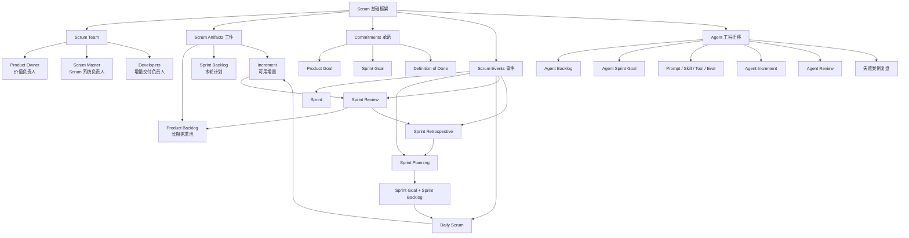

# 敏捷开发｜阶段二：Scrum 基础框架

## 0. 本文定位

这篇笔记沉淀的是敏捷开发课程的**阶段二：Scrum 基础框架｜第 5–11 章**。

阶段一已经建立了敏捷开发的底层认知：

> 敏捷不是“快”，而是在复杂系统中通过短周期交付、真实反馈和持续改进，稳定交付用户价值。

阶段二开始进入 Scrum 框架。

本阶段的重点不是背角色、会议和名词，而是理解：

> Scrum 如何把“不确定的产品目标”，转成“可执行、可检查、可迭代的交付系统”。

---

# 1. 阶段二总览

| 章节 | 主题 | 学习目标 |
|---:|---|---|
| 第 5 章 | Scrum 框架总览 | 理解 Scrum 的整体结构 |
| 第 6 章 | Product Owner、Scrum Master、Developers | 理解 Scrum 三类职责 |
| 第 7 章 | Product Backlog 与 Sprint Backlog | 理解 Scrum 如何管理需求和迭代任务 |
| 第 8 章 | Sprint Planning | 学会如何启动一次 Sprint |
| 第 9 章 | Daily Scrum | 学会如何每天检查和调整计划 |
| 第 10 章 | Sprint Review | 学会如何获取产品反馈 |
| 第 11 章 | Sprint Retrospective | 学会如何改进团队系统 |

---

# 2. 阶段二核心结论

## 2.1 一句话理解 Scrum

> Scrum 是一种用固定节奏，把复杂目标拆成短周期可验证增量的敏捷框架。

它不是：

- 项目管理软件
- 看板工具
- 每日站会
- 任务分配流程
- 管理者监督工具

它本质上是：

> 一个围绕 Product Goal，通过 Sprint 周期把 Product Backlog 转化为可用 Increment，并通过 Review 和 Retrospective 持续校准产品与流程的交付系统。

## 2.2 Scrum 的核心结构

Scrum 可以压缩成：

```text
1 个 Scrum Team
3 类职责
5 个事件
3 个工件
3 个承诺
```

也可以理解为：

```text
目标
  ↓
需求池
  ↓
本轮目标
  ↓
本轮计划
  ↓
每日检查
  ↓
可用增量
  ↓
产品反馈
  ↓
流程改进
  ↓
下一轮迭代
```

## 2.3 阶段二必须掌握的 7 个判断

| 序号 | 核心理解 | 简单解释 |
|---:|---|---|
| 1 | Scrum 是框架，不是流程表 | 它提供最小结构，具体实践要团队补充 |
| 2 | Sprint 是价值交付周期 | 不是任务冲刺，也不是加班周期 |
| 3 | Product Backlog 是价值排序系统 | 不是普通待办清单 |
| 4 | Sprint Backlog 是本轮实现计划 | 不是主管派活列表 |
| 5 | Daily Scrum 是计划调整机制 | 不是日报会 |
| 6 | Sprint Review 是产品反馈机制 | 不是 Demo 表演 |
| 7 | Retrospective 是系统改进机制 | 不是情绪发泄会 |

---

# 3. 第 5 章：Scrum 框架总览

## 3.1 Scrum 的 3-5-3 结构

| 类型 | 内容 | 简单理解 |
|---|---|---|
| 3 类职责 | Product Owner、Scrum Master、Developers | 谁负责什么 |
| 5 个事件 | Sprint、Sprint Planning、Daily Scrum、Sprint Review、Sprint Retrospective | Scrum 的工作节奏 |
| 3 个工件 | Product Backlog、Sprint Backlog、Increment | Scrum 管理什么东西 |
| 3 个承诺 | Product Goal、Sprint Goal、Definition of Done | 每个工件背后的目标和质量约束 |

## 3.2 Scrum 的运行闭环

```text
Product Goal
  ↓
Product Backlog
  ↓
Sprint Planning
  ↓
Sprint Backlog + Sprint Goal
  ↓
Sprint 执行
  ↓
Daily Scrum 每日检查调整
  ↓
Increment
  ↓
Sprint Review 产品反馈
  ↓
Sprint Retrospective 流程改进
  ↓
更新 Product Backlog
  ↓
下一轮 Sprint
```

费曼解释：

> Scrum 就是一个“短周期产品实验系统”。  
> 每个 Sprint 都是在回答一个问题：我们能不能在这一小段时间内，交付一个更接近产品目标的可用增量？

## 3.3 Scrum 的底层逻辑

| 底层逻辑 | 含义 |
|---|---|
| 透明 | 工作状态、目标、问题必须可见 |
| 检查 | 定期检查产品、进度和流程 |
| 适应 | 根据检查结果调整 Backlog、计划和工作方式 |
| 小批量 | 不一次性做大项目，而是拆成可验证增量 |
| 目标牵引 | Sprint 不是任务堆砌，而是围绕 Sprint Goal 交付 |
| 质量内建 | Increment 必须满足 Definition of Done |

## 3.4 Scrum 到 Agent 工程的迁移

| Scrum 概念 | Agent 工程对应物 |
|---|---|
| Product Goal | Agent 系统目标 |
| Product Backlog | Agent 能力需求池 |
| Sprint Goal | 本轮 Agent 迭代目标 |
| Sprint Backlog | 本轮要改的 Prompt / Skill / Tool / Eval |
| Increment | 一个可用的 Agent 能力增量 |
| Definition of Done | Agent 能力完成标准 |
| Review | 对 Agent 输出进行演示和质量判断 |
| Retrospective | 复盘失败案例并沉淀规则 |

---

# 4. 第 6 章：Product Owner、Scrum Master、Developers

## 4.1 Scrum Team 的本质

Scrum Team 不是传统的“老板安排、开发执行、测试验收”的层级结构，而是一个围绕 Product Goal 协作交付价值的小团队。

Scrum Team 的三类职责：

| 角色 / 职责 | 核心问题 |
|---|---|
| Product Owner | 做什么最有价值？ |
| Scrum Master | 如何让 Scrum 系统有效运行？ |
| Developers | 如何把目标变成可用增量？ |

对应到 Agent 工程：

| 角色视角 | Agent 工程问题 |
|---|---|
| PO 视角 | 这个 Agent 能力解决什么真实任务？ |
| SM 视角 | 这个迭代流程有没有验收、测试、复盘？ |
| Dev 视角 | Prompt、Skill、Tool、Eval 如何实现？ |

## 4.2 Product Owner：价值负责人

Product Owner 的核心职责不是“写需求文档”，而是：

> 确保团队始终在做最有价值的事情。

| 职责 | 简单理解 |
|---|---|
| 明确 Product Goal | 产品要朝哪里走 |
| 管理 Product Backlog | 需求池里有什么、先做什么 |
| 排序优先级 | 哪些需求价值最高 |
| 澄清需求 | 帮团队理解为什么做、做到什么程度 |
| 接收反馈 | 根据 Review 和用户反馈调整 Backlog |

### Product Owner 在 Agent 工程中的对应

| Scrum PO | Agent 工程对应 |
|---|---|
| 定义产品目标 | 定义 Agent 要解决什么工作问题 |
| 管理 Product Backlog | 管理 Agent 能力池 |
| 排优先级 | 决定先做哪个 Agent 场景 |
| 澄清需求 | 明确输入、输出、边界、验收标准 |
| 接收反馈 | 根据测试结果和用户反馈调整迭代方向 |

## 4.3 Scrum Master：Scrum 系统负责人

Scrum Master 不是项目经理，也不是团队主管。

它的核心职责是：

> 确保 Scrum 被正确理解和有效使用，并帮助团队移除阻碍。

| 职责 | 简单理解 |
|---|---|
| 维护 Scrum 规则 | 防止 Scrum 变成形式主义 |
| 促进事件有效进行 | 让 Planning、Review、Retro 真正产生价值 |
| 移除阻碍 | 帮团队解决影响交付的问题 |
| 保护团队节奏 | 减少无效干扰 |
| 推动持续改进 | 让团队每轮都变好一点 |

### Scrum Master 在 Agent 工程中的对应

| Scrum Master | Agent 工程对应 |
|---|---|
| 维护 Scrum 机制 | 维护 Agent 迭代流程 |
| 保障质量节奏 | 防止 Prompt 乱改、Skill 无验收 |
| 移除阻碍 | 解决工具、数据、测试、上下文问题 |
| 推动复盘 | 把失败案例沉淀为 Eval 和规则 |
| 防止形式主义 | 防止只写需求、不验证输出 |

## 4.4 Developers：增量交付负责人

Developers 不只指程序员，而是所有负责创建 Increment 的人。

| 职责 | 简单理解 |
|---|---|
| 创建 Sprint Backlog | 把本轮工作拆成可执行计划 |
| 构建 Increment | 交付可用成果 |
| 遵守 Definition of Done | 确保质量达标 |
| 每天调整计划 | 根据实际进展修正执行方式 |
| 对交付负责 | 不只是“做任务”，而是交付可用价值 |

### Developers 在 Agent 工程中的对应

| Developers | Agent 工程对应 |
|---|---|
| 开发功能 | 改 Prompt、Skill、Tool、Workflow |
| 写测试 | 准备 Eval 和测试案例 |
| 做集成 | 连接工具、数据源、文件结构 |
| 做质量控制 | 检查输出稳定性和边界情况 |
| 交付 Increment | 交付一个可验证的 Agent 能力 |

---

# 5. 第 7 章：Product Backlog 与 Sprint Backlog

## 5.1 Scrum 的三个核心工件

| 工件 | 承诺 | 简单理解 |
|---|---|---|
| Product Backlog | Product Goal | 产品需求池，服务长期目标 |
| Sprint Backlog | Sprint Goal | 本轮迭代任务池，服务当前目标 |
| Increment | Definition of Done | 本轮完成的可用成果，必须满足完成标准 |

## 5.2 Product Backlog：产品需求池

Product Backlog 不是普通待办清单，而是一个围绕 Product Goal 持续更新、排序的产品工作列表。

| 维度 | 说明 |
|---|---|
| 内容 | 功能、优化、缺陷、技术债、实验、研究任务 |
| 负责人 | Product Owner |
| 特点 | 动态变化、持续排序、逐步细化 |
| 目标 | 让团队永远知道下一步最有价值的工作是什么 |

### 好的 Product Backlog 应该具备

| 标准 | 说明 |
|---|---|
| 有目标 | 需求不是散的，服务 Product Goal |
| 有排序 | 高价值、高风险、高优先级在前 |
| 可拆分 | 大需求可以拆成可迭代的小项 |
| 可理解 | 团队能看懂为什么做 |
| 可验收 | 每个重要需求都有验收标准 |

## 5.3 Sprint Backlog：本轮迭代计划

Sprint Backlog 是团队在 Sprint Planning 中选出的 Product Backlog Items，加上完成这些工作的计划。

| 维度 | 说明 |
|---|---|
| 内容 | 本轮要做的需求 + 实现计划 |
| 负责人 | Developers |
| 目标 | 达成本轮 Sprint Goal |
| 特点 | Sprint 内可根据实际情况调整 |
| 不是 | 不是上级派下来的死任务清单 |

## 5.4 Product Backlog vs Sprint Backlog

| 对比项 | Product Backlog | Sprint Backlog |
|---|---|---|
| 时间范围 | 长期 | 当前 Sprint |
| 目标 | Product Goal | Sprint Goal |
| 负责人 | Product Owner | Developers |
| 是否持续变化 | 持续变化 | Sprint 内围绕目标调整 |
| 作用 | 决定未来做什么 | 决定本轮怎么做 |

## 5.5 Increment：真正的交付物

Increment 是 Sprint 结束时已经满足 Definition of Done 的成果。它不是半成品，也不是“代码写完但没测”。

| 错误理解 | 正确理解 |
|---|---|
| 写完代码就是 Increment | 必须满足 DoD |
| 做了一堆任务就是 Increment | 必须形成可用价值 |
| Sprint 结束自然有 Increment | 只有完成且可验证的成果才是 Increment |
| Increment 一定要立刻发布 | 可以发布，但是否发布由产品决策决定 |

## 5.6 Agent 工程中的 Backlog 设计

### Agent Product Backlog 示例

| Backlog Item | 价值 | 类型 |
|---|---|---|
| 让 Agent 能分析 PRD 并拆分任务 | 提升需求拆解效率 | 新能力 |
| 为 Skill 生成 DoD 检查清单 | 提升 Skill 质量 | 新能力 |
| 增加 Prompt 回归测试集 | 降低漂移风险 | 质量任务 |
| 修复工具调用失败时的错误处理 | 提升稳定性 | 缺陷修复 |
| 重构 Skill 输出模板 | 降低维护成本 | 技术债 |

### Agent Sprint Backlog 示例

Sprint Goal：

> 让 Agent 能稳定评估一个 SKILL.md 的质量。

Sprint Backlog：

| 任务 | 说明 |
|---|---|
| 定义 SKILL.md 质量维度 | description、trigger、workflow、resources、evals |
| 准备 5 个测试样例 | 好案例、差案例、边界案例 |
| 写评估 Prompt | 输出结构化评分 |
| 加入 DoD | 必须指出证据链和改进建议 |
| 运行测试并复盘 | 记录失败模式 |

---

# 6. 第 8 章：Sprint Planning

## 6.1 Sprint Planning 的本质

Sprint Planning 不是“分配任务会”。

它要回答三个问题：

```text
为什么做？
做什么？
怎么做？
```

## 6.2 Sprint Planning 的三个输出

| 输出 | 作用 |
|---|---|
| Sprint Goal | 本轮迭代的目标 |
| Sprint Backlog | 本轮要完成的 Backlog Items |
| 实现计划 | Developers 对如何完成工作的初步计划 |

## 6.3 Sprint Goal 是核心

Sprint Goal 不是任务列表，而是本轮 Sprint 的目标。

| 差的 Sprint Goal | 好的 Sprint Goal |
|---|---|
| 完成 A、B、C 三个任务 | 让用户可以完成首次注册并创建项目 |
| 修复 12 个 Bug | 降低结账流程的失败率 |
| 优化 Prompt | 让 Agent 能稳定输出结构化 PRD 分析 |
| 做 Skill 文件 | 让 Skill 能被正确触发并完成质量评估 |

### 为什么 Sprint Goal 重要

| 没有 Sprint Goal | 有 Sprint Goal |
|---|---|
| 团队只是在清任务 | 团队知道本轮价值目标 |
| 遇到变化不知道取舍 | 可以围绕目标调整计划 |
| Review 只能汇报做了什么 | Review 可以判断目标是否达成 |
| Retrospective 难以复盘 | 可以复盘为什么目标完成或没完成 |

## 6.4 Sprint Planning 的执行流程

| 步骤 | 要做什么 |
|---:|---|
| 1 | PO 说明当前 Product Goal 和高优先级 Backlog |
| 2 | 团队讨论本轮最有价值的目标 |
| 3 | 形成 Sprint Goal |
| 4 | 从 Product Backlog 选择合适的 Items |
| 5 | Developers 拆解实现计划 |
| 6 | 判断容量、风险、依赖和质量标准 |
| 7 | 形成 Sprint Backlog |

## 6.5 Agent 工程中的 Sprint Planning 示例

Agent Product Goal：

> 构建一个能辅助我创建高质量 Agent Skill 的工程化助手。

Sprint Goal：

> 本轮让 Agent 能稳定完成“复杂任务需求澄清与拆解”。

Sprint Backlog：

| 类型 | 任务 |
|---|---|
| 需求 | 定义复杂任务输入类型 |
| Prompt | 编写澄清问题生成 Prompt |
| Skill | 设计 `complex-task-clarifier` SKILL.md |
| Test | 准备模糊需求、清晰需求、边界需求测试用例 |
| Eval | 检查是否能输出需求分析、任务拆解、验收标准 |
| Doc | 把失败案例沉淀到 LLM-Wiki |

---

# 7. 第 9 章：Daily Scrum

## 7.1 Daily Scrum 的本质

Daily Scrum 不是日报会，也不是给主管汇报进度。

它的本质是：

> Developers 每天检查距离 Sprint Goal 的进展，并调整当天计划。

## 7.2 Daily Scrum 要回答的问题

传统三问是：

```text
昨天做了什么？
今天做什么？
有什么阻碍？
```

但不要机械化。更好的问题是：

| 问题 | 目的 |
|---|---|
| 我们距离 Sprint Goal 更近了吗？ | 检查目标进展 |
| 当前最大阻碍是什么？ | 暴露问题 |
| 今天需要如何调整计划？ | 适应变化 |
| 有没有任务偏离目标？ | 防止忙错方向 |
| 有没有质量风险？ | 防止最后爆雷 |

## 7.3 好的 Daily Scrum vs 差的 Daily Scrum

| 差的 Daily Scrum | 好的 Daily Scrum |
|---|---|
| 每个人报流水账 | 围绕 Sprint Goal 检查进展 |
| 变成主管点名 | Developers 自己同步和调整 |
| 只说做了什么 | 重点说风险、阻碍、调整 |
| 会议拖很久 | 短、快、聚焦 |
| 问题不处理 | 问题会形成后续行动 |

## 7.4 Agent 工程中的 Daily Scrum

如果一个人做 Agent 工程，也可以使用 Daily Scrum 思维。

每日自检：

| 问题 | Agent 工程表达 |
|---|---|
| Sprint Goal 是否更近？ | Agent 能力是否更稳定？ |
| 当前最大阻碍是什么？ | Prompt、Tool、Eval、数据、上下文哪里卡住？ |
| 今天要调整什么？ | 是否需要改测试、改验收标准、改流程？ |
| 有没有偏离目标？ | 是否又开始扩展无关功能？ |
| 有没有质量风险？ | 是否没有测试就宣称完成？ |

---

# 8. 第 10 章：Sprint Review

## 8.1 Sprint Review 的本质

Sprint Review 不是成果汇报会，也不是团队邀功会。

它的本质是：

> 检查本轮 Increment 是否产生价值，并根据反馈调整 Product Backlog。

## 8.2 Review 看什么

| 检查对象 | 问题 |
|---|---|
| Increment | 本轮交付是否真的可用？ |
| Sprint Goal | 本轮目标是否达成？ |
| 用户价值 | 这是否解决了真实问题？ |
| 反馈 | 用户、利益相关者、团队看到了什么问题？ |
| Backlog | 下一轮优先级是否需要调整？ |

## 8.3 Review 不是 Demo

Demo 只是 Review 的一部分。

| Demo | Review |
|---|---|
| 展示做了什么 | 判断产生了什么价值 |
| 偏展示 | 偏反馈和决策 |
| 关注功能 | 关注目标、结果和下一步 |
| 可以没有真实讨论 | 必须影响 Backlog |

## 8.4 Agent 工程中的 Sprint Review

Agent Review 应该检查：

| 检查项 | 问题 |
|---|---|
| 输出质量 | 是否达到验收标准？ |
| 稳定性 | 多个测试样例是否稳定？ |
| 边界情况 | 模糊输入、异常输入是否能处理？ |
| 工具调用 | 是否正确调用工具？失败时如何处理？ |
| 用户价值 | 是否真的节省时间或提高质量？ |
| Backlog 调整 | 下一轮应该修什么、增强什么、删除什么？ |

### Agent Review 示例

Sprint Goal：

> 让 Agent 能稳定评估 SKILL.md 质量。

Review 检查：

| 测试样例 | 输出是否合格 | 问题 |
|---|---|---|
| 完整 SKILL.md | 合格 | 能指出结构和资源闭环 |
| 缺少 description | 合格 | 能识别触发风险 |
| 缺少 evals | 部分合格 | 建议过泛，需要细化测试类型 |
| 近似场景 | 不合格 | 误判为应触发，需要改 trigger 边界 |

Review 结论：

> 本轮 Agent 已具备基础评估能力，但触发边界判断不稳定。下一轮优先增强“正确触发 / 错误触发 / 近似误触发”测试。

---

# 9. 第 11 章：Sprint Retrospective

## 9.1 Retrospective 的本质

Sprint Retrospective 不是抱怨会，也不是总结会。

它的本质是：

> 检查团队工作系统本身，并决定下一轮如何改进。

## 9.2 Review vs Retrospective

| 对比项 | Sprint Review | Sprint Retrospective |
|---|---|---|
| 检查对象 | 产品成果 | 工作方式 |
| 核心问题 | 这轮交付有没有价值？ | 我们怎么做得更好？ |
| 参与重点 | Scrum Team + Stakeholders | Scrum Team |
| 输出 | Product Backlog 调整 | 改进行动 |
| 关注 | 产品方向 | 团队系统 |

## 9.3 Retrospective 看什么

| 维度 | 检查问题 |
|---|---|
| 流程 | 哪些环节卡住了？ |
| 协作 | 沟通是否顺畅？ |
| 质量 | 缺陷为什么产生？ |
| 计划 | Sprint Goal 是否合理？ |
| 需求 | Backlog 是否足够清晰？ |
| 工具 | 工具链是否阻碍效率？ |
| 技术债 | 哪些问题正在积累？ |
| 改进行动 | 下一轮具体改变什么？ |

## 9.4 好的 Retro 输出

差的 Retro：

```text
这轮沟通不好。
下次注意。
```

好的 Retro：

```text
问题：本轮两个需求验收标准不清，导致返工。

原因：Sprint Planning 时没有检查 Acceptance Criteria。

行动：下一轮所有 Story 进入 Sprint 前必须满足 DoR：
1. 用户场景明确
2. 验收标准明确
3. 边界情况明确
4. 测试样例至少 3 个

负责人：PO + Developers
检查时间：下次 Sprint Planning
```

## 9.5 Agent 工程中的 Retrospective

Agent Retro 的核心不是“这次输出错了”，而是：

> 为什么会错？这个错误能不能变成规则、测试、模板或 Skill 改进？

| 失败现象 | 复盘问题 | 沉淀结果 |
|---|---|---|
| Prompt 输出泛泛而谈 | 验收标准是否不清？ | 增加输出质量标准 |
| Tool 调用错误 | 工具选择规则是否不明确？ | 增加 Tool 使用边界 |
| Skill 未正确触发 | description 是否模糊？ | 修改 trigger 条件 |
| 输出缺少证据链 | DoD 是否要求证据？ | 增加证据链检查项 |
| 任务未完成却声称完成 | 是否缺少完成定义？ | 增加 completion checklist |
| 同类错误反复出现 | 是否没有回归测试？ | 加入 Eval 测试集 |

---

# 10. 阶段二整合：Scrum 是一个交付系统

## 10.1 Scrum 闭环

```text
Product Goal
  ↓
Product Backlog：长期需求池
  ↓
Sprint Planning：选择本轮目标
  ↓
Sprint Backlog：本轮执行计划
  ↓
Daily Scrum：每日检查与调整
  ↓
Increment：可用成果
  ↓
Sprint Review：检查产品价值
  ↓
Sprint Retrospective：改进工作系统
  ↓
下一轮 Sprint
```

## 10.2 Scrum 不是会议体系

Scrum 的价值不在于“开了几个会”，而在于这些事件是否形成闭环。

| Scrum 元素 | 真正作用 |
|---|---|
| Sprint Planning | 确定本轮价值目标和执行计划 |
| Daily Scrum | 每天检查是否偏离 Sprint Goal |
| Sprint Review | 用成果获取反馈，并调整 Product Backlog |
| Sprint Retrospective | 改进团队工作系统 |
| Increment | 提供可验证价值 |
| Definition of Done | 防止半成品伪装成完成 |

---

# 11. 阶段二核心心智图



---

# 12. 阶段二对 Agent 工程的迁移框架

## 12.1 Scrum 到 Agent 工程的映射

| Scrum 元素 | Agent 工程映射 |
|---|---|
| Product Goal | Agent 系统长期目标 |
| Product Backlog | Agent 能力需求池 |
| Product Owner | 负责判断哪个 Agent 能力最有价值的人 |
| Scrum Master | 维护 Agent 工程流程和质量节奏的人 |
| Developers | 实现 Prompt、Skill、Tool、Eval、Workflow 的人 |
| Sprint Goal | 本轮 Agent 能力目标 |
| Sprint Backlog | 本轮需要修改和验证的 Prompt / Skill / Tool / Eval 项 |
| Increment | 一个可用、可测试、可复盘的 Agent 能力增量 |
| Daily Scrum | 每日检查 Agent Sprint Goal 是否推进 |
| Sprint Review | 检查 Agent 输出是否产生真实价值 |
| Sprint Retrospective | 把失败案例沉淀为规则、测试和知识库 |
| Definition of Done | Agent 能力完成标准 |

## 12.2 Agent Scrum 最小工作流

```text
1. 定义 Agent Product Goal
2. 建立 Agent Product Backlog
3. 选择本轮最高价值目标
4. 形成 Agent Sprint Goal
5. 拆出 Sprint Backlog
6. 修改 Prompt / Skill / Tool / Eval
7. 每日检查是否偏离 Sprint Goal
8. 交付一个 Agent Increment
9. Review 输出质量和用户价值
10. Retro 复盘失败案例
11. 更新 Backlog、Eval、Skill、LLM-Wiki
```

## 12.3 Agent Sprint 示例模板

```md
# Agent Sprint 模板

## 1. Product Goal

这个 Agent 系统长期要解决什么问题？

## 2. Sprint Goal

本轮迭代要让 Agent 获得什么明确能力？

## 3. Sprint Backlog

| 类型 | 任务 | 验收方式 |
|---|---|---|
| Prompt |  |  |
| Skill |  |  |
| Tool |  |  |
| Eval |  |  |
| Doc |  |  |

## 4. Definition of Done

- [ ] 输出符合结构要求
- [ ] 至少通过 3 个正常测试
- [ ] 至少通过 2 个边界测试
- [ ] 能解释失败原因
- [ ] 有失败案例沉淀
- [ ] 更新 LLM-Wiki / Skill / Eval

## 5. Review 结果

本轮能力是否产生真实价值？

## 6. Retrospective 结果

下轮流程、测试、规则需要怎么改？
```

---

# 13. 阶段二常见误区清单

| 误区 | 为什么错 | 正确理解 |
|---|---|---|
| Scrum 就是每天站会 | 把一个事件当成整个框架 | Scrum 是角色、事件、工件、承诺的系统 |
| PO 就是写需求的人 | 低估了价值排序职责 | PO 负责最大化产品价值 |
| Scrum Master 是项目经理 | 混淆管理者和促进者 | SM 负责 Scrum 有效运行 |
| Developers 只管写代码 | 忽略了计划、质量和交付责任 | Developers 对 Increment 负责 |
| Sprint Planning 是派任务 | 传统管理思维 | Planning 是共同制定目标和计划 |
| Daily Scrum 是汇报进度 | 变成管理控制 | Daily 是 Developers 自我检查与调整 |
| Review 是演示成果 | 只展示不反馈 | Review 必须影响 Product Backlog |
| Retro 是总结感受 | 没有改进行动 | Retro 必须产生下一轮改进措施 |
| Increment 等于代码写完 | 忽略质量门禁 | Increment 必须满足 DoD |
| Sprint Goal 等于任务列表 | 忽略价值目标 | Sprint Goal 是本轮价值目标，不是任务堆砌 |

---

# 14. 阶段二掌握标准

学完阶段二后，应该能回答：

| 序号 | 自测问题 | 掌握标准 |
|---:|---|---|
| 1 | Scrum 是什么？ | 能说出它是轻量级敏捷框架，用于复杂产品交付 |
| 2 | Scrum 的 3-5-3 是什么？ | 能说出 3 类职责、5 个事件、3 个工件 |
| 3 | PO 的核心职责是什么？ | 能说出最大化产品价值和管理 Product Backlog |
| 4 | Scrum Master 是不是项目经理？ | 能解释不是，SM 是 Scrum 有效运行的促进者 |
| 5 | Developers 负责什么？ | 能说出交付可用 Increment，并遵守 DoD |
| 6 | Product Backlog 和 Sprint Backlog 区别是什么？ | 能区分长期需求池和本轮计划 |
| 7 | Sprint Goal 为什么重要？ | 能解释它不是任务列表，而是本轮目标 |
| 8 | Daily Scrum 为什么不是日报？ | 能解释它是检查和调整 Sprint Plan |
| 9 | Review 和 Retro 有什么区别？ | Review 看产品成果，Retro 看工作系统 |
| 10 | 如何迁移到 Agent 工程？ | 能设计 Agent Backlog、Agent Sprint、Agent Review、Agent Retro |

---

# 15. 阶段二最小知识卡片

## 15.1 Scrum 基础框架

```md
# Scrum 基础框架

Scrum 是一个用于复杂产品交付的轻量级敏捷框架。

它的核心不是“开会”，而是建立一个短周期交付闭环：

Product Goal
→ Product Backlog
→ Sprint Planning
→ Sprint Backlog
→ Daily Scrum
→ Increment
→ Sprint Review
→ Sprint Retrospective
→ 下一轮迭代

Scrum 的 3-5-3 结构：

1. 3 类职责
   - Product Owner：负责价值和 Product Backlog
   - Scrum Master：负责 Scrum 有效运行
   - Developers：负责交付可用 Increment

2. 5 个事件
   - Sprint
   - Sprint Planning
   - Daily Scrum
   - Sprint Review
   - Sprint Retrospective

3. 3 个工件
   - Product Backlog
   - Sprint Backlog
   - Increment

对应 Agent 工程：

- Product Backlog = Agent 能力需求池
- Sprint Goal = 本轮 Agent 能力目标
- Sprint Backlog = 本轮 Prompt / Skill / Tool / Eval 修改计划
- Increment = 一个可验证的 Agent 能力增量
- Review = 检查 Agent 输出是否有价值
- Retrospective = 把失败案例沉淀成规则、测试和知识库
```

## 15.2 Scrum 不是会议体系

```md
# Scrum 不是会议体系

Scrum 不是每天开站会，也不是用 Jira 管任务。

Scrum 是一个交付系统：

- Product Backlog 管理长期价值
- Sprint Planning 确定本轮目标
- Daily Scrum 每天检查和调整
- Increment 提供可用成果
- Sprint Review 检查产品价值
- Sprint Retrospective 改进工作系统

如果只有会议，没有可用增量、反馈和改进，那只是伪 Scrum。
```

## 15.3 Agent 工程中的 Scrum

```md
# Agent 工程中的 Scrum

Agent 工程可以用 Scrum 管理，因为 Agent 能力也需要持续迭代。

映射关系：

- Product Goal = Agent 系统目标
- Product Backlog = Agent 能力池
- Sprint Goal = 本轮要验证的 Agent 能力
- Sprint Backlog = Prompt / Skill / Tool / Eval 修改计划
- Increment = 可测试的 Agent 能力增量
- Review = 检查输出质量和真实价值
- Retro = 把失败案例沉淀成规则、测试、Skill 和 LLM-Wiki

核心原则：

不要一次性设计全能 Agent。
要用 Sprint 一轮一轮验证关键能力。
```

---

# 16. 推荐放入 LLM-Wiki 的位置

## 16.1 建议目录

```text
llm-wiki/
  software-engineering/
    agile-development/
      00-index.md
      01-stage-cognition/
        00-agile-overview.md
        01-what-is-agile.md
        02-agile-vs-waterfall-lean-devops.md
        03-agile-manifesto-principles.md
        04-agile-for-complex-systems.md
        stage-1-summary.md
      02-stage-scrum-framework/
        05-scrum-overview.md
        06-scrum-roles.md
        07-product-backlog-sprint-backlog.md
        08-sprint-planning.md
        09-daily-scrum.md
        10-sprint-review.md
        11-sprint-retrospective.md
        stage-2-summary.md
```

## 16.2 当前文件建议命名

```text
敏捷开发-阶段二-Scrum基础框架.md
```

## 16.3 建议双向链接

```md
相关链接：

- [[敏捷开发完整学习路线图]]
- [[敏捷开发-阶段一-认知入门]]
- [[Scrum]]
- [[Product Backlog]]
- [[Sprint Backlog]]
- [[Sprint Goal]]
- [[Definition of Done]]
- [[Sprint Review]]
- [[Sprint Retrospective]]
- [[Agent 工程]]
- [[Agent Evals]]
- [[Skill 工程化]]
- [[LLM-Wiki]]
```

---

# 17. 后续学习入口

阶段二完成后，下一阶段是：

> 阶段三：需求拆解与用户故事｜第 12–18 章

进入阶段三前，应先确认已经理解：

```text
Scrum 不是会议体系，而是一个围绕 Product Goal，
通过 Sprint 周期把 Product Backlog 转化为可用 Increment，
并通过 Review 和 Retrospective 持续校准产品与流程的交付系统。
```

阶段三会从 Scrum 框架进入需求建模能力：

| 章节 | 主题 |
|---:|---|
| 第 12 章 | User Story 用户故事 |
| 第 13 章 | User Story Template |
| 第 14 章 | Acceptance Criteria 验收标准 |
| 第 15 章 | INVEST 原则 |
| 第 16 章 | Story Mapping |
| 第 17 章 | Story Splitting |
| 第 18 章 | MVP 与 Increment |

---

# 18. 参考来源

- Scrum Guide: https://scrumguides.org/scrum-guide.html
- Agile Alliance Scrum Glossary: https://agilealliance.org/glossary/scrum/
- Agile Manifesto: https://agilemanifesto.org/
- Agile Alliance Agile 101: https://agilealliance.org/agile101/
