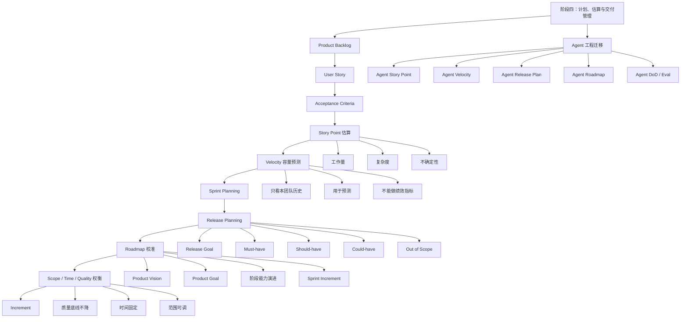

# 敏捷开发｜阶段四：计划、估算与交付管理

## 0. 本文定位

这篇笔记沉淀的是敏捷开发课程的**阶段四：计划、估算与交付管理｜第 19–24 章**。

前面三个阶段分别解决：

| 阶段 | 解决的问题 |
|---|---|
| 阶段一：认知入门 | 敏捷是什么，为什么适合复杂系统 |
| 阶段二：Scrum 基础框架 | Scrum 如何形成短周期交付闭环 |
| 阶段三：需求拆解与用户故事 | 模糊需求如何变成可验收、可交付的 User Story |

阶段四开始从“需求怎么写”进入“需求怎么排、怎么估、怎么交付”。

核心问题是：

```text
这些 Story 怎么估？
一个 Sprint 能做多少？
什么时候能发布？
Roadmap 和 Sprint 怎么连接？
范围、时间、质量冲突时怎么取舍？
```

对 Agent 工程来说，本阶段对应的是：

> 如何为 Agent Backlog 做估算、规划 Agent Sprint、预测版本交付、设计 Agent Roadmap，并在时间有限时保护质量底线。

---

# 1. 阶段四总览

| 章节 | 主题 | 学习目标 |
|---:|---|---|
| 第 19 章 | 估算的本质 | 理解估算不是承诺，而是降低不确定性的预测 |
| 第 20 章 | Story Point | 学会用相对复杂度估算需求 |
| 第 21 章 | Velocity | 学会用历史交付速率预测容量 |
| 第 22 章 | Release Planning | 学会从 Sprint 推导发布计划 |
| 第 23 章 | Roadmap 与 Sprint 的关系 | 学会连接长期方向和短期迭代 |
| 第 24 章 | Scope、Time、Quality 的权衡 | 学会处理延期、砍范围和质量底线 |

---

# 2. 阶段四核心结论

## 2.1 一句话理解阶段四

> 阶段四的核心，是把已拆好的 User Story 转成可估算、可预测、可发布、可取舍的交付计划。

## 2.2 阶段四在 Scrum 中的位置

阶段三已经形成：

```text
模糊想法
→ User Story
→ Acceptance Criteria
→ INVEST
→ Story Mapping
→ Story Splitting
→ MVP / Increment
```

阶段四继续向下推进：

```text
Product Backlog
  ↓
估算复杂度
  ↓
判断 Sprint 容量
  ↓
制定 Release Plan
  ↓
连接 Roadmap
  ↓
处理范围 / 时间 / 质量冲突
```

## 2.3 Agent 工程中的对应位置

```text
Agent Backlog
  ↓
估算 Prompt / Skill / Tool / Eval 的复杂度
  ↓
判断本轮 Agent Sprint 能交付什么
  ↓
规划 Agent Release
  ↓
连接 Agent 能力路线图
  ↓
处理功能范围、交付时间和质量标准冲突
```

## 2.4 阶段四完整闭环

```text
Product Backlog
  ↓
User Story
  ↓
Acceptance Criteria
  ↓
Story Point 估算
  ↓
Velocity 判断容量
  ↓
Sprint Planning
  ↓
Release Planning
  ↓
Roadmap 校准方向
  ↓
Scope / Time / Quality 权衡
  ↓
Increment
```

对应 Agent 工程：

```text
Agent Backlog
  ↓
Agent User Story
  ↓
Agent Acceptance Criteria
  ↓
Agent Story Point
  ↓
Agent Velocity
  ↓
Agent Sprint Planning
  ↓
Agent Release Plan
  ↓
Agent Roadmap
  ↓
范围 / 时间 / 质量取舍
  ↓
Agent Increment
```

---

# 3. 第 19 章：估算的本质

## 3.1 一句话理解估算

> 估算不是承诺，而是在不确定条件下做出的交付预测。

常见错误理解：

```text
估了 5 天，就必须 5 天完成。
```

这不是敏捷估算，而是把估算当合同。

更准确的理解是：

```text
基于当前信息，
团队对复杂度、风险、工作量和不确定性的共同判断。
```

## 3.2 为什么需要估算

估算不是为了“压榨执行者”，而是为了支持决策。

| 估算用途 | 说明 |
|---|---|
| 判断 Sprint 容量 | 本轮能放多少工作 |
| 支持优先级排序 | 高价值低成本任务可优先 |
| 暴露不确定性 | 估不出来通常说明需求不清 |
| 支持 Release Planning | 预测大概几个 Sprint 能发布 |
| 支持范围取舍 | 时间固定时知道应该砍什么 |
| 支持风险管理 | 大估算通常意味着高复杂度或高未知 |

## 3.3 估算不是精确计算

软件开发和 Agent 工程都属于复杂工作。复杂工作的特点是：

| 特征 | 软件开发表现 | Agent 工程表现 |
|---|---|---|
| 需求会变化 | 用户反馈后修改功能 | Prompt 输出不符合预期后改需求 |
| 技术有未知 | 接口、架构、性能有风险 | Tool 调用、上下文、Eval 有风险 |
| 质量难提前完全定义 | 边界情况测试后才暴露 | 模型在异常输入下才暴露问题 |
| 反馈会改变计划 | Review 后 Backlog 调整 | Agent 测试后重新拆能力 |

所以估算应该被理解为：

```text
帮助团队更早发现不确定性，
而不是提前保证结果。
```

## 3.4 好估算 vs 坏估算

| 坏估算 | 问题 |
|---|---|
| 领导给日期，团队倒排 | 不是估算，是压时间 |
| 按个人能力估 | 不稳定，不可复用 |
| 只估开发，不估测试 | 低估真实交付成本 |
| 只估正常路径 | 忽略异常、集成、返工风险 |
| 估完不复盘 | 无法提升估算质量 |
| 把估算当绩效指标 | 团队会故意保守或造假 |

| 好估算 | 价值 |
|---|---|
| 团队共同估 | 形成共享理解 |
| 估复杂度和不确定性 | 不只看工作量 |
| 配合验收标准 | 知道完成边界 |
| 配合历史数据 | 用 Velocity 做预测 |
| 定期复盘偏差 | 持续提高估算质量 |
| 不用于个人绩效 | 避免指标异化 |

## 3.5 Agent 工程中的估算

Agent 工程中，不能只估“写 Prompt 要多久”。

真正成本通常来自：

| 成本类型 | 例子 |
|---|---|
| 需求澄清成本 | 这个 Agent 到底解决什么任务 |
| Prompt 设计成本 | 如何定义角色、边界、流程、输出格式 |
| Tool 集成成本 | 是否需要文件、网页、Gmail、日历、代码工具 |
| Eval 成本 | 如何构建测试样例和判断标准 |
| 边界测试成本 | 模糊输入、错误输入、超长输入如何处理 |
| 复盘沉淀成本 | 失败案例如何进入知识库和测试集 |

Agent Story 估算要考虑：

```text
Prompt 复杂度
+ Tool 复杂度
+ Eval 复杂度
+ 数据 / 文件复杂度
+ 边界条件复杂度
+ 复盘沉淀复杂度
```

---

# 4. 第 20 章：Story Point

## 4.1 一句话理解 Story Point

> Story Point 是用来估算一个 Backlog Item 相对复杂度的单位。

它不是小时，也不是天数。

它表达的是：

```text
这个需求相对于其他需求有多复杂？
```

而不是：

```text
这个需求到底要几小时？
```

## 4.2 为什么不用小时估算

小时估算的问题：

| 问题 | 说明 |
|---|---|
| 容易变成承诺 | “你说 8 小时，为什么没做完？” |
| 忽略不确定性 | 复杂任务不是线性劳动 |
| 依赖个人能力 | A 做 1 天，B 可能做 3 天 |
| 不利于团队预测 | 无法稳定表达团队整体容量 |
| 容易制造压力 | 团队会为了安全故意报大 |

Story Point 更适合复杂工作，因为它强调：

```text
相对复杂度
+ 工作量
+ 风险
+ 不确定性
```

## 4.3 Story Point 估什么

Story Point 通常综合考虑三类因素：

| 因素 | 解释 | Agent 工程示例 |
|---|---|---|
| 工作量 | 要做多少事情 | 要写 Prompt、Skill、Eval、文档 |
| 复杂度 | 做起来有多复杂 | 多工具、多步骤、多输出格式 |
| 不确定性 | 有多少未知风险 | 模型是否稳定、工具是否可靠、测试是否充分 |

## 4.4 Story Point 示例

| Story | Point | 原因 |
|---|---:|---|
| 修改一个输出标题 | 1 | 工作量小、风险低 |
| 为 Agent 增加 Markdown 输出模板 | 2 | 有格式要求，但风险低 |
| 让 Agent 生成 User Story + AC | 3 | 有结构和质量要求 |
| 让 Agent 做 Skill 质量评估 | 5 | 需要维度、证据链、改进建议 |
| 让 Agent 自动扫描仓库并生成 PR 建议 | 8 | 涉及工具、代码、文件结构、误判风险 |

## 4.5 常见点数序列

很多团队使用类似斐波那契的点数：

```text
1, 2, 3, 5, 8, 13, 21
```

原因是：

| 点数越大 | 意味着 |
|---|---|
| 不确定性更高 | 很难精确区分 13 和 14 |
| 需要拆分 | 13 或 21 往往太大 |
| 风险更高 | 需要 Spike 或进一步澄清 |

## 4.6 Story Point 的使用方法

常见流程：

```text
1. 选择一个基准 Story
2. 团队共同阅读需求和验收标准
3. 讨论复杂度、风险和工作量
4. 每个人独立给点数
5. 差异较大时讨论原因
6. 达成相对共识
7. 高点数 Story 继续拆分
```

注意：

```text
Story Point 的价值不在数字本身，
而在估算过程中暴露出的理解差异。
```

## 4.7 Agent Story Point 示例

### Story A

```text
作为 LLM-Wiki 维护者，
我希望 Agent 能把一段课程内容整理成 Markdown 文件，
以便沉淀到知识库。
```

估算：3 points

| 维度 | 判断 |
|---|---|
| 工作量 | 中等 |
| 复杂度 | 输出结构固定 |
| 不确定性 | 低到中 |
| 主要风险 | 目录结构和信息粒度不一致 |

### Story B

```text
作为 Skill 设计者，
我希望 Agent 能评估一个 SKILL.md 的触发边界、执行流程、资源闭环和 evals 质量，
以便判断这个 Skill 是否具备工程可用性。
```

估算：8 points

| 维度 | 判断 |
|---|---|
| 工作量 | 高 |
| 复杂度 | 需要多维度判断 |
| 不确定性 | 高 |
| 主要风险 | 可能泛泛而谈，缺少证据链 |

---

# 5. 第 21 章：Velocity

## 5.1 一句话理解 Velocity

> Velocity 是团队在一个 Sprint 中实际完成的 Story Point 数量。

它的核心用途是预测：

```text
团队平均每个 Sprint 能完成多少点。
```

## 5.2 Velocity 的用途

Velocity 用来回答：

```text
这个 Release 大概需要几个 Sprint？
当前 Sprint 是否放太多？
如果时间固定，需要砍掉多少范围？
```

示例：

| Sprint | 完成点数 |
|---|---:|
| Sprint 1 | 18 |
| Sprint 2 | 22 |
| Sprint 3 | 20 |

平均 Velocity：

```text
(18 + 22 + 20) / 3 = 20 points / Sprint
```

如果剩余 Backlog 是 80 points：

```text
80 / 20 = 4 个 Sprint
```

## 5.3 Velocity 不是绩效指标

Velocity 最容易被误用。

| 错误用法 | 后果 |
|---|---|
| 比较两个团队 Velocity | 每个团队点数基准不同，比较无意义 |
| 要求团队每轮提高 Velocity | 团队会虚报点数 |
| 用 Velocity 考核个人 | 破坏协作 |
| 把 Velocity 当承诺 | 忽略不确定性 |
| 只看点数，不看价值 | 做了很多低价值 Story |

正确理解：

```text
Velocity 是容量预测工具，
不是绩效考核工具。
```

## 5.4 Velocity 为什么只能看本团队历史

不同团队的点数标准不同。

| 团队 | 1 个 5 点 Story 可能代表 |
|---|---|
| 团队 A | 一个简单功能 |
| 团队 B | 一个复杂模块 |
| 团队 C | 包含开发、测试、文档、上线 |

所以 Velocity 只能用于：

```text
同一个团队
在相对稳定条件下
基于历史数据做预测
```

## 5.5 Agent 工程中的 Velocity

如果用 Sprint 管理 Agent 工程，也可以建立 Agent Velocity。

示例：

| Sprint | 完成能力 | Points |
|---|---|---:|
| Sprint 1 | 生成 User Story | 5 |
| Sprint 2 | 生成 Acceptance Criteria + INVEST 检查 | 8 |
| Sprint 3 | 生成 Agent Sprint Backlog | 5 |
| Sprint 4 | 加入 Eval 测试集生成 | 8 |

平均 Velocity：

```text
(5 + 8 + 5 + 8) / 4 = 6.5 points / Sprint
```

用途：

| 用途 | 说明 |
|---|---|
| 判断下一轮放多少 Agent Story | 防止过载 |
| 预测某个 Agent 版本何时完成 | 用剩余点数 / 平均 Velocity |
| 发现估算偏差 | 如果经常完不成，说明估算或拆分有问题 |
| 判断工程债 | 如果 Velocity 下降，可能是 Prompt、Tool、Eval 复杂度积累 |

---

# 6. 第 22 章：Release Planning

## 6.1 一句话理解 Release Planning

> Release Planning 是根据产品目标、Backlog 范围、团队容量和风险，规划一个可发布版本大概包含什么、何时交付。

它不是一次性锁死计划，而是滚动预测。

## 6.2 Release Planning 要回答的问题

| 问题 | 说明 |
|---|---|
| 这个版本目标是什么？ | Release Goal |
| 最小必须包含什么？ | Must-have Scope |
| 哪些可以后移？ | Should / Could |
| 团队每轮大概能做多少？ | Velocity |
| 需要几个 Sprint？ | 时间预测 |
| 最大风险是什么？ | 技术、需求、质量、依赖 |
| 什么时候重新评估？ | 每轮 Review 后更新 |

## 6.3 Release Planning 基本公式

```text
预计 Sprint 数 = Release 剩余点数 / 团队平均 Velocity
```

示例：

| 项目 | 数值 |
|---|---:|
| Release Backlog | 120 points |
| 平均 Velocity | 20 points / Sprint |
| 预计 Sprint 数 | 6 个 Sprint |

如果每个 Sprint 是 2 周：

```text
6 × 2 周 = 12 周
```

但这是预测，不是保证。

## 6.4 Release Plan 的常见结构

| 模块 | 内容 |
|---|---|
| Release Goal | 这个版本要达成什么业务目标 |
| Target Users | 服务哪类用户 |
| Must-have | 必须包含的能力 |
| Should-have | 尽量包含的能力 |
| Could-have | 有余力再做 |
| Out of Scope | 明确不做什么 |
| Risks | 风险和依赖 |
| Sprint Plan | 每轮大致目标 |
| Release Criteria | 发布标准 |

## 6.5 Agent Release Planning 示例

Agent Product Goal：

```text
构建一个能帮助我创建高质量 Agent Skill 的工程化助手。
```

Release Goal：

```text
V1 能把模糊 Agent 想法转成可开发、可验收、可测试的 Skill 需求包。
```

Release Scope：

| 优先级 | 能力 |
|---|---|
| Must-have | 生成 Agent User Story |
| Must-have | 生成 Acceptance Criteria |
| Must-have | 用 INVEST 检查 Story |
| Must-have | 生成 Sprint Backlog |
| Must-have | 生成 DoD |
| Should-have | 生成 Eval 测试样例 |
| Should-have | 输出 Markdown 需求文档 |
| Could-have | 自动生成 SKILL.md 初稿 |
| Out of Scope | 自动创建 GitHub PR |

估算：

| 能力 | Points |
|---|---:|
| User Story 生成 | 3 |
| Acceptance Criteria 生成 | 3 |
| INVEST 检查 | 2 |
| Sprint Backlog 生成 | 5 |
| DoD 生成 | 3 |
| Eval 测试样例 | 5 |
| Markdown 文档输出 | 2 |
| 合计 | 23 |

如果 Agent 工程 Velocity 是 8 points / Sprint：

```text
23 / 8 ≈ 3 个 Sprint
```

---

# 7. 第 23 章：Roadmap 与 Sprint 的关系

## 7.1 一句话理解 Roadmap

> Roadmap 是产品中长期方向图，Sprint 是短周期执行单元。

Roadmap 回答：

```text
未来几个阶段要解决什么大问题？
```

Sprint 回答：

```text
这一轮具体交付什么可用增量？
```

## 7.2 Roadmap、Release、Sprint 的层级

```text
Product Vision 产品愿景
  ↓
Product Goal 产品阶段目标
  ↓
Roadmap 路线图
  ↓
Release Plan 版本计划
  ↓
Sprint Goal 迭代目标
  ↓
Sprint Backlog 本轮任务
  ↓
Increment 可用增量
```

## 7.3 Roadmap 和 Sprint 的区别

| 对比项 | Roadmap | Sprint |
|---|---|---|
| 时间尺度 | 中长期 | 短周期 |
| 关注点 | 方向、阶段、能力演进 | 本轮具体交付 |
| 稳定性 | 相对稳定，但可调整 | Sprint Goal 应尽量稳定 |
| 粒度 | 粗 | 细 |
| 作用 | 对齐战略和大方向 | 组织执行和交付 |
| 输出 | 阶段目标、能力路线 | Increment |

## 7.4 常见错误：Roadmap 变成大甘特图

错误 Roadmap：

```text
1 月做 A
2 月做 B
3 月做 C
4 月做 D
```

问题：

| 问题 | 说明 |
|---|---|
| 过度承诺日期 | 忽略不确定性 |
| 变成任务排期 | 失去战略方向 |
| 无法适应反馈 | Review 结果难以改变计划 |
| 团队被动执行 | 不再围绕价值判断 |

更好的 Roadmap：

| 阶段 | 目标 | 关键能力 |
|---|---|---|
| Phase 1 | 验证核心任务可行 | User Story、AC、Sprint Backlog |
| Phase 2 | 提高输出稳定性 | Eval、DoD、失败案例库 |
| Phase 3 | 提升工程集成 | Skill、Tool、GitHub、文档输出 |
| Phase 4 | 系统化沉淀 | LLM-Wiki、模板、自动复盘 |

## 7.5 Agent 工程 Roadmap 示例

目标：

```text
构建一个高质量 Agent 工程助手。
```

Roadmap：

| 阶段 | 目标 | Agent 能力 |
|---|---|---|
| Phase 1：需求建模 | 把模糊想法变成可开发需求 | User Story、AC、INVEST |
| Phase 2：迭代规划 | 把需求变成 Sprint 计划 | Sprint Goal、Backlog、DoD |
| Phase 3：质量评估 | 判断输出是否达标 | Eval、测试集、失败案例 |
| Phase 4：Skill 工程化 | 把流程固化成 Skill | SKILL.md、references、evals |
| Phase 5：工具集成 | 接入文件、代码、GitHub | Tool 调用、PR、版本管理 |
| Phase 6：知识沉淀 | 形成个人工程知识库 | LLM-Wiki、模板、检查清单 |

Sprint 示例：

| Sprint | Sprint Goal | Increment |
|---|---|---|
| Sprint 1 | 生成 Agent User Story | 能输出 3–5 条合格 Story |
| Sprint 2 | 生成 Acceptance Criteria | 每条 Story 有验收标准 |
| Sprint 3 | 做 INVEST 检查 | 能指出 Story 质量问题 |
| Sprint 4 | 生成 Sprint Backlog | 能拆出执行任务 |
| Sprint 5 | 生成 Eval 测试样例 | 能建立回归测试 |

---

# 8. 第 24 章：Scope、Time、Quality 的权衡

## 8.1 一句话理解三角权衡

> 当范围、时间、质量发生冲突时，敏捷优先保护质量，通过调整范围和计划来交付最大价值。

传统项目管理常说三角约束：

```text
Scope 范围
Time 时间
Cost 成本
Quality 质量
```

在敏捷开发中，最危险的做法是：

```text
时间不变
范围不变
质量下降
```

这会导致：

| 后果 | 说明 |
|---|---|
| 技术债增加 | 后续开发越来越慢 |
| 缺陷增加 | 测试和返工成本上升 |
| 用户信任下降 | 发布了不可用功能 |
| Velocity 下降 | 团队持续被债务拖慢 |
| Agent 输出不稳定 | Prompt、Tool、Eval 开始失控 |

## 8.2 敏捷中的正确取舍顺序

推荐优先级：

```text
质量底线不能降
时间可以固定
范围可以调整
```

也就是：

| 约束 | 处理方式 |
|---|---|
| Quality | 设为底线，不能低于 DoD |
| Time | Sprint 周期通常固定 |
| Scope | 根据价值排序调整 |
| Cost | 团队容量相对稳定 |
| Value | 优先保留最高价值部分 |

## 8.3 为什么质量不能随便砍

不能这样说：

```text
虽然没测完，但算完成。
虽然输出不稳定，但先发布。
虽然没有 Eval，但先说能力完成。
```

这不是敏捷，是制造债务。

质量底线的作用是：

| 质量底线 | 目的 |
|---|---|
| Definition of Done | 防止半成品进入 Increment |
| 测试 | 防止明显缺陷 |
| Review | 防止做错方向 |
| Retro | 防止同类错误反复出现 |
| Eval | 防止 Agent 能力漂移 |
| 文档沉淀 | 防止经验只留在聊天里 |

## 8.4 当时间不够时，应该砍什么

错误做法：

```text
砍测试
砍 Review
砍 DoD
砍文档
砍复盘
```

正确做法：

```text
砍低价值范围
砍增强功能
砍边缘场景
砍未来版本能力
保留核心价值链
保留质量底线
```

示例：

| 目标 | 保留 | 后移 |
|---|---|---|
| 广告分析 MVP | 上传 CSV、识别高 ACOS、导出列表 | API 接入、自动建议、PDF 报告 |
| Skill 评估 Agent | 检查 description、workflow、evals | 自动生成 PR、扫描全仓库 |
| LLM-Wiki 整理 Agent | 输出结构化 Markdown | 自动双向链接、自动分类 |

## 8.5 Agent 工程中的三角权衡

Agent 工程常见冲突：

```text
我想一次做完整 Agent
但时间有限
而且输出质量必须稳定
```

正确处理方式：

| 维度 | 错误做法 | 正确做法 |
|---|---|---|
| Scope | 一次做 Prompt、Skill、Tool、Eval、GitHub 集成 | 先做一个高价值场景 |
| Time | 要求一天内完成完整系统 | 固定 Sprint，分轮交付 |
| Quality | 没测试也说完成 | 必须有验收标准和测试样例 |
| Eval | 以后再补 | MVP 阶段就要有最小 Eval |
| 文档 | 只保留聊天记录 | 每轮沉淀到 LLM-Wiki |

## 8.6 Agent 工程取舍示例

目标：

```text
构建 Skill 质量评估 Agent。
```

原始范围：

| 功能 | 是否保留 |
|---|---|
| 检查 SKILL.md description | 保留 |
| 检查 instructions 是否可执行 | 保留 |
| 检查 references / scripts / evals 是否闭环 | 保留 |
| 输出评分和改进建议 | 保留 |
| 自动扫描整个 GitHub 仓库 | 后移 |
| 自动修改文件 | 后移 |
| 自动创建 PR | 后移 |
| 自动跑 evals | 后移 |

MVP：

```text
输入一个 SKILL.md，
输出结构化质量评估报告，
包含问题、证据、风险和改进建议。
```

DoD：

```md
- [ ] 至少能识别 description 问题
- [ ] 至少能识别 instructions 执行问题
- [ ] 至少能识别资源闭环问题
- [ ] 至少能识别 evals 缺失问题
- [ ] 输出必须包含证据链
- [ ] 至少通过 3 个测试样例
- [ ] 失败案例沉淀到 LLM-Wiki
```

---

# 9. 阶段四核心心智图



---

# 10. 阶段四对 Agent 工程的迁移框架

## 10.1 敏捷交付概念到 Agent 工程的映射

| 敏捷交付概念 | Agent 工程对应物 |
|---|---|
| Product Backlog | Agent 能力需求池 |
| User Story | Agent 能力需求 |
| Acceptance Criteria | Agent 输出验收标准 |
| Story Point | Agent Story 相对复杂度 |
| Velocity | 每个 Agent Sprint 实际完成的点数 |
| Release Plan | Agent 版本计划 |
| Roadmap | Agent 能力路线图 |
| Scope | 本版本 Agent 能力范围 |
| Time | Sprint 周期 / 交付窗口 |
| Quality | Agent DoD / Eval / 输出稳定性 |
| Increment | 每轮新增的 Agent 可用能力 |

## 10.2 Agent 估算维度

| 维度 | 检查问题 |
|---|---|
| Prompt 复杂度 | 是否需要复杂角色、步骤、输出结构和边界规则？ |
| Skill 复杂度 | 是否需要 SKILL.md、references、assets、scripts、evals？ |
| Tool 复杂度 | 是否需要调用文件、网页、代码、邮箱、日历、GitHub？ |
| Eval 复杂度 | 是否需要设计测试集、评分规则、边界案例？ |
| 数据复杂度 | 输入是否结构化？是否有多文件、多格式、多来源？ |
| 稳定性风险 | 模型是否容易输出泛化、漏项、误判？ |
| 沉淀成本 | 是否需要同步到 LLM-Wiki、模板、检查清单？ |

## 10.3 Agent Release Plan 模板

```md
# Agent Release Plan 模板

## 1. Agent Product Goal

这个 Agent 系统长期要解决什么问题？

## 2. Release Goal

这个版本要交付什么核心能力？

## 3. Target Users

服务谁？

## 4. Scope

| 优先级 | 能力 | Points |
|---|---|---:|
| Must-have |  |  |
| Must-have |  |  |
| Should-have |  |  |
| Could-have |  |  |
| Out of Scope |  |  |

## 5. Velocity 假设

平均每个 Sprint 可完成：X points

## 6. Sprint 预测

Release 总点数 / Velocity = 预计 Sprint 数

## 7. Release Criteria

- [ ] 核心能力通过测试
- [ ] 输出符合 Acceptance Criteria
- [ ] 满足 Agent DoD
- [ ] 至少有最小 Eval
- [ ] 失败案例已沉淀
- [ ] 文档已进入 LLM-Wiki

## 8. Risks

| 风险 | 应对 |
|---|---|
|  |  |
```

## 10.4 Agent Roadmap 模板

```md
# Agent Roadmap 模板

## Product Vision

长期愿景：

## Product Goal

当前阶段目标：

## Roadmap

| 阶段 | 目标 | 核心能力 | 不做什么 |
|---|---|---|---|
| Phase 1 |  |  |  |
| Phase 2 |  |  |  |
| Phase 3 |  |  |  |

## Sprint Connection

| Sprint | Sprint Goal | Increment |
|---|---|---|
| Sprint 1 |  |  |
| Sprint 2 |  |  |
| Sprint 3 |  |  |
```

---

# 11. 阶段四最重要的 8 个理解

| 序号 | 核心理解 | 简单解释 |
|---:|---|---|
| 1 | 估算不是承诺 | 估算是预测和风险暴露 |
| 2 | Story Point 不是小时 | 它表达相对复杂度 |
| 3 | 点数包含复杂度、工作量、不确定性 | 不只是“要做多久” |
| 4 | Velocity 只能用于预测 | 不能当绩效指标 |
| 5 | Release Plan 是滚动计划 | 不是一次性锁死承诺 |
| 6 | Roadmap 是方向，不是任务排期表 | 它连接战略和阶段目标 |
| 7 | Sprint 是短周期交付单元 | 它把 Roadmap 转成 Increment |
| 8 | 质量不能随便砍 | 范围可调，DoD 不应降级 |

---

# 12. 阶段四常见误区清单

| 误区 | 为什么错 | 正确理解 |
|---|---|---|
| 估算就是承诺 | 会制造压力和造假 | 估算是预测 |
| Story Point 等于小时 | 混淆相对复杂度和时间 | 点数表达复杂度、工作量和风险 |
| Velocity 越高越好 | 会导致虚报点数 | Velocity 是容量预测工具 |
| 团队之间比较 Velocity | 每个团队点数基准不同 | 只能看本团队历史 |
| Release Plan 一旦定了不能改 | 忽略反馈和变化 | Release Plan 应滚动更新 |
| Roadmap 是固定排期 | 把战略工具变成甘特图 | Roadmap 应表达方向和阶段目标 |
| 时间不够就砍测试 | 会降低质量底线 | 应砍低价值范围 |
| Agent 先做全功能再补 Eval | 质量风险后置 | MVP 阶段就要有最小 Eval |

---

# 13. 阶段四掌握标准

学完阶段四后，应该能回答：

| 序号 | 自测问题 | 掌握标准 |
|---:|---|---|
| 1 | 估算的本质是什么？ | 能说出估算是预测，不是承诺 |
| 2 | Story Point 是什么？ | 能说出它是相对复杂度单位 |
| 3 | Story Point 估什么？ | 能说出工作量、复杂度、不确定性 |
| 4 | Velocity 是什么？ | 能说出团队每个 Sprint 实际完成点数 |
| 5 | Velocity 为什么不能当绩效？ | 能解释点数基准不同且会被异化 |
| 6 | Release Planning 怎么做？ | 能用 Backlog 点数和 Velocity 推算版本计划 |
| 7 | Roadmap 和 Sprint 的区别是什么？ | Roadmap 管方向，Sprint 管短周期交付 |
| 8 | Scope、Time、Quality 冲突时怎么取舍？ | 保质量，调范围，固定节奏 |
| 9 | 如何迁移到 Agent 工程？ | 能估 Agent Story、算 Agent Velocity、做 Agent Release Plan |
| 10 | 什么情况下需要拆 Story？ | 点数过大、风险过高、不可验收、无法在 Sprint 内完成 |

---

# 14. 阶段四最小知识卡片

## 14.1 计划、估算与交付管理

```md
# 计划、估算与交付管理

敏捷估算不是承诺，而是预测。

Story Point 不是小时，而是对 User Story 的相对复杂度估算，通常包含：

- 工作量
- 技术复杂度
- 不确定性
- 风险

Velocity 是团队每个 Sprint 实际完成的 Story Point 数量，用于预测容量和 Release 时间。

Velocity 不能用于个人绩效，也不能用于跨团队比较。

Release Planning 的基本逻辑：

Release 剩余点数 / 团队平均 Velocity = 预计 Sprint 数

Roadmap 是产品中长期方向图，Sprint 是短周期交付单元。

当 Scope、Time、Quality 冲突时，敏捷优先保护质量：

- 时间通常固定
- 质量底线不降
- 范围根据价值排序调整

迁移到 Agent 工程中：

- Agent Story 也需要估算
- Agent Velocity 可用于判断每轮能交付多少能力
- Agent Release Plan 用于规划版本能力
- Agent Roadmap 用于管理长期能力演进
- Agent MVP 阶段也必须保留最小 Eval 和 DoD
```

## 14.2 Velocity 不是绩效指标

```md
# Velocity 不是绩效指标

Velocity 是团队每个 Sprint 实际完成的 Story Point 数量。

它的用途是容量预测，不是绩效考核。

错误用法：

- 比较不同团队的 Velocity
- 要求 Velocity 每轮上升
- 用 Velocity 考核个人
- 把 Velocity 当成承诺
- 只看点数，不看价值

正确用法：

- 基于本团队历史数据做预测
- 判断 Sprint 是否过载
- 预测 Release 需要几个 Sprint
- 发现估算、拆分或工程债问题
```

## 14.3 Agent 工程中的范围取舍

```md
# Agent 工程中的范围取舍

当 Agent 工程出现 Scope、Time、Quality 冲突时，不能为了赶进度降低质量底线。

错误做法：

- 没有测试也说完成
- 没有 Eval 也发布
- 输出不稳定也上线
- 不做失败案例复盘
- 不沉淀到 LLM-Wiki

正确做法：

- 保留核心用户价值链
- 保留最小 Eval
- 保留 Agent DoD
- 保留 Review 和 Retro
- 砍掉低价值范围、增强功能和未来版本能力

原则：

质量底线不降。
时间可以固定。
范围根据价值排序调整。
```

---

# 15. 推荐放入 LLM-Wiki 的位置

## 15.1 建议目录

```text
llm-wiki/
  software-engineering/
    agile-development/
      00-index.md
      01-stage-cognition/
        00-agile-overview.md
        01-what-is-agile.md
        02-agile-vs-waterfall-lean-devops.md
        03-agile-manifesto-principles.md
        04-agile-for-complex-systems.md
        stage-1-summary.md
      02-stage-scrum-framework/
        05-scrum-overview.md
        06-scrum-roles.md
        07-product-backlog-sprint-backlog.md
        08-sprint-planning.md
        09-daily-scrum.md
        10-sprint-review.md
        11-sprint-retrospective.md
        stage-2-summary.md
      03-stage-requirements-user-stories/
        12-user-story.md
        13-user-story-template.md
        14-acceptance-criteria.md
        15-invest.md
        16-story-mapping.md
        17-story-splitting.md
        18-mvp-increment.md
        stage-3-summary.md
      04-stage-planning-estimation-delivery/
        19-estimation.md
        20-story-point.md
        21-velocity.md
        22-release-planning.md
        23-roadmap-vs-sprint.md
        24-scope-time-quality.md
        stage-4-summary.md
```

## 15.2 当前文件建议命名

```text
敏捷开发-阶段四-计划估算与交付管理.md
```

## 15.3 建议双向链接

```md
相关链接：

- [[敏捷开发完整学习路线图]]
- [[敏捷开发-阶段一-认知入门]]
- [[敏捷开发-阶段二-Scrum基础框架]]
- [[敏捷开发-阶段三-需求拆解与用户故事]]
- [[Product Backlog]]
- [[Sprint Backlog]]
- [[User Story]]
- [[Acceptance Criteria]]
- [[Story Point]]
- [[Velocity]]
- [[Release Planning]]
- [[Roadmap]]
- [[Definition of Done]]
- [[MVP]]
- [[Increment]]
- [[Agent 工程]]
- [[Agent Evals]]
- [[Skill 工程化]]
- [[LLM-Wiki]]
```

---

# 16. 后续学习入口

阶段四完成后，下一阶段是：

> 阶段五：Kanban 与流程优化｜第 25–30 章

进入阶段五前，应先确认自己能完成下面任务：

```text
给定一个 Agent Backlog，
你能：
1. 为每个 Agent Story 估 Story Point
2. 判断哪些 Story 太大，需要继续拆
3. 根据历史 Velocity 预测需要几个 Sprint
4. 设计一个 Release Plan
5. 说明哪些能力是 Must-have / Should-have / Could-have
6. 在时间不够时，砍范围而不是砍质量
```

阶段五会进入：

| 章节 | 主题 |
|---:|---|
| 第 25 章 | Kanban 基础 |
| 第 26 章 | 工作流可视化 |
| 第 27 章 | WIP Limit |
| 第 28 章 | Cycle Time 与 Lead Time |
| 第 29 章 | 瓶颈识别 |
| 第 30 章 | Scrum 与 Kanban 组合使用 |

---

# 17. 参考来源

- Scrum Guide: https://scrumguides.org/scrum-guide.html
- Agile Alliance: https://agilealliance.org/
- Scrum Alliance Glossary: https://www.scrumalliance.org/glossary
- Agile Alliance Points Estimates: https://agilealliance.org/glossary/points-estimates-in/
