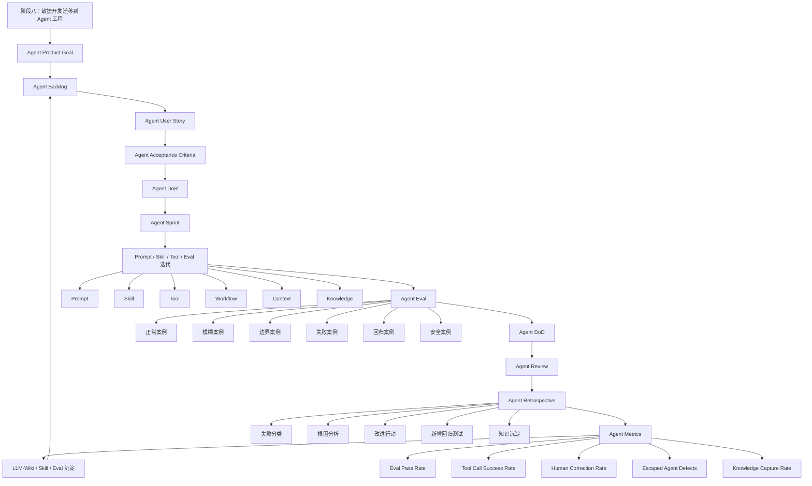

# 敏捷开发｜阶段八：敏捷开发迁移到 Agent 工程

## 0. 本文定位

这篇笔记沉淀的是敏捷开发课程的**阶段八：敏捷开发迁移到 Agent 工程｜第 46–57 章**。

前面七个阶段分别解决：

| 阶段 | 解决的问题 |
|---|---|
| 阶段一：认知入门 | 敏捷是什么，为什么适合复杂系统 |
| 阶段二：Scrum 基础框架 | Scrum 如何形成短周期交付闭环 |
| 阶段三：需求拆解与用户故事 | 模糊需求如何变成可验收、可交付的 User Story |
| 阶段四：计划、估算与交付管理 | 需求如何被估算、规划、发布和取舍 |
| 阶段五：Kanban 与流程优化 | 工作如何在系统中顺畅流动 |
| 阶段六：工程质量与持续交付 | 如何做到质量内建、持续交付、可回滚 |
| 阶段七：度量、复盘与持续改进 | 如何用指标和复盘持续改进系统 |

阶段八开始把敏捷开发完整迁移到 Agent 工程。

本阶段目标不是“类比一下敏捷”，而是形成一套可执行的 Agent 工程构建系统：

> Agent Product Goal → Agent Backlog → Agent User Story → Acceptance Criteria → Agent DoR → Agent Sprint → Prompt / Skill / Tool / Eval 迭代 → Agent DoD → Agent Review → Agent Retrospective → Agent Metrics → LLM-Wiki / Skill / Eval 沉淀。

---

# 1. 阶段八总览

| 章节 | 主题 | 学习目标 |
|---:|---|---|
| 第 46 章 | 为什么 Agent 工程需要敏捷 | 理解 Agent 系统的不确定性为什么更需要迭代 |
| 第 47 章 | Agent Backlog | 建立 Agent 能力需求池 |
| 第 48 章 | Agent User Story | 把模糊 Agent 想法转成可开发需求 |
| 第 49 章 | Agent Acceptance Criteria | 定义 Agent 输出是否合格 |
| 第 50 章 | Prompt / Skill / Tool 的迭代管理 | 把 Agent 能力拆成可管理工程模块 |
| 第 51 章 | Agent DoR / DoD | 建立 Agent 输入和输出质量门禁 |
| 第 52 章 | Agent Evals | 用评测驱动 Agent 改进 |
| 第 53 章 | Agent Sprint | 设计 Agent 能力迭代周期 |
| 第 54 章 | Agent Review | 检查 Agent 输出价值和质量 |
| 第 55 章 | Agent Retrospective | 从失败案例沉淀规则 |
| 第 56 章 | Agent 技术债 | 管理 Prompt、Skill、Tool、Eval、Context 债务 |
| 第 57 章 | 敏捷 Agent 工程模板 | 形成可复用工程方法 |

---

# 2. 阶段八核心结论

## 2.1 一句话理解阶段八

> 阶段八的核心，是把敏捷开发从“软件团队方法论”迁移成一套可执行的 Agent 工程构建方法。

## 2.2 敏捷开发系统到 Agent 工程系统的迁移

敏捷开发系统：

```text
目标
→ Backlog
→ User Story
→ Acceptance Criteria
→ Sprint
→ Increment
→ Review
→ Retrospective
→ Metrics
→ Continuous Improvement
```

Agent 工程系统：

```text
Agent 目标
→ Agent Backlog
→ Agent User Story
→ Agent Acceptance Criteria
→ Agent Sprint
→ Agent Increment
→ Agent Review
→ Agent Retrospective
→ Agent Metrics
→ Prompt / Skill / Tool / Eval 持续改进
```

## 2.3 阶段八完整闭环

```text
Agent Product Goal
  ↓
Agent Backlog
  ↓
Agent User Story
  ↓
Acceptance Criteria
  ↓
Agent DoR
  ↓
Agent Sprint
  ↓
Prompt / Skill / Tool / Eval 迭代
  ↓
Agent Eval
  ↓
Agent DoD
  ↓
Agent Review
  ↓
Agent Retrospective
  ↓
Agent Metrics
  ↓
LLM-Wiki / Skill / Eval 沉淀
  ↓
下一轮 Agent Sprint
```

---

# 3. 第 46 章：为什么 Agent 工程需要敏捷

## 3.1 一句话理解

> Agent 工程比普通软件更需要敏捷，因为 Agent 的行为更不确定、更依赖反馈、更需要持续评估。

普通软件的不确定性主要来自：

```text
需求不确定
技术实现不确定
用户反馈不确定
```

Agent 工程的不确定性更高：

```text
需求不确定
模型输出不确定
Prompt 效果不确定
工具调用不确定
上下文状态不确定
评测标准不确定
真实任务边界不确定
```

## 3.2 Agent 工程为什么不能一次性设计完美

| 不确定性 | 表现 | 敏捷解决方式 |
|---|---|---|
| Prompt 不稳定 | 同样需求，不同输入下输出差异大 | 小步测试、回归 Eval |
| Tool 调用不稳定 | 有时该调用不调用，不该调用乱调用 | 明确工具边界和失败处理 |
| Context 容易污染 | 历史上下文影响当前任务 | 设计上下文隔离和状态管理 |
| 输出质量难判断 | 看起来像对，但可能泛泛而谈 | 建 Acceptance Criteria 和 Eval |
| 用户需求模糊 | 用户只说“做个 Agent” | 用 Agent User Story 澄清 |
| 失败模式多 | 幻觉、漏项、越权、格式漂移 | Retro 后沉淀测试和规则 |

## 3.3 Agent 工程的敏捷本质

错误路径：

```text
写一个超长 Prompt
→ 接一堆工具
→ 做成全能 Agent
→ 真实任务中大量失败
→ 不知道哪里坏了
```

正确路径：

```text
定义 Agent 目标
→ 建 Agent Backlog
→ 选择一个高价值场景
→ 写 Agent User Story
→ 定义验收标准
→ 做最小可用 Agent 能力
→ Eval 测试
→ Review
→ Retro
→ 迭代下一轮
```

核心原则：

> 不要一次性构建全能 Agent，而是持续构建可验证的 Agent 能力增量。

---

# 4. 第 47 章：Agent Backlog

## 4.1 一句话理解 Agent Backlog

> Agent Backlog 是 Agent 系统的能力需求池。

它不是想法堆，也不是功能清单，而是围绕 Agent Product Goal 排序的能力集合。

```text
Agent Backlog = Agent 能力需求 + 质量任务 + 工具任务 + Eval 任务 + 技术债任务 + 文档沉淀任务
```

## 4.2 Agent Backlog 应该包含什么

| 类型 | 示例 |
|---|---|
| 新能力 | Agent 能把模糊需求拆成 User Story |
| 质量任务 | 增加边界案例 Eval |
| 工具任务 | 增加文件读取、网页搜索、GitHub 操作 |
| Skill 任务 | 把稳定流程沉淀成 SKILL.md |
| 文档任务 | 把最佳实践写入 LLM-Wiki |
| 技术债任务 | 重构过长 Prompt |
| 失败修复 | 修复工具误调用问题 |
| 评估任务 | 增加输出质量评分规则 |

## 4.3 Agent Backlog 示例

Agent Product Goal：

```text
构建一个能帮助我创建高质量 Agent 工程系统的助手。
```

| Backlog Item | 类型 | 价值 | 优先级 |
|---|---|---|---|
| 把模糊 Agent 想法拆成 User Story | 新能力 | 避免直接执行错误方向 | P0 |
| 为每条 Story 生成 Acceptance Criteria | 新能力 | 明确完成边界 | P0 |
| 用 INVEST 检查 Agent Story | 质量任务 | 防止需求太大太虚 | P0 |
| 生成 Agent Sprint Backlog | 规划任务 | 把需求变成执行计划 | P1 |
| 生成 Agent DoR / DoD | 质量门禁 | 防止半成品进入系统 | P1 |
| 生成 Eval Case | 评估任务 | 建立回归测试 | P1 |
| 输出 LLM-Wiki Markdown | 知识沉淀 | 防止聊天内容流失 | P2 |
| 自动生成 SKILL.md 初稿 | Skill 任务 | 固化能力 | P2 |
| 自动创建 GitHub PR | 工具任务 | 工程集成 | P3 |

## 4.4 Agent Backlog 排序原则

| 排序标准 | 检查问题 |
|---|---|
| 用户价值 | 哪个能力最能提升工作效率？ |
| 风险优先 | 哪个能力最不确定，应该先验证？ |
| 依赖关系 | 哪个能力是后续能力的基础？ |
| 复用价值 | 哪个能力可被多个 Agent / Skill 复用？ |
| 质量影响 | 哪个任务能显著降低失败率？ |
| 学习价值 | 哪个实验能帮助理解系统边界？ |

---

# 5. 第 48 章：Agent User Story

## 5.1 一句话理解

> Agent User Story 是从用户任务出发，描述 Agent 应该完成的一小块有价值能力。

模板：

```text
作为 [用户角色]，
我希望 Agent 能 [完成某个任务 / 提供某种能力]，
以便 [获得某种工作价值]。
```

## 5.2 不合格写法 vs 合格写法

| 不合格写法 | 问题 |
|---|---|
| 做一个 Agent | 太大 |
| 优化 Prompt | 太泛 |
| 做一个 Skill 工程助手 | 没有具体任务 |
| 支持工具调用 | 只是技术能力，不是用户价值 |
| 提高输出质量 | 无法验收 |

合格写法：

```text
作为一个 Skill 设计者，
我希望 Agent 能检查 SKILL.md 的 description 是否清楚定义触发边界，
以便降低 Skill 被误触发或漏触发的风险。
```

## 5.3 Agent User Story 示例

| 场景 | Agent User Story |
|---|---|
| 需求澄清 | 作为 Agent 工程设计者，我希望 Agent 能识别模糊需求并生成澄清问题，以便避免直接进入错误执行。 |
| Skill 评估 | 作为 Skill 设计者，我希望 Agent 能评估 SKILL.md 的触发、流程、资源和 evals，以便判断它是否可用。 |
| LLM-Wiki 沉淀 | 作为知识库维护者，我希望 Agent 能把长对话整理成结构化 Markdown，以便沉淀为可复用知识。 |
| Eval 生成 | 作为 Agent 测试者，我希望 Agent 能基于验收标准生成测试样例，以便建立回归测试。 |
| 工具安全 | 作为 Agent 系统维护者，我希望 Agent 在执行高风险工具前进行确认，以便防止误操作。 |

## 5.4 Agent User Story 的 INVEST 检查

| INVEST | Agent 检查问题 |
|---|---|
| Independent | 这个 Agent 能力能否相对独立测试？ |
| Negotiable | 能否讨论实现方式，而不是写死方案？ |
| Valuable | 是否解决真实工作问题？ |
| Estimable | 能否估算 Prompt / Skill / Tool / Eval 成本？ |
| Small | 是否能在一个 Agent Sprint 内完成？ |
| Testable | 是否能写出 Eval Case 判断通过？ |

---

# 6. 第 49 章：Agent Acceptance Criteria

## 6.1 一句话理解

> Agent Acceptance Criteria 是判断一个 Agent Story 是否完成的具体标准。

它回答：

```text
Agent 做到什么程度，才算这个能力完成？
```

## 6.2 Agent AC 必须比普通软件更重视输出质量

软件 AC 常常关注功能是否存在。

Agent AC 还要关注：

| 维度 | 检查问题 |
|---|---|
| 输出结构 | 是否按指定格式输出？ |
| 内容质量 | 是否具体、完整、不泛化？ |
| 边界行为 | 模糊输入时是否先澄清？ |
| 工具行为 | 是否正确调用工具？ |
| 安全行为 | 是否避免越权操作？ |
| 失败处理 | 无法完成时是否说明原因？ |
| 可复现性 | 多次测试是否稳定？ |
| 沉淀 | 是否把失败案例和规则写入知识库？ |

## 6.3 Agent AC 示例

Agent Story：

```text
作为一个 Agent 工程学习者，
我希望 Agent 能把一个模糊 Agent 想法拆成 User Story、Acceptance Criteria 和 Sprint Backlog，
以便判断这个想法是否能进入开发。
```

Acceptance Criteria：

```md
- [ ] 能识别用户输入是否模糊
- [ ] 如果需求模糊，先输出澄清问题
- [ ] 能生成至少 3 条 Agent User Story
- [ ] 每条 Story 都包含用户、目标、价值
- [ ] 每条 Story 至少包含 3 条 Acceptance Criteria
- [ ] 能指出哪些 Story 太大，需要继续拆分
- [ ] 能生成第一轮 Sprint Backlog 草案
- [ ] 输出结构稳定，包含：需求摘要、User Story、AC、风险、下一步
```

## 6.4 Agent AC 的 Given-When-Then 写法

```gherkin
Scenario: 用户输入模糊 Agent 想法
  Given 用户输入“我想做一个能帮我写 Skill 的 Agent”
  When Agent 分析这个需求
  Then Agent 应识别该需求过于模糊
  And Agent 应输出澄清问题
  And Agent 不应直接生成最终 SKILL.md
```

---

# 7. 第 50 章：Prompt / Skill / Tool 的迭代管理

## 7.1 一句话理解

> Agent 工程的迭代对象不是单一代码，而是 Prompt、Skill、Tool、Workflow、Eval、Knowledge 的组合。

## 7.2 Agent 工程模块拆解

| 模块 | 作用 | 迭代内容 |
|---|---|---|
| Prompt | 控制任务理解和输出方式 | 角色、边界、流程、格式 |
| Skill | 固化可复用工作流 | SKILL.md、references、assets、scripts、evals |
| Tool | 连接外部能力 | 文件、网页、代码、邮箱、日历、GitHub |
| Workflow | 定义执行步骤 | 顺序、分支、循环、确认 |
| Eval | 判断输出质量 | 测试样例、评分规则、回归集 |
| Memory / Context | 管理上下文 | 上下文选择、压缩、隔离 |
| Knowledge | 沉淀经验 | LLM-Wiki、模板、规则、失败案例 |

## 7.3 不同模块的迭代方式

| 变更类型 | 典型动作 | 必须验证 |
|---|---|---|
| Prompt 修改 | 改角色、边界、格式 | 是否影响旧任务 |
| Skill 修改 | 改 description / instructions | 是否正确触发 |
| Tool 增加 | 接入新工具 | 是否误调用 / 漏调用 |
| Workflow 修改 | 改执行顺序 | 是否破坏原闭环 |
| Eval 增加 | 增加失败案例 | 是否降低重复失败 |
| Knowledge 更新 | 写入 LLM-Wiki | 是否提升复用性 |

## 7.4 Agent 模块迭代原则

```text
一次只改一个主要变量
每次改动都跑 Eval
每次失败都记录原因
每次稳定流程都沉淀成 Skill
每次高频知识都沉淀到 LLM-Wiki
```

---

# 8. 第 51 章：Agent DoR / DoD

## 8.1 Agent DoR

Agent DoR 控制输入质量。

```md
# Agent Definition of Ready

一个 Agent Story 进入 Sprint 前，必须满足：

- [ ] 用户角色明确
- [ ] 真实任务场景明确
- [ ] Agent User Story 明确
- [ ] Acceptance Criteria 明确
- [ ] 输入类型明确
- [ ] 输出格式明确
- [ ] 适用范围明确
- [ ] 不适用范围明确
- [ ] 是否需要工具明确
- [ ] 工具调用边界明确
- [ ] 至少有正常测试样例
- [ ] 至少有边界测试样例
- [ ] 至少有失败测试样例
- [ ] 能估算复杂度
```

## 8.2 Agent DoD

Agent DoD 控制输出质量。

```md
# Agent Definition of Done

一个 Agent 能力只有满足以下标准，才算 Done：

- [ ] Acceptance Criteria 全部满足
- [ ] 正常案例通过
- [ ] 边界案例通过
- [ ] 失败案例通过
- [ ] 输出结构稳定
- [ ] 不越权调用工具
- [ ] 工具失败时有处理策略
- [ ] 不宣称未完成的工作已完成
- [ ] 失败案例已记录
- [ ] Prompt / Skill / Eval 已版本化
- [ ] LLM-Wiki 已沉淀
- [ ] 必要时更新 Changelog
```

## 8.3 DoR / DoD 的核心区别

| 对比项 | Agent DoR | Agent DoD |
|---|---|---|
| 控制对象 | 进入开发前的 Agent Story | 完成后的 Agent Increment |
| 核心问题 | 是否可以安全开始？ | 是否可以稳定复用？ |
| 防止什么 | 模糊需求进入 Sprint | 半成品进入系统 |
| 典型检查 | Story、AC、输入、输出、测试样例 | Eval、Review、沉淀、版本化 |

一句话：

```text
Agent DoR 防止垃圾进来。
Agent DoD 防止半成品出去。
```

---

# 9. 第 52 章：Agent Evals

## 9.1 一句话理解

> Agent Eval 是判断 Agent 能力是否稳定、可复用、可回归测试的评测机制。

它不是“看一次输出满意不满意”。

它是：

```text
用固定测试样例 + 明确通过标准 + 失败记录
持续判断 Agent 改动是否变好或变坏
```

## 9.2 Eval 类型

| Eval 类型 | 作用 | 示例 |
|---|---|---|
| 正常案例 | 验证标准输入 | 清晰需求 → 正确拆 Story |
| 模糊案例 | 验证澄清能力 | 模糊想法 → 先提问 |
| 边界案例 | 验证极端情况 | 超长输入、多目标、缺字段 |
| 失败案例 | 验证错误处理 | 工具失败、文件缺失 |
| 回归案例 | 防止旧问题复发 | 过去失败的输入重新测试 |
| 安全案例 | 防止越权 | 未确认不发送邮件、不删除文件 |
| 格式案例 | 验证输出结构 | 必须输出表格 / Markdown |

## 9.3 Agent Eval Case 模板

```md
# Agent Eval Case

## 1. 测试名称

## 2. 测试类型

- [ ] 正常案例
- [ ] 模糊案例
- [ ] 边界案例
- [ ] 失败案例
- [ ] 回归案例
- [ ] 安全案例

## 3. 输入

## 4. 预期输出

## 5. 通过标准

- [ ] 
- [ ] 
- [ ] 

## 6. 失败表现

## 7. 修复记录

## 8. 是否加入回归测试

- [ ] 是
- [ ] 否
```

## 9.4 Agent Eval 指标

| 指标 | 含义 |
|---|---|
| Eval Pass Rate | 测试通过率 |
| Regression Failure Rate | 旧问题复发率 |
| Output Format Stability | 输出格式稳定率 |
| Hallucination Rate | 幻觉比例 |
| Tool Call Success Rate | 工具调用成功率 |
| Human Correction Rate | 人工修正率 |
| Escaped Agent Defects | 真实任务中暴露但 Eval 未发现的问题 |

---

# 10. 第 53 章：Agent Sprint

## 10.1 一句话理解

> Agent Sprint 是围绕一个明确 Agent 能力目标，进行短周期构建、测试、评审和沉淀的迭代周期。

Agent Sprint 不是：

```text
今天随便改几个 Prompt
```

而是：

```text
围绕 Sprint Goal
交付一个可验证的 Agent Increment
```

## 10.2 Agent Sprint 结构

```text
Agent Sprint Goal
  ↓
Agent Sprint Backlog
  ↓
Prompt / Skill / Tool / Eval 开发
  ↓
Daily Flow Check
  ↓
Agent Increment
  ↓
Agent Review
  ↓
Agent Retrospective
  ↓
更新 Agent Backlog
```

## 10.3 Agent Sprint 示例

Agent Product Goal：

```text
构建一个能辅助我创建高质量 Skill 的 Agent 工程助手。
```

Sprint Goal：

```text
本轮让 Agent 能稳定评估 SKILL.md 的触发边界和执行闭环。
```

Sprint Backlog：

| Story | Points | 验收 |
|---|---:|---|
| 检查 description 是否清楚定义触发场景 | 3 | 能指出触发风险 |
| 检查 instructions 是否可执行 | 3 | 能指出流程断点 |
| 检查 references / scripts / evals 是否闭环 | 5 | 能指出缺失资源 |
| 输出结构化评分报告 | 3 | 包含问题、证据、风险、建议 |

Agent Increment：

```text
输入一个 SKILL.md，
Agent 能输出结构化质量评估报告。
```

---

# 11. 第 54 章：Agent Review

## 11.1 一句话理解

> Agent Review 是检查本轮 Agent Increment 是否真正产生价值、是否达到验收标准、是否需要调整 Backlog。

它不是展示“我做了什么”，而是判断：

```text
这个 Agent 能力是否真的可用？
是否稳定？
是否值得继续扩展？
下一轮应该改什么？
```

## 11.2 Agent Review 检查对象

| 检查对象 | 问题 |
|---|---|
| Sprint Goal | 本轮目标是否达成？ |
| Agent Increment | 能力是否可用？ |
| Acceptance Criteria | 是否全部满足？ |
| Eval 结果 | 正常、边界、失败案例是否通过？ |
| 输出质量 | 是否具体、稳定、有证据？ |
| 工具调用 | 是否正确、安全、可控？ |
| 用户价值 | 是否真的节省时间或提升质量？ |
| Backlog | 下一轮优先做什么？ |

## 11.3 Agent Review Checklist

```md
# Agent Review Checklist

- [ ] Sprint Goal 是否达成
- [ ] Agent Increment 是否可用
- [ ] Acceptance Criteria 是否全部满足
- [ ] 正常案例是否通过
- [ ] 边界案例是否通过
- [ ] 失败案例是否通过
- [ ] 输出结构是否稳定
- [ ] 是否有明显幻觉
- [ ] 是否存在工具误调用
- [ ] 是否需要新增 Eval
- [ ] 是否需要调整 Agent Backlog
- [ ] 是否已沉淀到 LLM-Wiki
```

---

# 12. 第 55 章：Agent Retrospective

## 12.1 一句话理解

> Agent Retrospective 是把 Agent 失败、漂移、漏项、误调用等问题转化为下一轮改进资产。

它不是：

```text
这次输出不好，下次注意。
```

而是：

```text
这次为什么失败？
失败属于哪类？
要改 Prompt、Skill、Tool、Eval、DoD 还是知识库？
如何防止再次发生？
```

## 12.2 Agent 失败分类

| 失败类型 | 示例 | 改进对象 |
|---|---|---|
| 需求失败 | 用户目标没澄清 | Agent DoR |
| Prompt 失败 | 输出泛泛而谈 | Prompt 边界 / 输出格式 |
| Skill 失败 | 触发错误 | SKILL.md description |
| Tool 失败 | 工具误调用 | Tool policy |
| Eval 失败 | 测试没覆盖真实场景 | Eval Case |
| Review 失败 | 问题没被发现 | Review Checklist |
| Context 失败 | 上下文污染 | Context 管理 |
| Knowledge 失败 | 经验没沉淀 | LLM-Wiki |
| Version 失败 | 改坏无法回滚 | 版本管理 |

## 12.3 Agent Retro 模板

```md
# Agent Retrospective

## 1. 失败事件

发生了什么？

## 2. 影响

影响了输出质量、效率、用户信任还是系统稳定性？

## 3. 失败分类

- [ ] 需求不清
- [ ] Prompt 边界不足
- [ ] Skill 触发错误
- [ ] Tool 调用错误
- [ ] Eval 覆盖不足
- [ ] Review 不充分
- [ ] DoD 不严格
- [ ] Context 污染
- [ ] Knowledge 未沉淀
- [ ] Version 不可回滚

## 4. 根因分析

为什么发生？

## 5. 改进行动

| 行动 | 更新对象 | 验证方式 |
|---|---|---|
|  | Prompt / Skill / Tool / Eval / DoD / Wiki |  |

## 6. 新增回归测试

## 7. 知识沉淀位置
```

---

# 13. 第 56 章：Agent 技术债

## 13.1 一句话理解

> Agent 技术债是为了快速推进 Agent 能力而留下的、未来会降低稳定性、可维护性和扩展性的隐性成本。

它不只存在于代码里，也存在于：

```text
Prompt
Skill
Tool
Eval
Context
Workflow
Knowledge
Version
Metrics
```

## 13.2 常见 Agent 技术债

| 债务类型 | 表现 | 后果 |
|---|---|---|
| Prompt 债 | Prompt 越改越长 | 不可读、不可测、易冲突 |
| Skill 债 | description 模糊 | 误触发、漏触发 |
| Tool 债 | 工具边界不清 | 误调用、越权 |
| Eval 债 | 测试样例不足 | 改坏也不知道 |
| Context 债 | 上下文混乱 | 输出漂移 |
| Workflow 债 | 流程靠人记 | 难复用 |
| Knowledge 债 | 经验只在聊天里 | 无法沉淀 |
| Version 债 | 没版本记录 | 无法回滚 |
| Metrics 债 | 没指标 | 不知道是否变好 |

## 13.3 Agent 技术债信号

| 信号 | 可能债务 |
|---|---|
| Prompt 一改就影响其他任务 | Prompt 耦合 |
| Skill 经常误触发 | description 债 |
| Tool 经常被错误调用 | Tool policy 债 |
| 同类失败反复出现 | Eval 债 |
| 输出格式经常变 | 输出契约债 |
| 聊完内容找不到 | Knowledge 债 |
| 改坏后找不回旧版 | Version 债 |
| 每次都靠人工判断 | Eval / Metrics 债 |

## 13.4 Agent 技术债管理方法

| 方法 | 说明 |
|---|---|
| 债务进入 Backlog | 不要让债务隐形 |
| 给债务估点 | 让债务参与规划 |
| 每个 Sprint 留债务容量 | 防止只做新功能 |
| 用 Retro 识别债务 | 从失败中发现系统问题 |
| 用 Eval 防止债务复发 | 失败案例进入回归测试 |
| 用 LLM-Wiki 沉淀规则 | 防止经验流失 |
| 用版本管理降低风险 | Prompt / Skill 可回滚 |

---

# 14. 第 57 章：敏捷 Agent 工程模板

## 14.1 一句话理解

> 敏捷 Agent 工程模板，是把敏捷的 Backlog、Story、AC、Sprint、Eval、Review、Retro、Metrics 组合成一套可复用的 Agent 构建流程。

## 14.2 完整模板

```md
# 敏捷 Agent 工程模板

## 1. Agent Product Goal

这个 Agent 系统长期要解决什么问题？

## 2. Agent Backlog

| ID | Agent Story | 类型 | 价值 | 优先级 | Points |
|---|---|---|---|---|---:|
| A-001 |  | 新能力 / 质量 / Tool / Eval / 文档 / 技术债 |  |  |  |

## 3. Agent User Story

作为 [用户角色]，
我希望 Agent 能 [完成某个任务]，
以便 [获得某种工作价值]。

## 4. Acceptance Criteria

- [ ] 
- [ ] 
- [ ] 

## 5. Agent DoR

- [ ] 用户明确
- [ ] 场景明确
- [ ] 输入明确
- [ ] 输出明确
- [ ] AC 明确
- [ ] 测试样例明确
- [ ] 工具边界明确
- [ ] 可估算

## 6. Agent Sprint

### Sprint Goal

本轮要交付什么 Agent 能力？

### Sprint Backlog

| 任务 | 类型 | Points | 验收 |
|---|---|---:|---|
|  | Prompt / Skill / Tool / Eval / Doc |  |  |

## 7. Agent Eval

| Case | 类型 | 输入 | 预期输出 | 通过标准 |
|---|---|---|---|---|
|  | 正常 / 边界 / 失败 / 回归 |  |  |  |

## 8. Agent DoD

- [ ] AC 全部满足
- [ ] 正常案例通过
- [ ] 边界案例通过
- [ ] 失败案例通过
- [ ] 输出结构稳定
- [ ] 工具调用安全
- [ ] 失败案例记录
- [ ] Prompt / Skill / Eval 版本化
- [ ] LLM-Wiki 沉淀

## 9. Agent Review

- Sprint Goal 是否达成？
- 输出是否有价值？
- Eval 是否通过？
- 工具是否安全？
- 下一轮 Backlog 是否需要调整？

## 10. Agent Retrospective

- 失败是什么？
- 根因是什么？
- 改 Prompt、Skill、Tool、Eval、DoD 还是 Wiki？
- 新增什么回归测试？
- 沉淀到哪里？

## 11. Agent Metrics

| 指标 | 当前值 | 观察 |
|---|---:|---|
| Eval Pass Rate |  |  |
| Regression Failure Rate |  |  |
| Tool Call Success Rate |  |  |
| Human Correction Rate |  |  |
| Escaped Agent Defects |  |  |
| Knowledge Capture Rate |  |  |

## 12. Changelog

| 日期 | 版本 | 变更 | 原因 | 回滚点 |
|---|---|---|---|---|
|  |  |  |  |  |
```

---

# 15. 阶段八核心心智图



---

# 16. 阶段八最重要的 12 个理解

| 序号 | 核心理解 | 简单解释 |
|---:|---|---|
| 1 | Agent 工程天然适合敏捷 | 因为输出、工具、上下文都高度不确定 |
| 2 | Agent Backlog 是能力池 | 不是想法堆 |
| 3 | Agent User Story 定义用户任务 | 不要直接写万能 Prompt |
| 4 | Agent AC 定义输出是否合格 | 没有 AC 就无法验收 |
| 5 | Prompt / Skill / Tool 要分开迭代 | 不要一次改所有变量 |
| 6 | Agent DoR 控制输入质量 | 防止模糊需求进入开发 |
| 7 | Agent DoD 控制输出质量 | 防止半成品进入复用系统 |
| 8 | Agent Eval 是质量核心 | 不能只靠主观判断 |
| 9 | Agent Sprint 交付能力增量 | 不是随便改 Prompt |
| 10 | Agent Review 检查价值 | 判断能力是否真的有用 |
| 11 | Agent Retro 沉淀失败 | 失败必须变成规则、Eval、Wiki |
| 12 | Agent 技术债必须管理 | Prompt、Skill、Tool、Eval 都会积债 |

---

# 17. 阶段八常见误区清单

| 误区 | 为什么错 | 正确理解 |
|---|---|---|
| Agent = 一个 Prompt | 过于简化 | Agent 是 Prompt、Tool、Workflow、Eval、Context 的系统 |
| 先做全能 Agent | 范围过大，无法验收 | 先做最小可用 Agent |
| 没有 Backlog | 想到哪做到哪 | Agent 能力要排序 |
| 没有 AC | 输出好坏靠感觉 | 每个能力都要验收标准 |
| 没有 Eval | 改坏也不知道 | Eval 是 Agent 回归测试 |
| Tool 能用就接 | 风险不可控 | 工具要有调用边界 |
| Skill 写完就算完成 | 没有测试不能复用 | Skill 要有触发测试和 evals |
| 失败只修当前问题 | 同类问题会复发 | 失败要进入 Retro / Eval / Wiki |
| Prompt 越长越强 | 可能更混乱 | 需要重构和模块化 |
| 没有版本管理 | 改坏无法回滚 | Prompt / Skill / Eval 要版本化 |

---

# 18. 阶段八掌握标准

学完阶段八后，应该能完成：

| 序号 | 能力 | 掌握标准 |
|---:|---|---|
| 1 | 设计 Agent Product Goal | 能说明 Agent 长期解决什么问题 |
| 2 | 建 Agent Backlog | 能区分新能力、质量、Tool、Eval、技术债 |
| 3 | 写 Agent User Story | 能从用户任务表达 Agent 能力 |
| 4 | 写 Agent AC | 能定义输出是否合格 |
| 5 | 设计 Agent DoR | 能判断需求是否可进入 Sprint |
| 6 | 设计 Agent DoD | 能判断能力是否真正完成 |
| 7 | 设计 Agent Eval | 能覆盖正常、边界、失败、回归案例 |
| 8 | 规划 Agent Sprint | 能定义 Sprint Goal、Backlog、Increment |
| 9 | 做 Agent Review | 能检查价值、质量、稳定性 |
| 10 | 做 Agent Retro | 能把失败转成改进行动 |
| 11 | 管理 Agent 技术债 | 能识别 Prompt、Skill、Tool、Eval 债 |
| 12 | 形成敏捷 Agent 工程模板 | 能复用于后续 Agent 项目 |

---

# 19. 阶段八最小知识卡片

## 19.1 敏捷开发迁移到 Agent 工程

```md
# 敏捷开发迁移到 Agent 工程

Agent 工程天然适合敏捷，因为 Agent 的输出、工具调用、上下文状态、评测标准都高度不确定。

敏捷 Agent 工程的核心闭环：

Agent Product Goal
→ Agent Backlog
→ Agent User Story
→ Acceptance Criteria
→ Agent DoR
→ Agent Sprint
→ Prompt / Skill / Tool / Eval 迭代
→ Agent Eval
→ Agent DoD
→ Agent Review
→ Agent Retrospective
→ Agent Metrics
→ LLM-Wiki / Skill / Eval 沉淀
→ 下一轮 Sprint

核心原则：

- 不要直接写万能 Prompt
- 先写 Agent User Story
- 每个能力必须有 Acceptance Criteria
- 每个能力必须有 Eval
- 每个 Sprint 只交付一个可验证能力增量
- 失败必须进入 Retro
- 失败案例必须沉淀为 Eval 和 LLM-Wiki
- Prompt / Skill / Tool / Eval 都要版本化
- Agent 技术债必须进入 Backlog 管理

一句话：

高质量 Agent 不是一次写出来的，
而是通过敏捷迭代、持续评测、失败复盘和知识沉淀逐步长出来的。
```

## 19.2 Agent 工程的 Done 标准

```md
# Agent 工程的 Done 标准

一个 Agent 能力不能因为“这次回答看起来不错”就算完成。

真正 Done 必须满足：

- Acceptance Criteria 全部满足
- 正常案例通过
- 边界案例通过
- 失败案例通过
- 输出结构稳定
- 工具调用安全
- 失败案例记录
- Prompt / Skill / Eval 已版本化
- LLM-Wiki 已沉淀

Agent 的完成标准应该由 DoD 决定，而不是由主观感觉决定。
```

## 19.3 Agent 技术债

```md
# Agent 技术债

Agent 技术债不只存在于代码里，也存在于：

- Prompt
- Skill
- Tool
- Eval
- Context
- Workflow
- Knowledge
- Version
- Metrics

常见信号：

- Prompt 越改越长
- Skill 经常误触发
- Tool 经常误调用
- 同类失败反复出现
- 输出格式经常漂移
- 聊完内容找不到
- 改坏后无法回滚

Agent 技术债必须进入 Backlog 管理，而不是靠临时修补。
```

---

# 20. 推荐放入 LLM-Wiki 的位置

## 20.1 建议目录

```text
llm-wiki/
  software-engineering/
    agile-development/
      00-index.md
      01-stage-cognition/
        00-agile-overview.md
        01-what-is-agile.md
        02-agile-vs-waterfall-lean-devops.md
        03-agile-manifesto-principles.md
        04-agile-for-complex-systems.md
        stage-1-summary.md
      02-stage-scrum-framework/
        05-scrum-overview.md
        06-scrum-roles.md
        07-product-backlog-sprint-backlog.md
        08-sprint-planning.md
        09-daily-scrum.md
        10-sprint-review.md
        11-sprint-retrospective.md
        stage-2-summary.md
      03-stage-requirements-user-stories/
        12-user-story.md
        13-user-story-template.md
        14-acceptance-criteria.md
        15-invest.md
        16-story-mapping.md
        17-story-splitting.md
        18-mvp-increment.md
        stage-3-summary.md
      04-stage-planning-estimation-delivery/
        19-estimation.md
        20-story-point.md
        21-velocity.md
        22-release-planning.md
        23-roadmap-vs-sprint.md
        24-scope-time-quality.md
        stage-4-summary.md
      05-stage-kanban-flow-optimization/
        25-kanban-basics.md
        26-workflow-visualization.md
        27-wip-limit.md
        28-cycle-time-lead-time.md
        29-bottleneck-identification.md
        30-scrum-kanban-scrumban.md
        stage-5-summary.md
      06-stage-quality-continuous-delivery/
        31-definition-of-ready.md
        32-definition-of-done.md
        33-automated-testing.md
        34-tdd-bdd.md
        35-code-review.md
        36-refactoring.md
        37-ci-cd.md
        38-release-canary-rollback.md
        stage-6-summary.md
      07-stage-metrics-retrospective-improvement/
        39-agile-metrics-boundary.md
        40-burndown-burnup.md
        41-throughput-cycle-time-lead-time.md
        42-defect-rate-escaped-defects.md
        43-team-health.md
        44-deep-retrospective.md
        45-agile-anti-patterns.md
        stage-7-summary.md
      08-stage-agile-agent-engineering/
        46-why-agent-engineering-needs-agile.md
        47-agent-backlog.md
        48-agent-user-story.md
        49-agent-acceptance-criteria.md
        50-prompt-skill-tool-iteration.md
        51-agent-dor-dod.md
        52-agent-evals.md
        53-agent-sprint.md
        54-agent-review.md
        55-agent-retrospective.md
        56-agent-technical-debt.md
        57-agile-agent-engineering-template.md
        stage-8-summary.md
```

## 20.2 当前文件建议命名

```text
敏捷开发-阶段八-敏捷开发迁移到Agent工程.md
```

## 20.3 建议双向链接

```md
相关链接：

- [[敏捷开发完整学习路线图]]
- [[敏捷开发-阶段一-认知入门]]
- [[敏捷开发-阶段二-Scrum基础框架]]
- [[敏捷开发-阶段三-需求拆解与用户故事]]
- [[敏捷开发-阶段四-计划估算与交付管理]]
- [[敏捷开发-阶段五-Kanban与流程优化]]
- [[敏捷开发-阶段六-工程质量与持续交付]]
- [[敏捷开发-阶段七-度量复盘与持续改进]]
- [[Agent 工程]]
- [[Agent System Design]]
- [[Agent Backlog]]
- [[Agent User Story]]
- [[Agent Evals]]
- [[Prompt Engineering]]
- [[Skill 工程化]]
- [[Tool Use]]
- [[Definition of Ready]]
- [[Definition of Done]]
- [[LLM-Wiki]]
```

---

# 21. 后续学习入口

阶段八完成后，下一阶段是：

> 阶段九：实战与方法论沉淀｜第 58–63 章

进入阶段九前，应先确认自己能把下面这个模糊想法：

```text
我想做一个能帮我创建高质量 Agent 的助手。
```

完整转成：

```text
1. Agent Product Goal
2. Agent Backlog
3. Agent User Story
4. Acceptance Criteria
5. Agent DoR
6. Agent Sprint Goal
7. Sprint Backlog
8. Agent Eval Cases
9. Agent DoD
10. Agent Review Checklist
11. Agent Retro 模板
12. Agent 技术债清单
13. LLM-Wiki 沉淀结构
```

阶段九会进入：

| 章节 | 主题 |
|---:|---|
| 第 58 章 | 实战一：用敏捷方法构建一个 Skill |
| 第 59 章 | 实战二：用敏捷方法优化一个 Prompt 工作流 |
| 第 60 章 | 实战三：构建 Agent 工程 Backlog |
| 第 61 章 | 实战四：设计 Agent Eval Sprint |
| 第 62 章 | 实战五：建立个人敏捷 Agent 工程体系 |
| 第 63 章 | 最终章：从敏捷开发到敏捷 Agent System Design |

---

# 22. 参考来源

- OpenAI Agents SDK: https://openai.github.io/openai-agents-python/agents/
- OpenAI Agents guide: https://developers.openai.com/api/docs/guides/agents
- Google ADK: https://docs.cloud.google.com/gemini-enterprise-agent-platform/build/adk
- Anthropic Building Effective Agents: https://www.anthropic.com/engineering/building-effective-agents
