# 敏捷开发｜阶段九：实战与方法论沉淀

## 0. 本文定位

这篇笔记沉淀的是敏捷开发课程的**阶段九：实战与方法论沉淀｜第 58–63 章**。

前面八个阶段分别解决：

| 阶段 | 解决的问题 |
|---|---|
| 阶段一：认知入门 | 敏捷是什么，为什么适合复杂系统 |
| 阶段二：Scrum 基础框架 | Scrum 如何形成短周期交付闭环 |
| 阶段三：需求拆解与用户故事 | 模糊需求如何变成可验收、可交付的 User Story |
| 阶段四：计划、估算与交付管理 | 需求如何被估算、规划、发布和取舍 |
| 阶段五：Kanban 与流程优化 | 工作如何在系统中顺畅流动 |
| 阶段六：工程质量与持续交付 | 如何做到质量内建、持续交付、可回滚 |
| 阶段七：度量、复盘与持续改进 | 如何用指标和复盘持续改进系统 |
| 阶段八：敏捷开发迁移到 Agent 工程 | 如何把敏捷完整迁移到 Agent 工程 |

阶段九开始进入实战和方法论沉淀。

本阶段目标不是继续讲概念，而是把前面所有敏捷知识真正落到 Agent 工程项目里，形成你自己的可复用方法论、模板、Checklist 和 LLM-Wiki 资产。

核心问题是：

```text
如何用敏捷方法真正构建 Agent？
如何把 Prompt、Skill、Tool、Eval、Workflow 做成工程系统？
如何从一次项目沉淀成长期复用的方法论？
```

---

# 1. 阶段九总览

| 章节 | 主题 | 你要完成什么 |
|---:|---|---|
| 第 58 章 | 实战一：用敏捷方法构建一个 Skill | 从模糊需求到可用 Skill |
| 第 59 章 | 实战二：用敏捷方法优化一个 Prompt 工作流 | 把 Prompt 从临时提示词变成可测试流程 |
| 第 60 章 | 实战三：构建 Agent 工程 Backlog | 建立长期 Agent 能力池 |
| 第 61 章 | 实战四：设计 Agent Eval Sprint | 用评测驱动 Agent 改进 |
| 第 62 章 | 实战五：建立个人敏捷 Agent 工程体系 | 形成个人工作系统 |
| 第 63 章 | 最终章：从敏捷开发到敏捷 Agent System Design | 从单 Agent 升级到系统设计能力 |

---

# 2. 阶段九核心结论

## 2.1 一句话理解阶段九

> 阶段九的核心，是把敏捷开发迁移成可执行、可复用、可沉淀的 Agent 工程方法论。

## 2.2 阶段九不是讲概念，而是做工程

学完阶段九后，你应该能把任意一个 Agent 想法落成：

```text
Goal
→ Backlog
→ Story
→ AC
→ DoR
→ Sprint
→ Eval
→ DoD
→ Review
→ Retro
→ Wiki
```

## 2.3 阶段九完整闭环

```text
Agent Idea
  ↓
Agent Product Goal
  ↓
Agent Backlog
  ↓
Agent User Story
  ↓
Acceptance Criteria
  ↓
Agent DoR
  ↓
Agent Sprint
  ↓
Prompt / Skill / Tool / Eval 开发
  ↓
Agent Eval
  ↓
Agent DoD
  ↓
Agent Review
  ↓
Agent Retrospective
  ↓
Agent Metrics
  ↓
LLM-Wiki / Skill / Eval 沉淀
```

---

# 3. 第 58 章：实战一｜用敏捷方法构建一个 Skill

## 3.1 本章目标

把一个模糊 Skill 想法，转成一个可开发、可验收、可测试、可沉淀的 Skill 工程交付包。

示例目标：

```text
我想做一个 complex-task-clarifier Skill，
当用户提出复杂、模糊、早期想法时，
不要直接执行，而是先做需求澄清、任务建模、拆解和验收标准设计。
```

## 3.2 敏捷构建 Skill 的完整流程

```text
模糊想法
  ↓
Skill Product Goal
  ↓
Skill Backlog
  ↓
Skill User Story
  ↓
Acceptance Criteria
  ↓
Skill DoR
  ↓
Sprint Goal
  ↓
Sprint Backlog
  ↓
SKILL.md / references / evals
  ↓
Skill Review
  ↓
Skill Retrospective
  ↓
LLM-Wiki 沉淀
```

## 3.3 Skill Product Goal

```md
# Skill Product Goal

构建一个用于复杂任务澄清的 Skill，
当用户提出模糊、复杂、早期想法时，
该 Skill 能帮助 Agent 先完成需求分析、上下文审计、任务拆解和验收标准设计，
而不是直接进入执行。
```

## 3.4 Skill User Story

```text
作为一个 Agent 工程设计者，
我希望 Skill 能在用户提出复杂模糊任务时先进行需求澄清和任务建模，
以便避免 Agent 直接执行错误方向。
```

## 3.5 Acceptance Criteria

```md
- [ ] 能识别用户任务是否复杂 / 模糊 / 早期
- [ ] 能判断是否应该先澄清，而不是直接执行
- [ ] 能输出需求摘要
- [ ] 能输出关键澄清问题
- [ ] 能拆解任务模块
- [ ] 能生成验收标准
- [ ] 能指出缺失上下文
- [ ] 能输出下一步执行建议
- [ ] 不应在需求不清时直接生成最终交付物
```

## 3.6 Skill Sprint Backlog

| 任务 | 类型 | 验收方式 |
|---|---|---|
| 编写 SKILL.md description | Skill 核心 | 能准确触发复杂模糊任务 |
| 设计 instructions 流程 | Skill 核心 | 能按需求澄清 → 拆解 → 验收输出 |
| 增加 references | 资源 | 包含需求澄清框架和任务建模框架 |
| 增加 evals | 测试 | 包含正确触发、错误触发、近似误触发 |
| 写 Review Checklist | 质量 | 能检查 Skill 是否可用 |
| 写 LLM-Wiki 总结 | 沉淀 | 记录设计原则和失败案例 |

## 3.7 Skill DoD

```md
# Skill Definition of Done

- [ ] description 能清楚说明触发场景
- [ ] description 能说明不适用场景
- [ ] instructions 可执行
- [ ] references 支撑执行
- [ ] evals 覆盖正确触发、错误触发、近似误触发
- [ ] 输出格式稳定
- [ ] 至少通过 3 个测试样例
- [ ] 已沉淀到 LLM-Wiki
```

## 3.8 Skill 构建实战模板

```md
# Skill 构建实战模板

## 1. Skill Product Goal

这个 Skill 长期要解决什么问题？

## 2. Skill User Story

作为 [用户角色]，
我希望 Skill 能 [完成某个任务]，
以便 [获得某种价值]。

## 3. Acceptance Criteria

- [ ] 
- [ ] 
- [ ] 

## 4. Skill DoR

- [ ] 触发场景明确
- [ ] 不适用场景明确
- [ ] 输入类型明确
- [ ] 输出格式明确
- [ ] 测试样例明确
- [ ] references 需求明确

## 5. Skill Sprint Backlog

| 任务 | 类型 | 验收方式 |
|---|---|---|
|  | SKILL.md / references / evals / docs |  |

## 6. Skill DoD

- [ ] description 清楚
- [ ] instructions 可执行
- [ ] resources 闭环
- [ ] evals 覆盖关键场景
- [ ] 输出稳定
- [ ] 已沉淀 LLM-Wiki
```

---

# 4. 第 59 章：实战二｜用敏捷方法优化一个 Prompt 工作流

## 4.1 本章目标

把一个临时 Prompt，升级成可测试、可复用、可迭代的 Prompt Workflow。

原始 Prompt：

```text
帮我分析这个需求，输出完整方案。
```

问题：

| 问题 | 后果 |
|---|---|
| 角色不清 | 输出风格不稳定 |
| 任务不清 | 可能直接执行 |
| 边界不清 | 可能越界扩展 |
| 输出不清 | 格式漂移 |
| 验收不清 | 无法判断好坏 |
| 没测试 | 改坏也不知道 |

## 4.2 Prompt Workflow 改造路径

```text
原始 Prompt
  ↓
识别任务场景
  ↓
写 Prompt User Story
  ↓
定义 Acceptance Criteria
  ↓
拆 Prompt 模块
  ↓
设计 Eval Case
  ↓
运行测试
  ↓
复盘失败
  ↓
重构 Prompt
```

## 4.3 Prompt 模块化结构

```md
# Prompt Workflow Template

## 1. Role

你是什么角色？

## 2. Task

你要完成什么任务？

## 3. Context

你需要使用哪些上下文？

## 4. Process

你要按什么步骤执行？

## 5. Constraints

哪些事情不能做？

## 6. Output Format

输出结构是什么？

## 7. Acceptance Criteria

怎样判断输出合格？

## 8. Failure Handling

无法完成时如何处理？
```

## 4.4 Prompt Eval 示例

| Case | 输入 | 预期行为 |
|---|---|---|
| 正常案例 | 用户提供清晰需求 | 直接分析并输出结构化方案 |
| 模糊案例 | “我想做一个 Agent” | 先澄清，不直接执行 |
| 边界案例 | 需求包含多个目标 | 先拆分目标 |
| 失败案例 | 缺少关键上下文 | 说明缺失信息 |
| 回归案例 | 过去曾输出泛泛而谈 | 必须输出具体结构和判断 |

## 4.5 Prompt Workflow DoD

```md
# Prompt Workflow Definition of Done

- [ ] Role 明确
- [ ] Task 明确
- [ ] Context 使用规则明确
- [ ] Process 可执行
- [ ] Constraints 明确
- [ ] Output Format 稳定
- [ ] Acceptance Criteria 明确
- [ ] Failure Handling 明确
- [ ] 至少有正常 / 模糊 / 边界 / 失败测试
- [ ] 失败案例已记录
- [ ] Prompt 版本已记录
```

---

# 5. 第 60 章：实战三｜构建 Agent 工程 Backlog

## 5.1 本章目标

建立一个长期可维护的 Agent 能力池，而不是想到哪做到哪。

## 5.2 Agent Backlog 分类

| 类型 | 说明 | 示例 |
|---|---|---|
| 新能力 | 新增 Agent 能力 | 生成 User Story |
| 质量任务 | 提升稳定性 | 增加边界 Eval |
| Tool 任务 | 接入工具能力 | GitHub、文件、网页 |
| Skill 任务 | 固化复用流程 | complex-task-clarifier |
| Eval 任务 | 增加测试能力 | 失败案例回归测试 |
| 文档任务 | 沉淀知识 | 输出 LLM-Wiki 文件 |
| 技术债 | 修复结构问题 | 重构过长 Prompt |
| 安全任务 | 降低风险 | 高风险工具确认机制 |

## 5.3 Agent Backlog 示例

| ID | Agent Story | 类型 | 优先级 | Points |
|---|---|---|---|---:|
| A-001 | Agent 能把模糊想法拆成 User Story | 新能力 | P0 | 3 |
| A-002 | Agent 能生成 Acceptance Criteria | 新能力 | P0 | 3 |
| A-003 | Agent 能生成 Agent DoR / DoD | 质量 | P1 | 5 |
| A-004 | Agent 能生成 Eval Case | Eval | P1 | 5 |
| A-005 | Agent 能评估 SKILL.md 质量 | Skill | P1 | 8 |
| A-006 | Agent 能输出 LLM-Wiki Markdown | 文档 | P2 | 3 |
| A-007 | Agent 能生成 GitHub PR 建议 | Tool | P3 | 8 |
| A-008 | 重构 Prompt 结构 | 技术债 | P1 | 3 |

## 5.4 Backlog 排序公式

```text
优先级 = 用户价值 + 风险降低 + 复用价值 + 依赖价值 - 实现复杂度
```

简单判断：

| 优先做 | 后做 |
|---|---|
| 高价值 | 低价值 |
| 高风险 | 低风险 |
| 被多个能力依赖 | 孤立能力 |
| 能降低失败率 | 只是锦上添花 |
| 能形成复用模板 | 一次性任务 |

## 5.5 Agent Backlog 模板

```md
# Agent Backlog 模板

## Agent Product Goal

长期目标：

## Backlog

| ID | Agent Story | 类型 | 用户价值 | 风险 | 依赖 | 复用价值 | Points | 优先级 | 状态 |
|---|---|---|---|---|---|---|---:|---|---|
| A-001 |  | 新能力 / 质量 / Tool / Skill / Eval / 文档 / 技术债 / 安全 |  |  |  |  |  | P0/P1/P2/P3 | Backlog/Ready/Done |

## 排序规则

- 用户价值高
- 风险需要提前验证
- 被多个能力依赖
- 能降低失败率
- 能形成复用资产
- 复杂度可控
```

---

# 6. 第 61 章：实战四｜设计 Agent Eval Sprint

## 6.1 本章目标

用一个 Sprint 专门提升 Agent 质量，而不是只做新功能。

## 6.2 Agent Eval Sprint 是什么

```text
Agent Eval Sprint =
围绕一个明确质量目标，
设计测试样例、运行评测、分析失败、修复规则、沉淀回归测试的一轮迭代。
```

## 6.3 Eval Sprint 示例

Sprint Goal：

```text
提升 “Agent 需求澄清能力” 的稳定性，
确保模糊需求下不会直接执行。
```

Sprint Backlog：

| 任务 | 类型 | 验收 |
|---|---|---|
| 收集 10 个模糊需求案例 | Eval | 案例覆盖不同模糊类型 |
| 设计 Given-When-Then 测试 | Eval | 每个案例有预期行为 |
| 运行当前 Agent | Test | 记录通过 / 失败 |
| 分析失败模式 | Retro | 分类失败原因 |
| 修改 Prompt / Skill | 改进 | 降低直接执行率 |
| 增加回归测试 | Eval | 失败案例进入测试集 |
| 更新 LLM-Wiki | 沉淀 | 写入失败模式和改进规则 |

## 6.4 Eval Sprint 输出物

| 输出物 | 用途 |
|---|---|
| Eval Case Set | 固定测试集 |
| Failure Report | 失败分析 |
| Prompt / Skill Patch | 改进内容 |
| Regression Suite | 回归测试 |
| Review Report | 质量判断 |
| LLM-Wiki Note | 知识沉淀 |
| Changelog | 版本记录 |

## 6.5 Agent Eval Sprint 模板

```md
# Agent Eval Sprint 模板

## 1. Sprint Goal

本轮要提升哪个 Agent 能力的稳定性？

## 2. 目标能力

Agent 当前应该完成什么任务？

## 3. Eval Scope

| 测试类型 | 数量 | 说明 |
|---|---:|---|
| 正常案例 |  |  |
| 模糊案例 |  |  |
| 边界案例 |  |  |
| 失败案例 |  |  |
| 回归案例 |  |  |
| 安全案例 |  |  |

## 4. Sprint Backlog

| 任务 | 类型 | 验收 |
|---|---|---|
|  | Eval / Test / Prompt / Skill / Wiki |  |

## 5. 失败分析

| Case | 失败表现 | 失败类型 | 根因 | 修复动作 |
|---|---|---|---|---|

## 6. 回归测试

新增哪些回归测试？

## 7. LLM-Wiki 沉淀

沉淀到哪个页面？
```

---

# 7. 第 62 章：实战五｜建立个人敏捷 Agent 工程体系

## 7.1 本章目标

把前面的敏捷 Agent 方法，变成个人长期可复用的工程系统。

## 7.2 个人敏捷 Agent 工程体系结构

```text
LLM-Wiki
  ↓
Agent Product Goal
  ↓
Agent Backlog
  ↓
Agent Sprint
  ↓
Prompt / Skill / Tool / Eval
  ↓
Review / Retro
  ↓
Metrics
  ↓
Templates / Checklists / Changelog
```

## 7.3 建议目录结构

```text
llm-wiki/
  agent-engineering/
    00-agent-system-index.md

    goals/
      agent-product-goals.md

    backlog/
      agent-backlog.md
      agent-technical-debt.md

    sprints/
      sprint-001.md
      sprint-002.md

    stories/
      agent-user-stories.md
      acceptance-criteria.md

    quality/
      agent-dor.md
      agent-dod.md
      agent-review-checklist.md

    evals/
      eval-index.md
      normal-cases.md
      boundary-cases.md
      failure-cases.md
      regression-cases.md

    retrospectives/
      retro-index.md
      failure-patterns.md

    skills/
      skill-design-principles.md
      skill-review-checklist.md

    templates/
      agent-sprint-template.md
      agent-eval-template.md
      agent-retro-template.md

    changelog/
      agent-system-changelog.md
```

## 7.4 个人工作节奏建议

| 节奏 | 动作 |
|---|---|
| 每次新想法 | 进入 Agent Backlog |
| 每次开发前 | 写 User Story + AC |
| 每轮 Sprint | 只选 1–3 个核心能力 |
| 每次改 Prompt / Skill | 跑 Eval |
| 每次失败 | 写 Retro |
| 每次稳定 | 沉淀 LLM-Wiki |
| 每周 | 清理 Backlog 和技术债 |
| 每月 | 复盘 Agent 系统能力路线 |

## 7.5 个人系统最小启动版

如果不想一开始建完整体系，最小版本可以只包含：

```text
agent-engineering/
  00-index.md
  agent-backlog.md
  agent-dor.md
  agent-dod.md
  eval-cases.md
  retrospectives.md
  prompt-skill-changelog.md
```

最低运行规则：

```text
1. 新想法先进入 Backlog
2. 进入开发前必须有 User Story + AC
3. 完成前必须跑 Eval
4. 失败必须写 Retro
5. 稳定经验必须进入 LLM-Wiki
6. Prompt / Skill 修改必须有 Changelog
```

---

# 8. 第 63 章：最终章｜从敏捷开发到敏捷 Agent System Design

## 8.1 本章目标

从“会做单个 Agent”升级到“能设计 Agent 系统”。

## 8.2 单 Agent vs Agent System

| 层级 | 关注点 |
|---|---|
| 单 Prompt | 一次任务输出 |
| Prompt Workflow | 稳定执行一个流程 |
| Skill | 固化一个可复用能力 |
| Agent | 能调用工具、执行多步骤任务 |
| Multi-Agent | 多个 Agent 分工协作 |
| Agent System | 目标、Backlog、Eval、Tool、Memory、Workflow、监控、迭代的完整系统 |

## 8.3 Agent System Design 的核心模块

| 模块 | 设计问题 |
|---|---|
| Goal | 系统长期解决什么问题？ |
| Backlog | 能力如何排序和演进？ |
| Agent Roles | 需要哪些 Agent 分工？ |
| Workflow | 任务如何流转？ |
| Tools | 哪些工具可用，边界是什么？ |
| Memory / Context | 上下文如何选择、隔离、压缩？ |
| Eval | 如何判断系统是否稳定？ |
| Guardrails | 如何防止越权和错误行为？ |
| Observability | 如何追踪失败和工具调用？ |
| Review / Retro | 如何持续改进？ |
| Knowledge | 如何沉淀经验？ |
| Versioning | 如何回滚和追踪变更？ |

## 8.4 敏捷 Agent System Design 闭环

```text
System Goal
  ↓
Capability Roadmap
  ↓
Agent Backlog
  ↓
Agent Sprint
  ↓
Capability Increment
  ↓
Eval / Review
  ↓
Failure Retrospective
  ↓
System Refactoring
  ↓
LLM-Wiki / Skill / Eval 更新
  ↓
下一轮 System Sprint
```

## 8.5 Agent System Design 最小模板

```md
# Agent System Design 模板

## 1. System Goal

系统长期解决什么问题？

## 2. Target Users

服务哪些用户 / 场景？

## 3. Capability Roadmap

| 阶段 | 目标 | 核心能力 |
|---|---|---|
| Phase 1 |  |  |
| Phase 2 |  |  |
| Phase 3 |  |  |

## 4. Agent Roles

| Agent | 职责 | 输入 | 输出 | 工具 |
|---|---|---|---|---|
|  |  |  |  |  |

## 5. Workflow

任务如何流转？

## 6. Tools

| Tool | 用途 | 调用边界 | 风险 |
|---|---|---|---|

## 7. Memory / Context

上下文如何选择、隔离、压缩？

## 8. Eval

| 能力 | Eval 类型 | 通过标准 |
|---|---|---|

## 9. Guardrails

哪些行为必须限制？

## 10. Observability

如何记录失败、工具调用、人工修正？

## 11. Review / Retro

如何周期性评审和复盘？

## 12. Knowledge

哪些经验进入 LLM-Wiki？

## 13. Versioning

如何记录版本、回滚变更？
```

---

# 9. 阶段九核心心智图

```mermaid
flowchart TD
    A[阶段九：实战与方法论沉淀] --> B[实战一：构建 Skill]
    B --> B1[Skill Product Goal]
    B --> B2[Skill User Story]
    B --> B3[Acceptance Criteria]
    B --> B4[SKILL.md / references / evals]
    B --> B5[Skill DoD]

    A --> C[实战二：优化 Prompt Workflow]
    C --> C1[Role]
    C --> C2[Task]
    C --> C3[Context]
    C --> C4[Process]
    C --> C5[Constraints]
    C --> C6[Output Format]
    C --> C7[Eval Case]

    A --> D[实战三：Agent Backlog]
    D --> D1[新能力]
    D --> D2[质量任务]
    D --> D3[Tool 任务]
    D --> D4[Skill 任务]
    D --> D5[Eval 任务]
    D --> D6[技术债]

    A --> E[实战四：Agent Eval Sprint]
    E --> E1[Eval Case Set]
    E --> E2[Failure Report]
    E --> E3[Prompt / Skill Patch]
    E --> E4[Regression Suite]
    E --> E5[LLM-Wiki Note]

    A --> F[实战五：个人敏捷 Agent 工程体系]
    F --> F1[Goals]
    F --> F2[Backlog]
    F --> F3[Sprints]
    F --> F4[Quality]
    F --> F5[Evals]
    F --> F6[Retrospectives]
    F --> F7[Templates]
    F --> F8[Changelog]

    A --> G[最终章：Agent System Design]
    G --> G1[System Goal]
    G --> G2[Capability Roadmap]
    G --> G3[Agent Roles]
    G --> G4[Workflow]
    G --> G5[Tools]
    G --> G6[Memory / Context]
    G --> G7[Eval]
    G --> G8[Guardrails]
    G --> G9[Observability]
```



---

# 10. 阶段九最关键的迁移能力

| 敏捷能力 | Agent 工程能力 |
|---|---|
| 拆 User Story | 拆 Agent 能力 |
| 写 AC | 定义输出验收 |
| 做 Sprint | 做 Agent 能力迭代 |
| 做 Review | 检查 Agent 价值 |
| 做 Retro | 复盘失败模式 |
| 做 DoD | 定义稳定复用门槛 |
| 做 Metrics | 跟踪 Agent 质量 |
| 管技术债 | 管 Prompt / Skill / Tool / Eval 债 |
| 做 Wiki | 沉淀工程方法论 |

---

# 11. 阶段九常见误区清单

| 误区 | 为什么错 | 正确理解 |
|---|---|---|
| 实战就是马上写 Prompt | 跳过需求建模 | 先 Goal / Backlog / Story / AC |
| Skill 写完就是完成 | 缺少 evals 和 DoD | Skill 必须可触发、可执行、可测试 |
| Prompt 优化就是改措辞 | 过浅 | 应模块化、评测化、版本化 |
| Agent Backlog 等于想法清单 | 无法排序和交付 | Backlog 要有价值、优先级、点数和状态 |
| Eval Sprint 是浪费时间 | 只重功能不重质量 | Eval Sprint 是质量增长机制 |
| 个人系统一开始要很复杂 | 容易维护失败 | 先建最小可运行体系 |
| Agent System Design 等于多 Agent | 过窄 | 还包括目标、流程、工具、上下文、评估、监控和迭代 |
| 经验只留在聊天里 | 无法复用 | 必须沉淀到 LLM-Wiki / Skill / Template |

---

# 12. 阶段九掌握标准

学完阶段九后，应该能完成：

| 序号 | 能力 | 掌握标准 |
|---:|---|---|
| 1 | 构建 Skill | 能从模糊需求到 SKILL.md + evals |
| 2 | 优化 Prompt Workflow | 能把临时 Prompt 变成可测试流程 |
| 3 | 建 Agent Backlog | 能管理长期能力池 |
| 4 | 做 Eval Sprint | 能用评测驱动质量改进 |
| 5 | 建个人 Agent 工程体系 | 能形成目录、模板、节奏和检查清单 |
| 6 | 做 Agent System Design | 能从单 Agent 升级到系统级架构 |
| 7 | 沉淀方法论 | 能把项目经验写入 LLM-Wiki |
| 8 | 持续迭代 | 能用 Review / Retro / Metrics 推动系统变好 |

---

# 13. 阶段九最小知识卡片

## 13.1 实战与方法论沉淀

```md
# 阶段九：实战与方法论沉淀

阶段九的目标是把敏捷开发迁移成可执行的 Agent 工程方法论。

核心闭环：

Agent Idea
→ Agent Product Goal
→ Agent Backlog
→ Agent User Story
→ Acceptance Criteria
→ Agent DoR
→ Agent Sprint
→ Prompt / Skill / Tool / Eval 开发
→ Agent Eval
→ Agent DoD
→ Agent Review
→ Agent Retrospective
→ Agent Metrics
→ LLM-Wiki / Skill / Eval 沉淀

核心原则：

- 不直接从想法跳到 Prompt
- 不一次性做全能 Agent
- 不靠感觉判断输出质量
- 不让失败只停留在当前对话
- 不让稳定流程只停留在经验里
- 不让 Prompt / Skill / Eval 无版本记录
- 不让技术债隐藏在系统里

最终目标：

把 Agent 工程从“灵感驱动”，升级为“敏捷迭代、评测驱动、知识沉淀、持续改进”的系统工程。
```

## 13.2 Skill 构建最小闭环

```md
# Skill 构建最小闭环

一个高质量 Skill 不应只包含 SKILL.md。

最小闭环：

Skill Product Goal
→ Skill User Story
→ Acceptance Criteria
→ SKILL.md description
→ instructions
→ references
→ evals
→ Review
→ Retro
→ LLM-Wiki 沉淀

Skill 的 Done 标准：

- description 能正确触发
- instructions 可执行
- references 支撑执行
- evals 覆盖正确触发、错误触发、近似误触发
- 输出格式稳定
- 已沉淀设计原则和失败案例
```

## 13.3 个人敏捷 Agent 工程体系

```md
# 个人敏捷 Agent 工程体系

个人敏捷 Agent 工程体系的目标是让 Agent 构建不再依赖临时灵感。

最小系统：

- Agent Product Goal
- Agent Backlog
- Agent Sprint
- Agent DoR
- Agent DoD
- Agent Eval Cases
- Agent Review Checklist
- Agent Retrospective
- Prompt / Skill Changelog
- LLM-Wiki 沉淀

运行规则：

- 新想法先进入 Backlog
- 开发前必须有 User Story + AC
- 完成前必须跑 Eval
- 失败必须写 Retro
- 稳定经验必须进入 LLM-Wiki
- Prompt / Skill 修改必须有 Changelog
```

---

# 14. 敏捷开发课程完成后的总能力

完成 9 个阶段后，应该具备以下能力：

| 能力 | 表现 |
|---|---|
| 理解能力 | 能解释敏捷的本质和边界 |
| 判断能力 | 能识别伪敏捷和指标异化 |
| 使用能力 | 能设计 Backlog、Sprint、Review、Retro |
| 工程能力 | 能设计 DoR、DoD、Eval、CI/CD |
| 迁移能力 | 能把敏捷用于 Agent 工程 |
| 沉淀能力 | 能把项目经验写入 LLM-Wiki |
| 系统能力 | 能从单 Agent 升级到 Agent System Design |

---

# 15. 推荐放入 LLM-Wiki 的位置

## 15.1 建议目录

```text
llm-wiki/
  software-engineering/
    agile-development/
      00-index.md
      01-stage-cognition/
      02-stage-scrum-framework/
      03-stage-requirements-user-stories/
      04-stage-planning-estimation-delivery/
      05-stage-kanban-flow-optimization/
      06-stage-quality-continuous-delivery/
      07-stage-metrics-retrospective-improvement/
      08-stage-agile-agent-engineering/
      09-stage-practice-methodology/
        58-build-skill-with-agile.md
        59-optimize-prompt-workflow-with-agile.md
        60-agent-engineering-backlog.md
        61-agent-eval-sprint.md
        62-personal-agile-agent-engineering-system.md
        63-agile-agent-system-design.md
        stage-9-summary.md
```

## 15.2 当前文件建议命名

```text
敏捷开发-阶段九-实战与方法论沉淀.md
```

## 15.3 建议双向链接

```md
相关链接：

- [[敏捷开发完整学习路线图]]
- [[敏捷开发-阶段一-认知入门]]
- [[敏捷开发-阶段二-Scrum基础框架]]
- [[敏捷开发-阶段三-需求拆解与用户故事]]
- [[敏捷开发-阶段四-计划估算与交付管理]]
- [[敏捷开发-阶段五-Kanban与流程优化]]
- [[敏捷开发-阶段六-工程质量与持续交付]]
- [[敏捷开发-阶段七-度量复盘与持续改进]]
- [[敏捷开发-阶段八-敏捷开发迁移到Agent工程]]
- [[Agent 工程]]
- [[Agent System Design]]
- [[Prompt Workflow]]
- [[Skill 工程化]]
- [[Agent Evals]]
- [[Agent Backlog]]
- [[Agent Retrospective]]
- [[LLM-Wiki]]
```

---

# 16. 后续学习入口

阶段九完成后，敏捷开发主课程已经闭环。

下一步建议进入：

```text
最终整合：敏捷开发 × Agent 工程 总方法论图谱
```

或者直接进入真实项目：

```text
用敏捷方法构建一个 complex-task-clarifier Skill
```

也可以进入沉淀型任务：

```text
把 9 个阶段整合成一个敏捷开发 × Agent 工程总索引文件
```

---

# 17. 参考来源

- OpenAI Agents SDK: https://openai.github.io/openai-agents-python/agents/
- OpenAI Agents guide: https://developers.openai.com/api/docs/guides/agents
- Google ADK: https://docs.cloud.google.com/gemini-enterprise-agent-platform/build/adk
- Anthropic Building Effective Agents: https://www.anthropic.com/engineering/building-effective-agents
