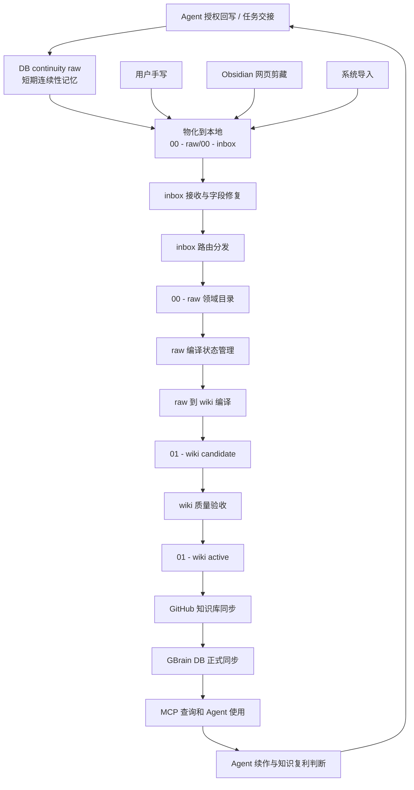
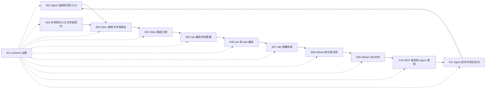

# 全层知识生产流水线操作手册

版本：v0.4.13

生命周期：Draft

日期：2026-06-22

适用范围：网页剪藏、用户手写、Agent 回写、inbox 路由、raw 编译、wiki 晋升、GitHub 知识库同步、GBrain DB 同步、MCP 查询、Agent 续作、任务交接、知识复利召回、生命周期治理

## 1. 手册定位

本手册是 Nexgaios GBrain 知识生产流水线的主入口。

本手册只负责调度，不承载全部细则。

Agent 执行知识库任务时，先读本手册，再按当前阶段读取对应细则。

## 2. 渐进式披露原则

规则按流水线阶段披露。

Agent 只读取当前任务需要的规则细则。

禁止为了执行单个阶段，把所有 schema 规则一次性塞进上下文。

当任务跨阶段时，按执行顺序逐段读取细则。

## 3. 双入口与统一知识生产主线

第一版知识飞轮固定为“双入口 + 单生产线”。

| 入口 | 第一动作 | 汇入点 | 目的 |
| --- | --- | --- | --- |
| Agent 授权回写 / 任务交接 | 写入 DB continuity raw | 本地 `00 - raw/00 - inbox` | 解决跨设备、跨线程、跨时间的 Agent 连续性问题。 |
| 用户手写 | 写入本地 raw inbox | 本地 `00 - raw/00 - inbox` | 保留用户主动维护的 Markdown 母本。 |
| Obsidian 网页剪藏 | 写入本地 raw inbox | 本地 `00 - raw/00 - inbox` | 保留外部资料原始入口。 |
| 系统导入 | 写入本地 raw inbox | 本地 `00 - raw/00 - inbox` | 批量材料统一进入字段修复和路由。 |

> [!important] DB 两层语义
> `DB continuity raw` 只用于解决 Agent 跨设备、跨线程、跨时间的连续性问题。
> 它不是正式知识索引，不等于 wiki active，不得被 Agent 当作默认可信结论。
>
> `GBrain DB 正式同步` 来自 GitHub / 本地知识母本的受控同步，用于 MCP 的正式查询服务。

> [!warning] 汇入点约束
> Agent 回写可以先进入 DB continuity raw，但随后必须物化到本地 `00 - raw/00 - inbox`。
> 从本地 raw inbox 开始，Agent 回写、用户手写、Obsidian 剪藏和系统导入都必须遵守同一条知识生产主线。

规则服务于这条主线。不能脱离流程单独解释字段、目录、状态、回写或同步行为。

## 4. 活动规则清单

脚本、模板、skill 和 Agent 操作说明引用规则时，必须能在本清单中找到对应版本。

脚本头部声明的规则版本与本清单不一致时，脚本必须输出版本不匹配警告。

第一版版本检查先做可见化，不强制阻断。

| 规则文件 | 当前版本 | 生命周期 | 所属阶段 | 依赖脚本 / 模板 / skill |
| --- | --- | --- | --- | --- |
| `《全层》知识生产流水线操作手册.md` | v0.4.13 | Draft | 全层调度 | inbox dry-run 脚本、GBrain DB 同步执行器脚本、三个模板、全部流水线细则 |
| `流水线细则/01 - 知识入口与字段规则.md` | v0.2.2 | Draft | 知识入口与字段契约 | inbox dry-run 脚本、三个模板、07 回写规则、06 同步规则 |
| `流水线细则/02 - inbox 接收与路由分发规则.md` | v0.3.0 | Draft | inbox 接收与路由分发 | 01 字段规则、09 回写 SOP、10 续作协议、inbox dry-run 脚本、Excel 审核表、路由结果清单、人工 / Codex 审核 |
| `流水线细则/03 - raw 目录与编译状态规则.md` | v0.1.1 | Draft | raw 目录与编译状态 | raw 覆盖率统计脚本、raw 编译脚本 |
| `流水线细则/04 - wiki 编译与页面治理规则.md` | v0.1.1 | Draft | raw 到 wiki 编译 | wiki 编译流程、wiki 页面模板 |
| `流水线细则/05 - wiki 质量验收规则.md` | v0.1.1 | Draft | wiki 质量验收 | wiki 页面模板、wiki 验收脚本 |
| `流水线细则/06 - GBrain DB 同步与 MCP 查询规则.md` | v0.2.1 | Draft | GBrain DB 同步与 MCP 查询 | GBrain DB 同步执行器脚本、sync 命令、MCP 查询策略、source include/exclude 配置 |
| `流水线细则/07 - Agent 回写闭环规则.md` | v0.3.0 | Draft | Agent 回写闭环 | Agent 回写 skill、MCP 写入工具、回写补偿队列、回写测试样例 |
| `流水线细则/08 - schema 治理与变更日志规则.md` | v0.1.1 | Draft | schema 治理 | 规则文件模板、规则变更日志 |
| `流水线细则/09 - Agent 资料提炼与 raw 回写 SOP.md` | v0.2.0 | Draft | Agent 资料提炼与 raw 回写质量 | 01 字段规则、07 回写规则、10 续作协议、Agent 回写工具、规则变更日志 |
| `流水线细则/10 - Agent 续作与知识复利协议.md` | v0.1.1 | Draft | Agent 续作与知识复利 | 06 同步与查询规则、07 回写规则、09 SOP、MCP 查询策略、任务交接页 |

## 5. 阶段状态机

> [!tip] 阅读方式
> 本节以流程图说明阶段流转，再用阶段卡片记录每一步的输入、阻断、输出和下一阶段。
> 避免使用九列表格，是为了让用户和 Agent 都能读清楚每个阶段只负责什么。

### 5.1 流程总览

### 5.2 阶段卡片

#### S01｜Agent 连续性回写入口

| 项 | 内容 |
| --- | --- |
| 输入状态 | 用户授权的 Agent 输出、任务交接、续作检查点 |
| 触发条件 | 当前用户消息明确授权回写，或任务交接触发且用户确认 |
| 执行者 | Agent、MCP 写入工具 |
| 必读规则 | [[流水线细则/07 - Agent 回写闭环规则\|07 回写闭环规则]]；[[流水线细则/09 - Agent 资料提炼与 raw 回写 SOP\|09 Agent 资料提炼 SOP]]；[[流水线细则/10 - Agent 续作与知识复利协议\|10 Agent 续作协议]] |
| 阻断条件 | 未获授权；安全门禁未通过；DB continuity raw 写入失败；本地物化失败 |
| 输出状态 | DB continuity raw 已写入；同一知识对象已物化到本地 raw inbox |
| 失败处理 | partial_failed 进入回写补偿队列；输出 DB 与本地物化状态 |
| 下一阶段 | S03 inbox 接收与字段修复 |

#### S02｜本地知识入口与字段契约

| 项 | 内容 |
| --- | --- |
| 输入状态 | 用户手写、Obsidian 网页剪藏、系统导入、字段冲突、字段迁移请求 |
| 触发条件 | 新材料进入本地知识库或字段校验失败 |
| 执行者 | 用户、Agent、脚本 |
| 必读规则 | [[流水线细则/01 - 知识入口与字段规则\|01 知识入口与字段规则]] |
| 阻断条件 | 缺少材料正文；非 Markdown 无说明卡；字段无法安全修复 |
| 输出状态 | 材料进入本地 raw inbox；frontmatter 具备 16 字段 |
| 失败处理 | 停止后续阶段，输出缺失字段或材料包问题 |
| 下一阶段 | S03 inbox 接收与字段修复 |

#### S03｜inbox 接收与字段修复

| 项 | 内容 |
| --- | --- |
| 输入状态 | lifecycle_status 为 inbox，或无合法 frontmatter |
| 触发条件 | 本地 raw inbox 有新材料 |
| 执行者 | inbox dry-run 脚本 |
| 必读规则 | [[流水线细则/02 - inbox 接收与路由分发规则\|02 inbox 接收与路由分发规则]] |
| 阻断条件 | frontmatter 结构损坏且无法修复；材料包缺文件 |
| 输出状态 | 16 字段完整；非法旧字段已迁移或删除 |
| 失败处理 | 输出校验问题，等待人工修复 |
| 下一阶段 | S04 inbox 路由分发 |

#### S04｜inbox 路由分发

| 项 | 内容 |
| --- | --- |
| 输入状态 | inbox 材料完成字段修复 |
| 触发条件 | 有待路由材料 |
| 执行者 | Codex、用户 |
| 必读规则 | [[流水线细则/02 - inbox 接收与路由分发规则\|02 inbox 接收与路由分发规则]] |
| 阻断条件 | 目标目录无法判断；目标目录不存在；置信度不足；用户未决策 |
| 输出状态 | lifecycle_status 为 raw；compile_status 为未编译；domain 已确定或进入待处理 |
| 失败处理 | 高置信度直接移动；中低置信度进入 Excel 审核表 |
| 下一阶段 | S05 raw 编译状态管理 |

#### S05｜raw 编译状态管理

| 项 | 内容 |
| --- | --- |
| 输入状态 | 材料位于领域 raw 目录 |
| 触发条件 | raw 覆盖率统计或编译前检查 |
| 执行者 | Codex、脚本 |
| 必读规则 | [[流水线细则/03 - raw 目录与编译状态规则\|03 raw 目录与编译状态规则]] |
| 阻断条件 | 缺少 compile_status；compiled_to 断链；raw 与 wiki 冲突未记录 |
| 输出状态 | raw 状态为未编译、部分编译、已编译、跳过编译、暂缓编译或已过期 |
| 失败处理 | 写入待处理索引或冲突索引 |
| 下一阶段 | S06 raw 到 wiki 编译 |

#### S06｜raw 到 wiki 编译

| 项 | 内容 |
| --- | --- |
| 输入状态 | raw 值得进入 wiki 或更新 wiki |
| 触发条件 | 编译任务启动 |
| 执行者 | Codex、用户 |
| 必读规则 | [[流水线细则/04 - wiki 编译与页面治理规则\|04 wiki 编译与页面治理规则]] |
| 阻断条件 | 无可追溯 raw；风险高但用户未确认；与 active 冲突 |
| 输出状态 | 新建或更新 candidate wiki；raw compiled_to 待更新 |
| 失败处理 | 进入待处理索引或冲突索引 |
| 下一阶段 | S07 wiki 质量验收 |

#### S07｜wiki 质量验收

| 项 | 内容 |
| --- | --- |
| 输入状态 | 新建、更新或晋升 wiki 页面 |
| 触发条件 | wiki 页面发生结论、链接或状态变化 |
| 执行者 | Codex、用户、验收脚本 |
| 必读规则 | [[流水线细则/05 - wiki 质量验收规则\|05 wiki 质量验收规则]] |
| 阻断条件 | 缺少依据来源；断链；模板残留；冲突未解决 |
| 输出状态 | lifecycle_status 为 active，或保持 candidate / deprecated / rejected |
| 失败处理 | 修复后重验；不能修复则记录待处理或冲突 |
| 下一阶段 | S08 GitHub 知识库同步 |

#### S08｜GitHub 知识库同步

| 项 | 内容 |
| --- | --- |
| 输入状态 | 本地知识库已完成 wiki 验收或 schema 规则变更验收 |
| 触发条件 | 用户确认同步或正式运行任务触发 |
| 执行者 | 用户、Git 工具、自动化任务 |
| 必读规则 | [[流水线细则/08 - schema 治理与变更日志规则\|08 schema 治理与变更日志规则]] |
| 阻断条件 | 工作区存在未确认改动；Git 认证失败；远端拒绝；用户要求暂不同步 |
| 输出状态 | GitHub 知识库分支或主分支已同步 |
| 失败处理 | 正式 GBrain DB 同步不得继续；输出 Git 失败原因 |
| 下一阶段 | S09 GBrain DB 同步 |

#### S09｜GBrain DB 同步

| 项 | 内容 |
| --- | --- |
| 输入状态 | GitHub 知识库已同步，或本地 dry-run 明确跳过 GitHub |
| 触发条件 | 正式同步任务触发 |
| 执行者 | GBrain DB 同步执行器、sync 命令、用户 |
| 必读规则 | [[流水线细则/06 - GBrain DB 同步与 MCP 查询规则\|06 GBrain DB 同步与 MCP 查询规则]] |
| 阻断条件 | include/exclude 范围不明；GitHub 同步失败且不是 dry-run；同步计划文件未通过 16 字段 frontmatter 契约；DB 连接失败 |
| 输出状态 | raw / wiki / schema 按规则进入 GBrain DB |
| 失败处理 | 标记 gbrain_db_sync_status 为 failed，或输出 blocked 报告并写错误原因 |
| 下一阶段 | S10 MCP 查询和 Agent 使用 |

#### S10｜MCP 查询和 Agent 使用

| 项 | 内容 |
| --- | --- |
| 输入状态 | GBrain DB 已有可检索知识 |
| 触发条件 | 用户提问或 Agent 需要上下文 |
| 执行者 | Agent、MCP 工具 |
| 必读规则 | [[流水线细则/06 - GBrain DB 同步与 MCP 查询规则\|06 GBrain DB 同步与 MCP 查询规则]] |
| 阻断条件 | 查询范围不明；命中 deprecated 或 raw 未标注来源状态 |
| 输出状态 | 按 raw / wiki / schema 分层回答 |
| 失败处理 | 标注不确定或请求用户缩小范围 |
| 下一阶段 | S11 Agent 续作与知识复利 |

#### S11｜Agent 续作与知识复利

| 项 | 内容 |
| --- | --- |
| 输入状态 | GBrain DB 已有可检索知识，或当前任务需要连续性 |
| 触发条件 | 新线程启动、长任务结束 / 暂停、用户要求继续 / 保存、出现相似信号、Agent 判断需查历史 |
| 执行者 | Agent、MCP 工具、用户 |
| 必读规则 | [[流水线细则/10 - Agent 续作与知识复利协议\|10 Agent 续作协议]] |
| 阻断条件 | 任务身份不明；用户未授权回写；历史命中状态不可用；相似性证据不足 |
| 输出状态 | 启动摘要、任务交接建议、沉淀建议、相似案例召回或生命周期复核项 |
| 失败处理 | 标注不确定、请求用户确认或进入待处理 |
| 下一阶段 | S01 Agent 连续性回写入口，或 S10 MCP 查询和 Agent 使用 |

#### S12｜schema 治理

| 项 | 内容 |
| --- | --- |
| 输入状态 | 规则、脚本、模板或变更日志需要修改 |
| 触发条件 | 用户明确要求修改规则，或工程依赖变化 |
| 执行者 | 用户、Agent |
| 必读规则 | [[流水线细则/08 - schema 治理与变更日志规则\|08 schema 治理与变更日志规则]] |
| 阻断条件 | 用户未确认；影响范围不明；迁移要求缺失 |
| 输出状态 | 规则版本、模板、脚本、变更日志同步 |
| 失败处理 | 停止落地，先补影响范围和迁移要求 |
| 下一阶段 | 对应流水线阶段 |

GitHub 知识库同步允许在本地 dry-run、人工审查、临时本机验证中跳过。

正式运行不得跳过 GitHub 知识库同步。

GitHub 知识库同步失败时，正式 GBrain DB 同步不得继续。

## 6. 全局约束

所有入口最终都必须汇入本地 `00 - raw/00 - inbox`，并进入 inbox 接收流程。

禁止绕过 inbox 直接进入领域 raw 目录。

禁止绕过 raw 直接生成 active wiki。

Agent 授权回写必须先进入 DB continuity raw，用于短期连续性和跨线程恢复；随后必须物化到本地 `00 - raw/00 - inbox`。

用户手写、Obsidian 网页剪藏和系统导入不直接写 DB continuity raw，默认先进入本地 `00 - raw/00 - inbox`。

DB continuity raw 不等于正式 GBrain DB 同步结果。

正式 GBrain DB 同步必须遵守 GitHub 前置条件和 `流水线细则/06 - GBrain DB 同步与 MCP 查询规则.md`。

所有 raw、wiki、schema Markdown frontmatter 全量展示 16 个字段。字段定义、枚举值和生成规则以 `流水线细则/01 - 知识入口与字段规则.md` 为准。

schema 是规则来源，不是业务事实来源。

raw 可以作为即时记忆和证据来源，未编译 raw 不得伪装成正式结论。

wiki active 是默认回答来源。

Agent 处理 GBrain、项目工程或长任务续作时，必须按 `流水线细则/10 - Agent 续作与知识复利协议.md` 先判断是否存在可恢复任务状态、相似历史事件或应沉淀的交接信息。

任务状态、案例记录、决策记录和流程经验在完成编译前仍属于 raw 或 candidate，不得伪装成正式 wiki 结论。

时间线、版本、验证状态、替代关系和尘封状态写入正文结构，不新增 frontmatter 字段。

## 7. 冲突处理

流程调度冲突时，以本手册为准。

阶段细则冲突时，停止执行并要求用户确认。

脚本、模板与规则冲突时，以规则为准，并同步修改脚本或模板。

旧主题规则文件不保留兼容入口。历史规则变化只通过 `规则变更日志.md` 追溯。

## 8. 执行顺序

Agent 执行知识任务时，按以下顺序读取：

1. 本手册。
2. 当前阶段对应的流水线细则。
3. 当前阶段引用的脚本、模板或 skill。
4. 规则变更日志。

跨阶段任务必须在进入下一阶段前读取下一阶段细则。

## 9. 细则影响面映射

修改本手册或任一流水线细则时，必须按本表同步检查。

| 修改对象 | 必须同步检查 |
| --- | --- |
| 主手册 | 活动规则清单、阶段状态机、三个模板、inbox dry-run 脚本、规则变更日志 |
| 01 字段规则 | inbox dry-run 脚本、三个模板、07 回写规则、06 同步规则、规则变更日志 |
| 02 inbox 规则 | inbox dry-run 脚本、Excel 审核表、路由结果清单、人工 / Codex 审核流程、规则变更日志 |
| 03 raw 规则 | raw 覆盖率统计脚本、raw 编译流程、raw 模板、规则变更日志 |
| 04 wiki 编译规则 | wiki 页面模板、wiki 编译流程、05 验收规则、规则变更日志 |
| 05 wiki 质量验收规则 | wiki 页面模板、wiki 验收脚本、04 wiki 编译规则、规则变更日志 |
| 06 GBrain DB 同步规则 | GBrain DB 同步执行器脚本、sync 命令、MCP 查询策略、source include/exclude 配置、01 字段规则、规则变更日志 |
| 07 Agent 回写规则 | Agent 回写 skill、MCP 写入工具、回写补偿队列、07 测试样例、01 字段规则、规则变更日志 |
| 08 schema 治理规则 | 规则文件模板、规则变更日志、活动规则清单 |
| 09 Agent 资料提炼与 raw 回写 SOP | 07 回写规则、Agent 回写工具、规则变更日志 |
| 10 Agent 续作与知识复利协议 | 06 同步与查询规则、07 回写规则、09 SOP、MCP 查询策略、任务交接页、规则变更日志 |

## 10. 后续同步要求

修改本手册或任一流水线细则时，必须同步检查：

1. `自动化脚本/00 - inbox 校验与路由输入 dry-run.ps1`
2. `模板/00 - raw 材料说明卡模板.md`
3. `模板/01 - wiki 页面模板.md`
4. `模板/02 - schema 规则文件模板.md`
5. 是否残留已废弃的旧主题规则入口
6. `规则变更日志.md`
